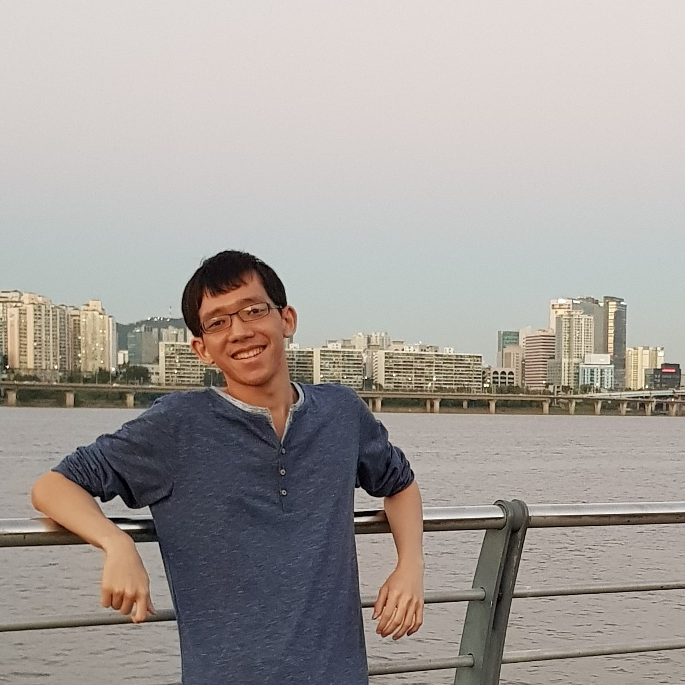
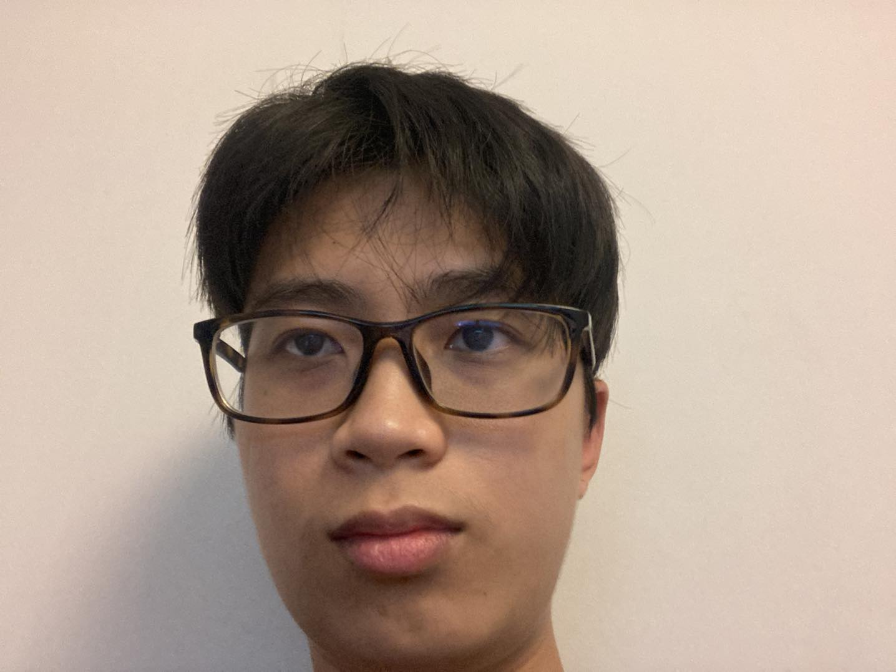
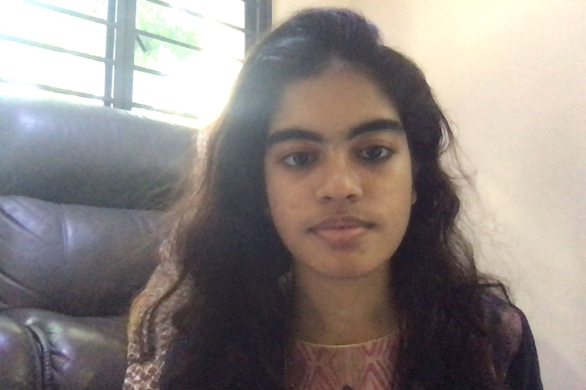
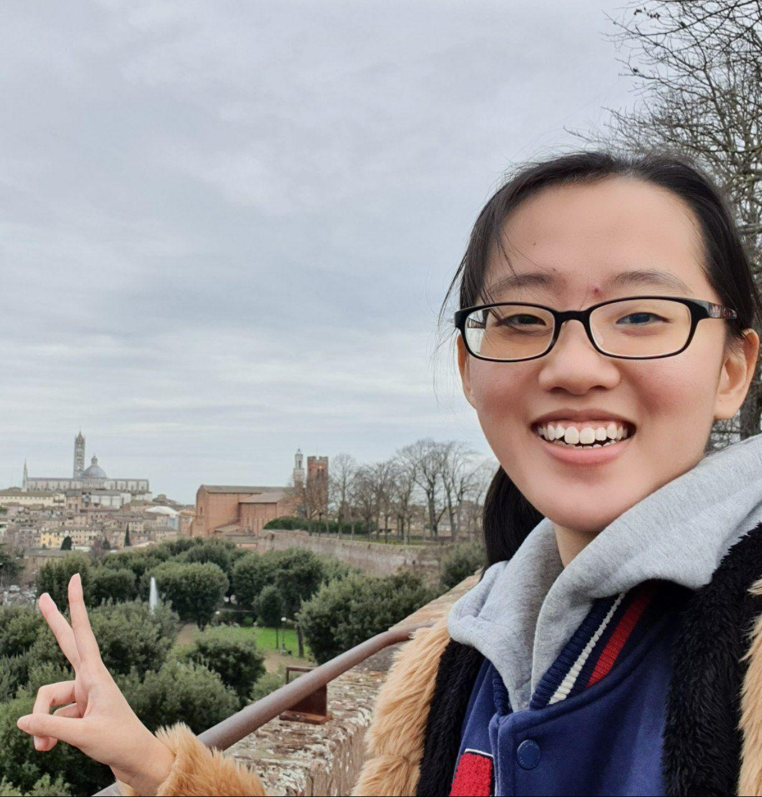

We are team CS2103T-W12-1 based in the [School of Computing, National University of Singapore](http://www.comp.nus.edu.sg).

## Project team

### Wee Yee Hong

[[Github](https://github.com/w-yeehong)][[Portfolio](/team/w-yeehong.md)]

* Role: Team Lead
* Responsibilities: Project Coordination

### Ge Wai Lok

[[Github](http://github.com/raymondge)][[Portfolio](/team/raymondge.md)]

* Role: Developer
* Responsibilities: Documentation

### Noorul Azlina

[[Github](http://github.com/itssodium)][[Portfolio](/team/itssodium.md)]

* Role: Developer
* Responsibilities: Code Quality

### Chiam Yun Qing

[[Github](https://github.com/chiamyunqing)][[Portfolio](/team/chiamyunqing.md)]

* Role: Developer
* Responsibilities: Testing

### Lee Ming De

[[Github](http://github.com/LeeMingDe)][[Portfolio](/team/leemingde.md)]

* Role: Developer
* Responsibilities: Integration (version the code, maintain the code repository and integrate various parts into a software)
