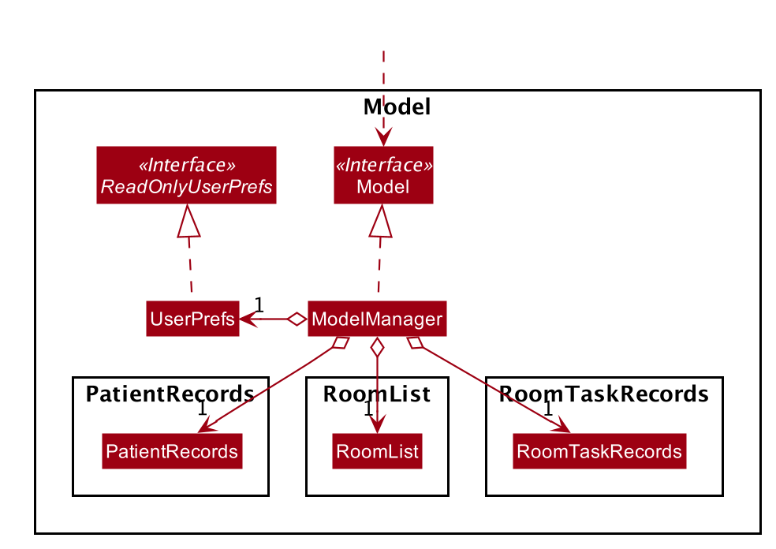
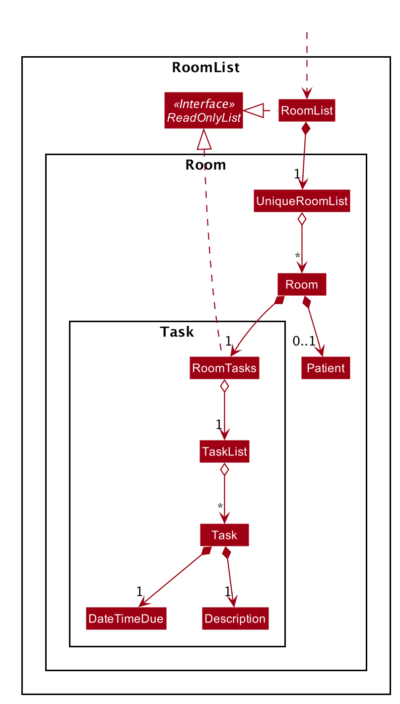
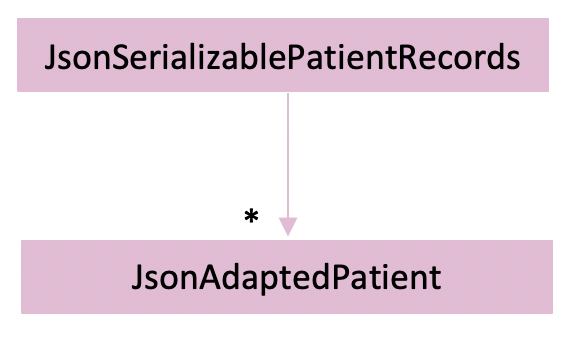
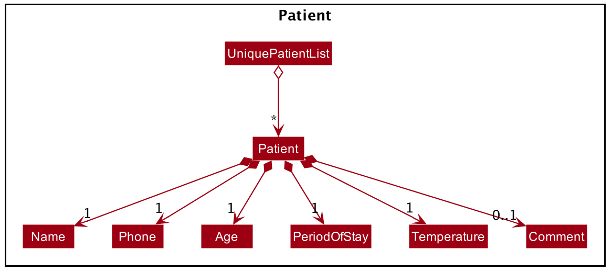
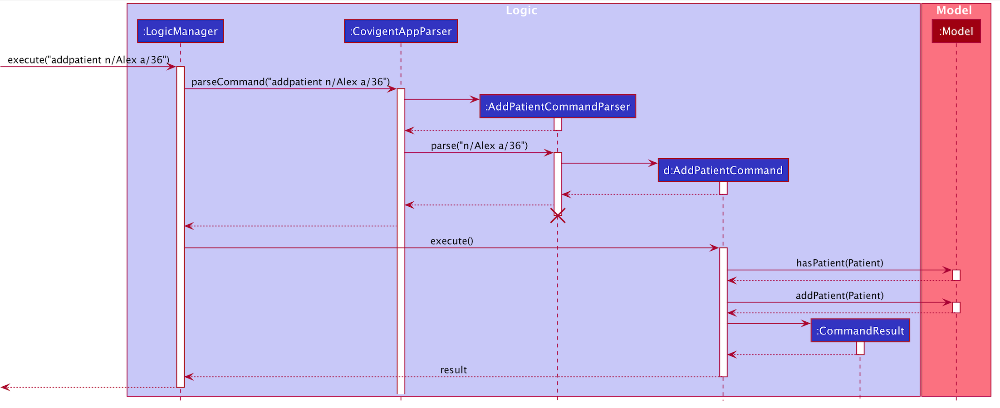
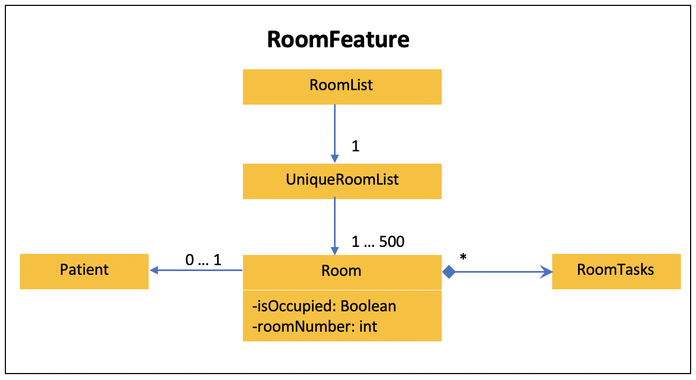
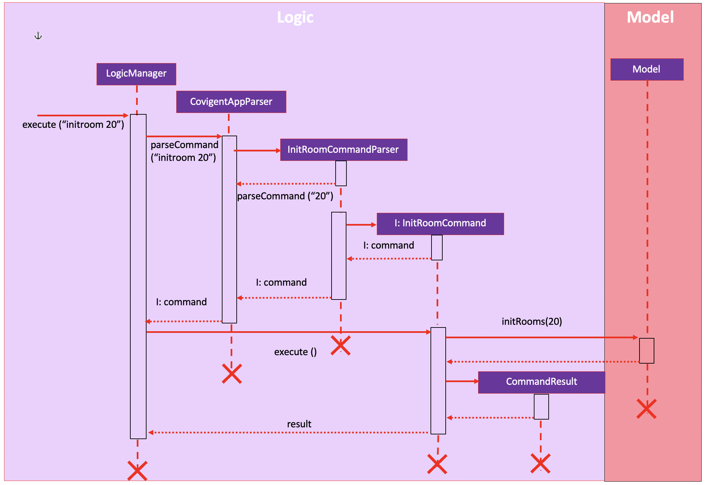

# Covigent - Developer Guide
1. [Preface](#1-preface)
2. [Setting Up](#2-setting-up)
3. [Design](#3-design) 
    3.1  [Architecture: High Level View](#31-architecture-high-level-view) 
    3.2  [UI Component](#32-ui-component) 
    3.3  [Logic Component](#33-logic-component) 
    3.4  [Model Component](#34-model-component) 
    3.5  [Storage Component](#35-storage-component) 
    3.6  [Commons Component](#36-commons-component) 
 4. [Implementation](#4-implementation) 
    4.1  [Patient Feature](#41-patient-feature) 
          4.1.1 [Overview](#411-overview) 
          4.1.2 [Create, Read, Update, Delete](#412-create-read-update-delete) 
          4.1.3 [Search Patient](#413-search-patient) 
    4.2  [Room Feature](#42-room-feature) 
          4.2.1 [Overview](#421-overview) 
          4.2.2 [Initialize Room](#422-implementation-of-initroomcommand) 
          4.2.3 [Allocate Room](#423-implementation-of-allocateroomcommand) 
          4.2.4 [GUI](#424-search-room) 
    4.3  [Task Feature](#43-task-feature) 
          4.3.1 [Add Task](#431-add-task) 
          4.3.2 [List Task](#432-list-task) 
          4.3.3 [Delete Task](#433-delete-task) 
          4.3.4 [Edit Task](#434-edit-task) 
          4.3.5 [Search Task](#435-search-task) 
    4.4  [Storage Feature(KIV)] 
    4.5  [Logging Feature(KIV)] 
    4.6  [Miscellaneous Feature](#46-miscellaneous-feature) 
          4.6.1 [Support for Multiple Date-Time Formats](#461-support-for-multiple-date-time-formats) 
    4.7  [Configuration Feature](#47-configuration-feature) 
 5. [Documentation](#5-documentation) 
 6. [Testing(KIV)] 
 7. [Appendix](#7-appendix) 
    A1. [Product Scope](#a1-product-scope) 
    A2. [User Stories](#a2-user-stories) 
    A3. [Use Cases](#a3-use-cases) 
    A4. [Non-Functional Requirements](#a4-non-functional-requirements) 
    A5. [Glossary](#a5-glossary) 
    
--------------------------------------------------------------------------------------------------------------------
## 1. Preface

Covigent is a desktop management application that helps to keep track of the information of quarantined individuals and the tasks to be done by the staff of a small hotel that has been converted to a quarantine facility.

The Covigent Developer Guide is designed to illustrate and identify the high level architecture systems used to design and implement the Covigent application. The document contains an overall view of the system hierarchy, logical views of the system components, and a process view of the system’s communication. We hope that this Developer Guide serves you well in understanding and maintaining the Covigent application. 

The link to the GitHub repository can be found [here](https://github.com/AY2021S1-CS2103T-W12-1/tp).

 _Written by: Yun Qing_ 

--------------------------------------------------------------------------------------------------------------------

## 2. Setting Up

Refer to the guide [_Setting up and getting started_](SettingUp.md).

--------------------------------------------------------------------------------------------------------------------

## 3. Design

### 3.1 Architecture: High Level View

The ***Architecture Diagram*** given above explains the high-level design of the App. Given below is a quick overview of each component.

:bulb: **Tip:** The `.puml` files used to create diagrams in this document can be found in the [diagrams](https://github.com/se-edu/addressbook-level3/tree/master/docs/diagrams/) folder. Refer to the [_PlantUML Tutorial_ at se-edu/guides](https://se-education.org/guides/tutorials/plantUml.html) to learn how to create and edit diagrams.

**`Main`** has two classes called [`Main`](https://github.com/se-edu/addressbook-level3/tree/master/src/main/java/seedu/address/Main.java) and [`MainApp`](https://github.com/se-edu/addressbook-level3/tree/master/src/main/java/seedu/address/MainApp.java). It is responsible for,
* At app launch: Initializes the components in the correct sequence, and connects them up with each other.
* At shut down: Shuts down the components and invokes cleanup methods where necessary.

[**`Commons`**](#common-classes) represents a collection of classes used by multiple other components.

The rest of the App consists of four components.

* [**`UI`**](#ui-component): The UI of the App.
* [**`Logic`**](#logic-component): The command executor.
* [**`Model`**](#model-component): Holds the data of the App in memory.
* [**`Storage`**](#storage-component): Reads data from, and writes data to, the hard disk.

Each of the four components,

* defines its *API* in an `interface` with the same name as the Component.
* exposes its functionality using a concrete `{Component Name}Manager` class (which implements the corresponding API `interface` mentioned in the previous point.

For example, the `Logic` component (see the class diagram given below) defines its API in the `Logic.java` interface and exposes its functionality using the `LogicManager.java` class which implements the `Logic` interface.

**How the architecture components interact with each other**

The *Sequence Diagram* below shows how the components interact with each other for the scenario where the user issues the command `delete 1`.

The sections below give more details of each component.

### 3.2 UI Component

The `UI` component displays information for the users based on user's input. The GUI to displayed is based on the return from logic.
It uses JavaFx UI framework. The layout of these UI parts are defined in matching `.fxml` files that are in the `src/main/resources/view` folder. For example, the layout of the [`MainWindow`](https://github.com/se-edu/addressbook-level3/tree/master/src/main/java/seedu/address/ui/MainWindow.java) is specified in [`MainWindow.fxml`](https://github.com/se-edu/addressbook-level3/tree/master/src/main/resources/view/MainWindow.fxml)

The `UI` component,
* Executes user commands using the `Logic` component.
* Consists of a `MainWindow` that is made up of many different parts that inherit from the abstract `UiPart` class.

The `MainWindow` is made up of 
* A `PatientListPanel` that displays the list of patients. The layout is defined by `PatientCard`.
* A `RoomListPanel` that displays the list of rooms. The layout is defined by `RoomCard` and `RoomDetailPanel`.
* A `RoomTaskListPanel` that displays the list of tasks. The layout is defined by `TaskCard`.
* A `HelpWindow` that displays the link to the help page.
* A `CommandBox` that displays the area for command input.
* A `ResultDisplay` that displays the robot response.
* A `StatusBarFooter` that displays the status bar footer. 
Below is a class diagram for `Ui`

**API** :
[`Ui.java`](https://github.com/se-edu/addressbook-level3/tree/master/src/main/java/seedu/address/ui/Ui.java)

The `UI` component,
* Listens for changes to `Model` data so that the `UI` can be updated with the modified data.
Below shows the interaction with `Model`

_Written by: Wai Lok_

### 3.3 Logic Component

The `Logic` component is the "brains" of Covigent. While the `Ui` defines the GUI and `Model` defines in-memory data,
the `Logic` component does most of the heavy-lifting in terms of deciding what to change within the `Model` and what to 
return to the `Ui`. 
The diagram below shows the structure of the `Logic` component and how it interacts with its internal parts.

*Figure 4. Structure of the Logic Component*

**API** :
[`Logic.java`](https://github.com/AY2021S1-CS2103T-W12-1/tp/blob/master/src/main/java/seedu/address/logic/Logic.java)

1. Once a user input is obtained from the GUI, `Logic` uses the `CovigentAppParser` class to parse the users' commands
and return a `Command` object.
1. The `Command` is executed by `LogicManager`.
1. Depending on the command input by the user, it may mutate the `Model`, such as adding a new patient, room or task.
1. The result of the command execution is encapsulated as a `CommandResult` that is returned to the `Ui`.
1. These `CommandResults` can instruct the `Ui` to perform certain actions, such as displaying help or error messages to the user.

Shown below is the Sequence Diagram within the `Logic` component for the API call: `execute("deletepatient alex")`.

*Figure 5. Interactions inside the `Logic` Component for the `deletepatient alex` Command*

:information_source: **Note:** The lifeline for `DeletePatientCommandParser` should end at the destroy marker (X) but due to a limitation of PlantUML, the lifeline reaches the end of diagram.

 
_Written by: Ming De_

### 3.4 Model Component

The `Model` API acts as a facade that handles interaction between different kinds of data in Covigent. These data include user's preferences, patient records and room list. The `Model` API exposes the methods that allow the logic component to utilise to perform retrieving and updating of data.

The `Model` component,
  * stores a `UserPref` object that represents the user’s preferences.
  * stores a `PatientRecords` object that stores the data of all the patients. 
  * stores a `RoomList` object that stores the data of all the rooms.
  * stores a `RoomTaskRecords` object that stores all the `RoomTaskAssociation` objects, which keep track of the room that a task belongs to.
  * exposes unmodifiable `ObservableList<Patient>`, `ObservableList<Room>` and `ObservableList<RoomTaskAssociation>` which can be observed. This means that the UI can be bound to the lists so that the UI automatically updates when data in the lists changes.
  * does not depend on any of the three components.

The concrete class `ModelManager` implements `Model` interface and manages the data for Covigent. `ModelManager` contains `UserPrefs`, `PatientRecords`, `RoomList` and `RoomTaskRecords`. These classes manage the data related to their specific features.

Below is a class diagram for `ModelManager`.

  
_Figure XX. Class Diagram for Model Component_

**API** : [`Model.java`](https://github.com/AY2021S1-CS2103T-W12-1/tp/blob/master/src/main/java/seedu/address/model/Model.java)

The breakdown for each type of data in `ModelManager`, which include `PatientRecords`, `RoomList` and `RoomTaskRecords`, can be found below.

The `PatientRecords` class is in charge of maintaining the data of the patients and in ensuring the uniqueness of patients according to their names. Below is a class diagram for `PatientRecords`. 

  
_Figure XX. Class Diagram for PatientRecords_

:information_source: **Note:** The `PatientRecords` class implements the interface ReadOnlyList&lt;Patient&gt; but due to a limitation of PlantUML, the interface is reflected as simply `ReadOnlyList`.

 

The `RoomList` class is in charge of maintaining the data in the rooms and in ensuring the uniqueness of rooms according to the room numbers. As each room stores the data of the patient who resides in the room and the tasks meant for the room, it incorporates data from both `Patient` and `RoomTasks`. `RoomTasks` class is in charge of maintaining the data of the tasks in a room. The full details of `Patient` can be found in the previous class diagram for `PatientRecords` so it is no longer reflected in the class diagram for `RoomList`. The class diagram for `RoomList` is shown below.  

  
_Figure XX. Class Diagram for RoomList_

:information_source: **Note:** The `RoomList` class implements the interface ReadOnlyList &lt;Room&gt; and the `RoomTasks` class implements the interface ReadOnlyList&lt;Task&gt;. However, due to a limitation of PlantUML, the interface is reflected as simply `ReadOnlyList`.

 

The `RoomTaskRecords` class is in charge of maintaining the data regarding the association of a task in a room. The `RoomTaskAssociation` class acts as an association class that ties `Task` and `Room` together so that the `Task` object does not need to know of the details of `Room` and we are still able to identify the room number that `Task` belongs to and its index in `Room`. The class diagram for `RoomTaskRecords` is shown below.

  
_Figure XX. Class Diagram for RoomTaskRecords_

:information_source: **Note:** The `RoomTaskRecords` class implements the interface ReadOnlyList &lt;RoomTaskAssociation&gt;. However, due to a limitation of PlantUML, the interface is reflected as simply `ReadOnlyList`.

 

 _Written by: Yun Qing_ 

### 3.5 Storage Component

**API** : [`Storage.java`](https://github.com/AY2021S1-CS2103T-W12-1/tp/blob/master/src/main/java/seedu/address/storage/Storage.java)

The `Storage` API handles the reading and writing of data in Json format, enabling Covigent to remember information stored by user even when the application is closed. The Storage API behaves like a façade by handling the storage classes and interfaces.

The `Storage` interface class diagram is shown below, and as it can be seen it inherits from specific storage interfaces.

The `Storage` component,
  *	Saves `UserPref` objects in Json format 
  *	Reads `UserPred` objects in Json format
  *	Saves `RoomRecords` and `PatientRecords` data in json format 
  *	Reads `RoomRecords` and `PatientRecords` data in json format 

The information of the `Patient` and `Room` feature of Covigent is stored locally in the Json format. This is done by adapting the Patient and Room feature into JsonSerializablePatientRecords and JsonSerializableRoomRecords respectively.

The class diagram for StorageManager is shown below

The information of the `Patient` and `Room` feature of Covigent is stored locally in the Json format. This is done by adapting the Patient and Room feature into JsonSerializablePatientRecords and JsonSerializableRoomRecords respectively.

The class diagrams for the above stated adapted classes are shown below
 
 Fig of `JsonSerializableRoomRecords`
 
 
 Fig of `JsonSerializableTaskList`
 
 _Written by: Noorul Azlina_

### 3.6 Commons Component

Classes used by multiple components are in the `seedu.addressbook.commons` package.

--------------------------------------------------------------------------------------------------------------------

## 4. Implementation

This section describes some noteworthy details on how certain features are implemented.

### 4.1 Patient Feature

#### 4.1.1 Overview

#### Design of Patient
A `Patient` object in Covigent contains the following attributes, which is also reflected in Figure xx:
1. Name
2. Temperature
3. PeriodOfStay
4. Age
5. Phone
6. Comment  

 
_Figure XX. Class Diagram for Patient_

#### Design Considerations for Patient 

**Aspect: Encapsulation of fields for `Patient` object**

* Option 1: Using primitive data types for `Temperature`, `Age` and `Comment` classes

Classes like `Temperature`, `Age` and `Comment` can be easily treated as primitive data types including double and string. However, this option goes against the spirit of OOP. Furthermore, it does not align to the original design of AddressBook3, which Covigent was morphed from, in which `Name` and `Phone` attributes were abstracted out as separate classes. 

* Option 2: Encapsulate constituent patient attributes in their own classes

This option increases OOP and is aligned to the original design of AddressBook3. In addition, this design has proven itself to be extensible in the long run and allows for adjustments to `Patient` attributes easily. For example, when setting the valid temperature range as input for `Temperature`, only the `Temperature` class needs to change, which demonstrates the essence of the single responsibility principle. This allows for better understanding and maintenance of our code base in the future.

**Aspect: Decision on the uniqueness of `Patient` object**

* Option 1: Uniqueness is identified by name, age and phone

Originally, our team intended to define two `Patient` to be equals if they have the same `Name`, `Age` and `Phone`. However, such a design will make it difficult for users of Covigent as they will have to key in all these fields when executing `EditPatientCommand` and `DeletePatientCommand` in order for Covigent to uniquely identify the `Patient` to manipulate. 

* Option 2: Uniqueness is identified by name

Keeping in mind the ease of usage of Covigent for users, our team chose to identify `Patient` uniquely by `Name` only. As such, when users need to manipulate the data of a `Patient`, all they need to input is the `Name`. Furthermore, our team believes that since Covigent is used by small hotels, there is a very low chance of two patients having the same names.

#### Features related to Patient

Having looked at the design of `Patient`, we can now explore the possible features related to `Patient`. In particular, our commands support [create, read, update, delete](#412-create-read-update-delete) and [search](#413-search-patient). 

The features comprise of five commands namely,
* `AddPatientCommand` - Adding patients
* `ListPatientCommand` - Listing all the patients
* `EditPatientCommand` - Editing patients
* `DeletePatientCommand` - Deleting patients
* `SearchPatientCommand`- Searching for patients

_Written by Yun Qing_

#### 4.1.2 Create, Read, Update, Delete

In this section, we will cover the implementation of the manipulation of the `Patient` data. The commands that allow creating, reading, updating and deleting of `Patient` include `AddPatientCommand`, `ListPatientCommand`, `EditPatientCommand` and `DeletePatientCommand`. 

As the `Patient` data are stored in `UniquePatientList`, which ensures the uniqueness of `Patient`, the actual manipulation of the `Patient` data is made in `UniquePatientList` class.

Some of the significant methods within `UniquePatientList` class that allows the manipulation of the `Patient` data are shown below:
* `UniquePatientList#add(Patient toAdd)` - Adds a `Patient` to `UniquePatientList`.
* `UniquePatientList#setPatient(Patient target, Patient editedPatient)` - Edits the attributes of `Patient`.
* `UniquePatientList#remove(Patient toRemove)` - Deletes a `Patient` from `UniquePatientList`.
* `UniquePatientList#asUnmodifiableObservableList()` - Returns an observable list of `Patient`
* `UniquePatientList#getPatientWithName(Name name)` - Returns the `Patient` with the given `Name` if the `Patient` object exists in `UniquePatientList`. Since `Name` is an identifier of a `Patient`, this method is used in `EditPatientCommand` and `DeletePatientCommand` to modify the `Patient` or check if the `Patient` to be deleted exists.

These methods in `UniquePatientList` class support the corresponding methods in the facade classes `PatientRecords` and `ModelManager`. In particular, the `Model` interface exposes the methods `Model#addPatient(Patient patient)`, `Model#setPatient(Patient target, Patient editedPatient)`, `Model#deletePatient(Patient target)`, `Model#getPatientWithName(Name name)` and `Model#getFilteredPatientList()`.

For brevity's sake, we will only illustrate the implementation of 2 specific commands - `AddPatientCommand` and `EditPatientCommand`.

**Implementation of AddPatientCommand**

The following is a detailed explanation of the operations that `AddPatientCommand` performs.

**Step 1.** The user executes `addpatient [input all attributes of Patient]` command to add a patient to Covigent. An `AddPatientCommandParser` object is created and the `AddPatientCommandParser#parse(String args)` method is called, which helps to parse the different attributes of `Patient`. The parse method returns a new `AddPatientCommand` object and the `AddPatientCommand` object stores the `Patient` to be added.

**Step 2.** The `Patient` to be added is then searched through `UniquePatientList#internalList`using the `Model#hasPatient(Patient patient)` method to check if the patient already exists. If the patient already exists, a `CommandException` object will be thrown with an error message.

**Step 3.** Through `Model#addPatient(Patient toAdd)`, the `Patient` will be added to `UniquePatientList`.

**Step 4.** A success message with the new patient details will be appended with the `AddPatientCommand#MESSAGE_SUCCESS` constant. A new `CommandResult` will be returned with the message.

The sequence diagram for `AddPatientCommand` can be found below.

 
_Figure XX. Sequence Diagram for AddPatientCommand_

:information_source: **Note:** Due to space limitation in PlantUML diagram, the addpatient command example given in the sequence diagram only consists of two patient attributes, name and age.

 

_Written by Yun Qing_

**Implementation of EditPatientCommand**
The following is a detailed explanation of the operations that `EditPatientCommand` performs.

**Step 1.** The `EditPatientCommand#execute(Model model)` method is executed and it checks if the `Name` defined when instantiating
`EditPatientCommand(Name patientToBeEdited, EditPatientDescriptor editPatientDescriptor)` is valid. The `EditPatientDescriptor` holds
the edited information of the `Patient`.

**Step 2.** A new `Patient` with the updated values will be created and the patient is then searched through `UniquePatientList#internalList`
using the `Model#hasPatient(Patient patient)` method to check if the patient already exists. If the patient already exists,
`CommandException` will be thrown with an error message.

**Step 3.** The newly created `Patient` will replace the existing patient object through the `Model#setPatient(Patient target, Patient editedPatient)`
method.

**Step 4.** A success message with the edited patient will be appended with the `EditPatientCommand#MESSAGE_EDIT_PATIENT_SUCCESS` constant. A 
new `CommandResult` will be returned with the message.

_EditPatientCommand Implementation written by Ming De_

#### 4.1.3 Search Patient

**Implementation**
The following is a detailed explanation of the operations that `SearchPatientCommand` performs.

**Step 1.** The `SearchPatientCommand#execute(Model model)` method is executed and checks the `criteriaToSearch` via `confirmCriteria(SearchPatientDescriptor searchPatientDescriptor)`. 
The `SearchPatientDescriptor` holds the `name` or `temperatureRange` of the Command.

**Step 2.** If the `criteriaToSearch` is `SearchCriteria.CRITERIA_NOT_FOUND`, `CommandException` will be thrown with an error message.

**Step 3.** If the `criteriaToSearch` is `SearchCriteria.CRITERIA_IS_NAME`, we update the `Model`'s `FilteredPatientList` Predicate via `updateNamePredicate(Model model, SearchPatientDescriptor searchPatientDescriptor)`
Then `findPatientWithName(SearchPatientDescriptor searchPatientDescriptor, List<Patient> patientList)` will go through `Model`'s `FilteredPatientList`, if no patient is found, `CommandException` will be thrown with an error message. If there is at least one patient found, a new `CommandResult` will be returned with the message.

**Step 4.** If the `criteriaToSearch` is `CRITERIA_IS_TEMPERATURE`, we update the `Model`'s `FilteredPatientList` Predicate via `updateTemperaturePredicate(Model model, SearchPatientDescriptor searchPatientDescriptor)`
Then `findPatientWithTemperature(SearchPatientDescriptor searchPatientDescriptor, List<Patient> patientList)` will go through `Model`'s `FilteredPatientList`, if no patient is found, `CommandException` will be thrown with an error message. If there is at least one patient found, a new `CommandResult` will be returned with the message.

**Step 5.** If the `criteriaToSearch` is `TOO_MANY_CRITERIA` A new `CommandResult` will be returned with the message.
method.

### 4.2 Room Feature

#### 4.2.1 Overview
The application is able to track the room details. It keep tracks of the whether a room is occupied and the patient inside the room if it is occupied. 
It also keeps track of the tasks assigned to a specific room. 
Hence, there is a need to represent the Room List as a list of Rooms on which the application can perform read and update operations.

#### Design of RoomList and Room
The class diagram or UniqueRoomList is shown below:

As seen in the diagram above, the UniqueRoomList contains a single RoomList object. This is a wrapper class around an ObservableList and PriorityQueue of Room objects. The UniqueRoomList contains no rooms at the start, however, after that you would require at least one room to be defined here.

Each Room contains the following member attributes, all of which are non-nullable attributes:

#### Design Considerations for RoomList and Room

**Aspect: Decision on allowing `editRoomCommand` that allows changing of room number to remain**

* Option 1: Do not change the `editRoomCommand`
Allowing the users to change room numbers will give the user more power in customising the rooms. However, this option introduced a bug into the system
that could not be easily resolved unless we changed our entire implementation of `InitRoomCommand`.
    
* Option 2: Remove `editRoomCommand` ability to change room number and rename it to `AllocateRoomCommand`
Removing the `editRoomCommand` to change room number is much more time-efficient compared to changing the entire implementation of `InitRoomCommand`. We
also decided that there should be no reason that a user would need to change the room number. Renaming the method to `AllocateRoomCommand` would provide
more clarity for the method.
    
Ultimately, we decided on Option 2. This is because keeping `editRoomCommand` would lead to a large consumption of time to redesign the system. In order
to not stray from our schedule, we have to remove `editRoomCommand` to ensure that we can develop the other features on time.
Furthermore, to solve the bug that was introduced, we would have to store the count of the number of times `InitRoomCommand` was called. This would
cause us to store information in another `.json` file which is unnecessary. Therefore, we decided that the forgoing a
small function like this would be a better choice.

_Written by Mingde_

#### Proposed Implementation

The proposed room feature is facilitated by `RoomList`. It extends `ReadOnlyRoomList` which reads the Room information Json file, stored internally as an `addressBookStateList` and `currentStatePointer`. Additionally, it implements the following operations:
* `RoomList#addRooms(int num)` — adds the number of which are said to add together and retains infromation previously stored in each room
* `RoomList#containsRoom(Room toCehck)` - checks whether the given room exists
* `RoomList#addTaskToRoom(Task task, Room room)` — adds task to the room given.
* `RoomList#deletesTaskFromRoom(Task task, Room romm)` — deletes task from room given
* `RoomList#setTaskToRoom(target, editedTask, room)` - sets task to room given
* `RoomList#clearRoom(Name patientName)` - removes patient from the room
* `RoomList#setSingleRoom(Room target, Room editedRoom)` - sets the editedRoom to the target room

These operations are exposed in the `Model` interface as `Model#addRooms(int num)`, `Model#hasroom(Room room)`, `Model#addTaskToRoom(Task task, Room room)`, `Model#deleteTaskFromRoom(Task task, Room room)`, `Model#setTaskToRoom(Task target, Task editedTask, Room room)`, `Model#clearRoom(Name patientName)` and `Model#setSingleRoom(Room target, Room editedRoom)` respectivley. 

### Feature related to Room

The features comprise of five commands namely,
* `InitRoomCommand` - Initializes the number of rooms in Covigent app.
* `ListRoomCommand` - Lists all the rooms in Covigent app.
* `AllocateRoomCommand` - Allocates a patient to a room.
* `SearchRoomCommand` - Searches for the room with the specified room number.
* `FindEmptyRoomCommand` - Finds an empty room with the lowest room number.

We will illustrate the progress of one of the above commands for simplicity.

#### 4.2.2 Room Feature
The class diagram for RoomList is shown below.

From the diagram above, the `RoomList` contains of one `UniqueRoomList`. This `UniqueRoomList` is a wrapper class around the `RoomList`
which contains an ObservableList of `Patient` and PriorityQueue of `Patient`. The `RoomList` can contain from about 1 to 500 rooms.

In turn, the `Room` class contains non-nullable attributes which are roomNumber, isOccupied, patient and tasks:
1. **roomNumber**
This gives the room number of the Room object
2. **isOccupied**
This gives the information of whether the Room is occupied or not. If there is a `Patient` inside the `Room`, then the isOccupied is true, else false
3. **patient**
This gives the patient details and it is stored as an Optional object. If there is no `Patient`, then the Optional.empty() is assigned.
4. **tasks**
This gives all the tasks that are assigned to a specific room. The number of tasks assigned can be zero.

#### 4.2.3 Implementation of InitRoomCommand
The following is a detailed explanation of the operations that `InitRoomCommand` performs.

**Step 1.** The `InitRoomCommand#execute(Model model)` method is executed and it check if the `Integer`defined when instantiating
If it is a positive integer and the number of rooms is more than or equal to the existing number of occupied rooms, InitRoomCommand is valid. 
The checking of the number of rooms is done by `Model#hasSpaceForRooms()`. If this is true then `Integer` is valid, else it is invalid.

**Step 2.** The stated number of rooms is then set to `Integer`, if `Integer` is greater than the existing number of rooms then excess rooms are added to the back of the 
UniqueRoomList. If the number of rooms is less than the `Integer` and there are occupied rooms the information of patients in that room is transferred to an empty room 
in the reduced number of rooms

**Step 4.** A success message with the `Intger` appended with the `InitRoomCommand#MESSAGE_SUCCESS` constant is displayed on the UI. A new `CommandResult`
returns this message.

The activity diagram below illustrates the `initRoom`.

The Sequence Diagram for `initRooms` is shown below.
 
 
  _Written By: Noorul Azlina_
#### 4.2.3 Implementation of AllocateRoomCommand
The following is a detailed explanation of the operations that `AllocateRoomCommand` performs.

**Step 1.** The `AllocateRoomCommand#execute(Model model)` method is executed and it checks if the `Integer` defined when instantiating
`AllocateRoomCommand(Integer roomNumberToAllocate, AllocateRoomDescriptor AllocateRoomDescriptor)` is valid. This is done using the `Model#getRoomWithRoomNumber` method
 where it is used to get an `Optional<Room>`. If `Optional<Room>` is empty, the `Integer` is not valid.
 The `AllocateRoomDescriptor` holds the information of the `Room` with the patient allocated.

**Step 2.** A new `Room` with the allocated patient will be created and the room is then searched through `RoomList#internalList`
using the `Model#hasRoom(Room room)` method to check if a room with the same room number exists. If it already exists,
`CommandException` will be thrown with an error message.

**Step 3.** The newly created `Room` will replace the existing room object through the `Model#setSingleRoom(Room target, Room editedRoom)`
method.

**Step 4.** A success message with the allocated room will be appended with the `AllocateRoomCommand#MESSAGE_ALLOCATE_ROOM_SUCCESS ` constant. A 
new `CommandResult` will be returned with the message.

The activity diagram below illustrates `allocateRoomCommand`.

_Figure XX. Activity Diagram for AllocateRoomCommand_
 
The sequence diagram for `AllocateRoomCommand` is shown below.

_Figure XX. Sequence Diagram for AllocateRoomCommand_
 
_Written by Mingde_

#### 4.2.4 Implementation of GUI
The GUI for room feature is based on a `ListView` that updates whenever the `RoomList` is updated and a `scroll pane` that
displays the details of the room. To ensure that the information displayed in the `scroll pane` is updated dynamically, 
we employ the use of `Listeners` that listens for changes and notify the `scroll pane` to update.

### 4.3 Task Feature

The task feature involves the CRUD of `Task` objects.

The feature comprises five commands, namely
* [`AddTaskCommand`](#431-add-task) - Adding tasks
* [`ListTaskCommand`](#432-list-task) - Listing tasks
* [`EditTaskCommand`](#433-edit-task) - Editing tasks
* [`DeleteTaskCommand`](#434-delete-task) - Deleting tasks
* [`SearchTaskCommand`](#435-search-task) - Searching for tasks

#### 4.3.1 Add Task 

**Implementation**
The following is a detailed explanation of the operations that `AddTaskCommand` performs.

**Step 1.** The `AddTaskCommand#execute(Model model)` method is executed and it checks if the `Name` defined when instantiating
`EditPatientCommand(Name patientToBeEdited, EditPatientDescriptor editPatientDescriptor)` is valid. The `EditPatientDescriptor` holds
the edited information of the `Patient`.

**Step 2.** A new `Patient` with the updated values will be created and the patient is then searched through `UniquePatientList#internalList`
using the `Model#hasPatient(Patient patient)` method to check if the patient already exists. If the patient already exists,
`CommandException` will be thrown with an error message.

**Step 3.** The newly created `Patient` will replace the existing patient object through the `Model#setPatient(Patient target, Patient editedPatient)`
method.

**Step 4.** A success message with the edited patient will be appended with the `EditPatientCommand#MESSAGE_EDIT_PATIENT_SUCCESS` constant. A 
new `CommandResult` will be returned with the message.

#### 4.3.2 List Task 

#### 4.3.3 Edit Task 

#### 4.3.4 Delete Task 

#### 4.3.5 Search Task

**Implementation**
The following is a detailed explanation of the operations that `SearchTaskCommand` performs.

**Step 1.** The `SearchTaskCommand#execute(Model model)` method is executed and it gets information of `task` from each `room` in the `roomList`.

**Step 2.** If the `task` has a `duedate` before the `duedate` from user command, it is stored in `taskListWithDesirableResult`.

**Step 3.** If no `task` is found, `CommandException` will be thrown with an error message. 

**Step 4.** If there is at least one task found, the `model`'s `filteredTaskList` is updated with a `dueDatePredicate` using `updateFilteredTaskList`

**Step 5.** a new `CommandResult` will be returned with the message.

### 4.5 Logging Feature

We are using `java.util.logging` package for logging. The `LogsCenter` class is used to manage the logging levels and logging destinations.

* The logging level can be controlled using the `logLevel` setting in the configuration file (See [Section 4.2, "Configuration"](#46-configuration-feature))
* The `Logger` for a class can be obtained using `LogsCenter.getLogger(Class)` which will log messages according to the specified logging level
* Log messages are output through: `Console` and to a `.log` file

**Logging Levels**:
* `SEVERE` : Critical problem detected which may possibly cause the termination of the application
* `WARNING` : Can continue, but with caution
* `INFO` : Information showing the noteworthy actions by the App
* `FINE` : Details that is not usually noteworthy but may be useful in debugging e.g. print the actual list instead of just its size

_Written by Mingde_

### 4.6 Miscellaneous Feature

#### 4.6.1 Support for Multiple Date-Time Formats

### 4.7 Configuration Feature
Certain properties of the application can be controlled (e.g user prefs file location, logging level) through the configuration file (default: `config.json`).

### \[Proposed\] Data archiving

_{Explain here how the data archiving feature will be implemented}_

--------------------------------------------------------------------------------------------------------------------

## 5. Documentation

* [Documentation guide](Documentation.md)
* [Testing guide](Testing.md)
* [Logging guide](Logging.md)
* [Configuration guide](Configuration.md)
* [DevOps guide](DevOps.md)

--------------------------------------------------------------------------------------------------------------------

## 6. Testing

--------------------------------------------------------------------------------------------------------------------

## 7. Appendix

### A1. Product scope

**Target user profile**:
* Needs to manage a significant number of patients and their tasks
* Needs to manage a significant number of rooms
* Wants to keep track of patients and their tasks efficiently
* Wants to look up patients, rooms and tasks details quickly
* Prefers desktop apps over other types
* Prefers typing to mouse interactions
* Prefers all information to be available at one place
* Can type fast
* Is reasonably comfortable using Command Line Interface (CLI) apps

**Value proposition**:
* Covigent is a handy tool for quarantine facility managers to manage the rooms and patients in the quarantine facility with increased productivity.
* Covigent stores and retrieves information faster than a typical mouse/GUI driven app.

### A2. User stories

Priorities: High (must have) - `* * *`, Medium (nice to have) - `* *`, Low (unlikely to have) - `*`

| Priority | As a …​                                    | I want to …​                     | So that I can…​                                                        |
| -------- | ------------------------------------------ | ------------------------------ | ---------------------------------------------------------------------- |
| `* * *`  | staff of a quarantine facility       | key in new patient information | better serve them |
| `* * *`  | staff of a quarantine facility       | edit patient information       | update his/her health status                                                                |
| `* * *` | staff of a quarantine facility | delete the records of patients who no longer resides in the facility | focus on information of existing patients residing in the facility
| `* * *`  | staff of a quarantine facility       | view which rooms are empty     |allocate patients to them |
| `* * *`  | staff of a quarantine facility       | allocate patients to room     |keep track of which room they are living in|
| `* * *`  | staff of a quarantine facility | quickly find the room that a patient is staying in | locate the patient in the facility easily |
| `* *`  | staff of a quarantine facility | quickly find the room details of a given room number | track the patient and tasks in that room easily |
| `* * *`  | staff of a quarantine facility       | key in new task information    | keep track of the details of the tasks that I must complete                                  |
| `* *`    | staff of the quarantine facility     | indicate that I have completed the task in the room | let other staff know that they no longer have to handle them
| `* *`    | staff of a quarantine facility | find out all the outstanding tasks left in each room |  serve the quarantined individuals better                                               |
| `* *` | staff of a quarantine facility | quickly search through patient information | find the patients that match my criteria

### A3. Use cases

(For all use cases below, the **System** is`Covigent` and the **Actor** is the `user`, unless specified otherwise)

**Use case: Deletes a patient from a room**

**MSS**
1. User requests to delete a patient into the system.
2. System deletes the patient and removes the patient from the room he/she is residing in.
Use case ends.

**Extensions**
* 1a. The patient name that the user input does not exist in the system.
    * 1a1. System displays a message that the patient does not exist.
Use case ends.

**Use case: Allocates a patient to a room**

**MSS**

1. User requests to add a patient into the system.
2. System adds the patient.
3. User requests to allocate the patient to a specified room.
4. System adds the patient to the specified room number.
Use case ends.

**Extensions**
* 4a. System realises that the specified room number does not exist.
    * 4a1. System displays an error message.
* 4b. System realises that the specified room is not empty.
   * 4b1. System displays an error message.
Use case ends.

**Use case: Edits a patient**

**MSS**

1. User requests to edit a patient.
2. User inputs the new information about the patient.
3. System edits the patient information to the new information.
4. System saves the new patient information.
Use case ends.

**Extensions**
* 2a. System realises that no optional fields are input.
   * 2a1. System displays an error message.
Use case ends.

**Use case: Searches a patient**

**MSS**

1. User requests to search patients with a criteria.
2. System search the patients with the inputted criteria.
3. System shows the search results.
Use case ends.

**Extensions**
* 2a. System realises that no such patient is recorded
   * 2a1. System displays an error message.
Use case ends.

### A4. Non-Functional Requirements

1.  Should work on any _mainstream OS_ as long as it has Java `11` or above installed.
2.  Should be able to hold up to 100 patients without a noticeable sluggishness in performance for typical usage.
3.  A user with above average typing speed for regular English text (i.e. not code, not system admin commands) should be able to accomplish most of the tasks faster using commands than using the mouse.
4. Should work even without internet connection.
5. Should respond to commands within 3 seconds.

### A5. Glossary
* **Mainstream OS**: Windows, Linux, Unix, OS-X
* **Patient**: An individual residing in the quarantine facility
* **Task**: Task is to be completed by staff of the quarantine facility

--------------------------------------------------------------------------------------------------------------------

## **Appendix: Instructions for manual testing**

Given below are instructions to test the app manually.

:information_source: **Note:** These instructions only provide a starting point for testers to work on;
testers are expected to do more *exploratory* testing.

### Launch and shutdown

1. Initial launch

   1. Download the jar file and copy into an empty folder

   1. Double-click the jar file Expected: Shows the GUI with a set of sample contacts. The window size may not be optimum.

1. Saving window preferences

   1. Resize the window to an optimum size. Move the window to a different location. Close the window.

   1. Re-launch the app by double-clicking the jar file. 
       Expected: The most recent window size and location is retained.

1. _{ more test cases …​ }_

### Deleting a person

1. Deleting a person while all persons are being shown

   1. Prerequisites: List all persons using the `list` command. Multiple persons in the list.

   1. Test case: `delete 1` 
      Expected: First contact is deleted from the list. Details of the deleted contact shown in the status message. Timestamp in the status bar is updated.

   1. Test case: `delete 0` 
      Expected: No person is deleted. Error details shown in the status message. Status bar remains the same.

   1. Other incorrect delete commands to try: `delete`, `delete x`, `...` (where x is larger than the list size) 
      Expected: Similar to previous.

1. _{ more test cases …​ }_

### Saving data

1. Dealing with missing/corrupted data files

   1. _{explain how to simulate a missing/corrupted file, and the expected behavior}_

1. _{ more test cases …​ }_

### 3.5 Storage component

The Storage API is responsible for reading and writing data in Json format. This allows the application to remember the information in a readable format of json when the user closes the application. The Storage API acts as a façade that handles interaction regarding storage related components. 

The concrete class StorageManager implements Storage and manages the storage for Room and Patient.

Below is a class diagram of StorageManager.

