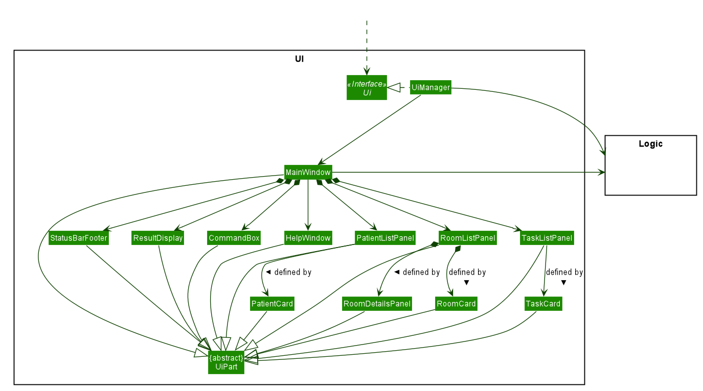
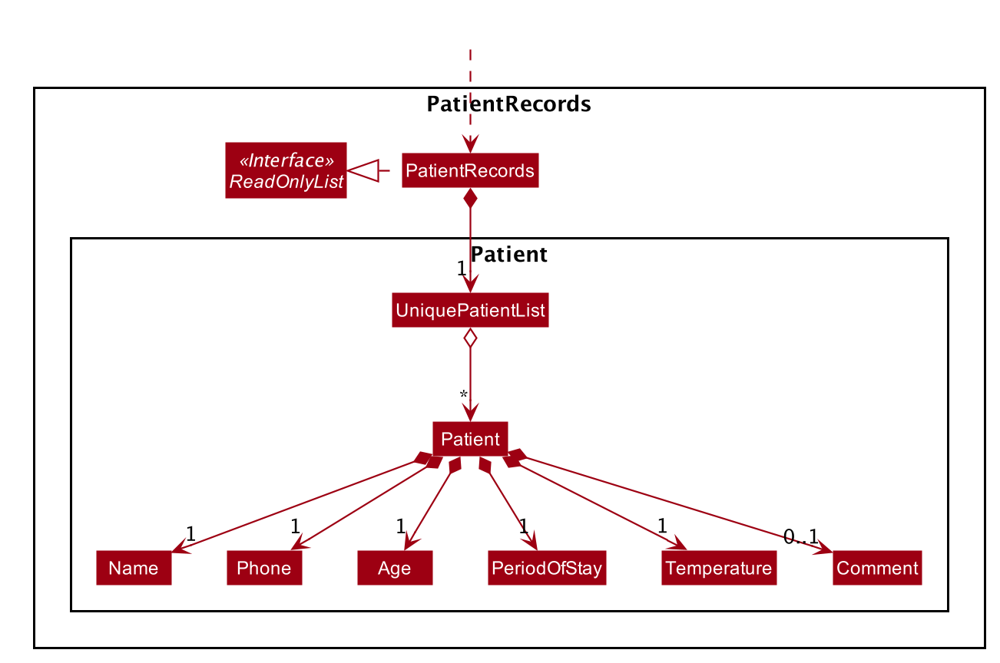
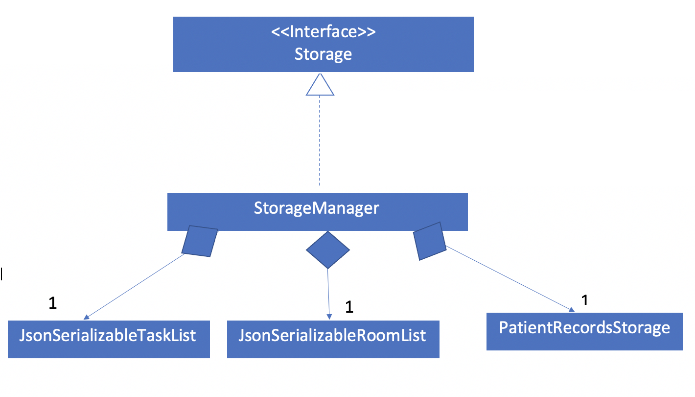
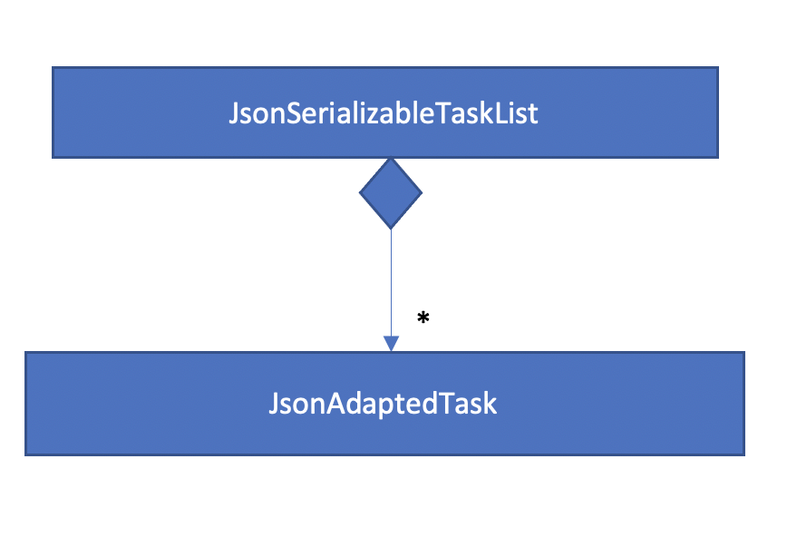
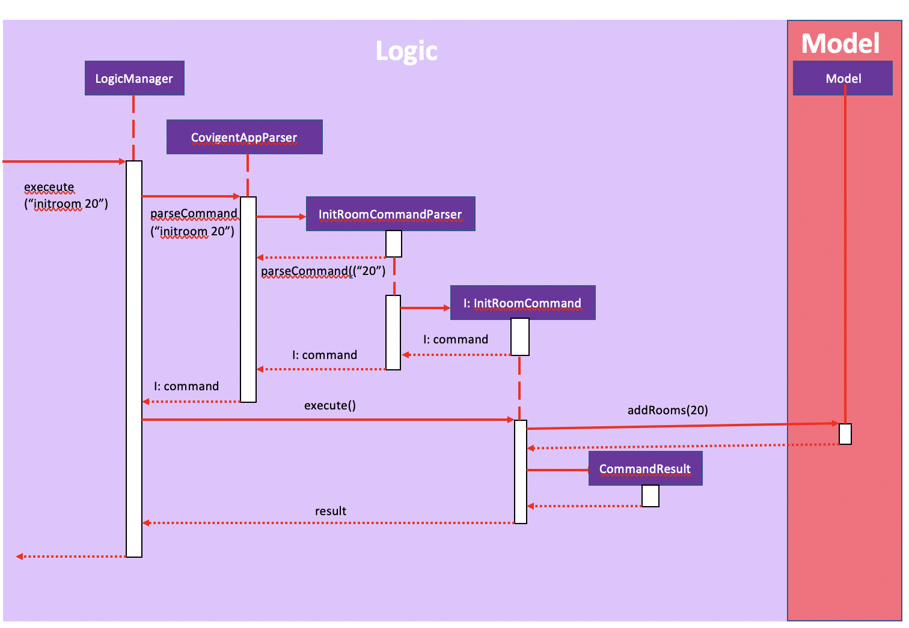
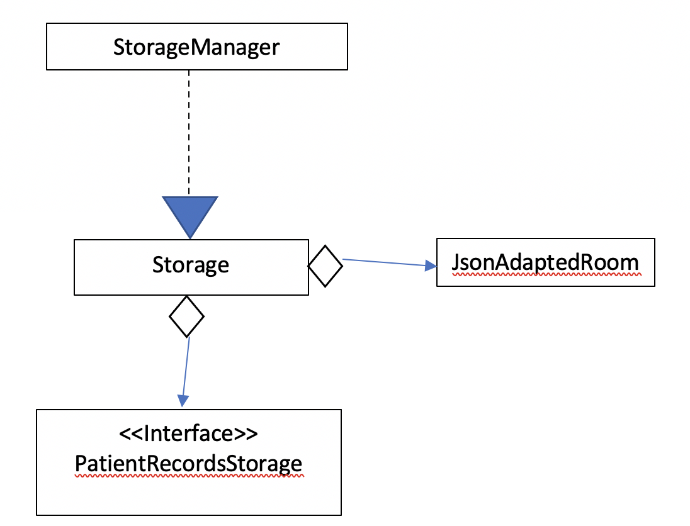

# Covigent - Developer Guide
1. [Preface](#1-preface)
2. [Setting Up](#2-setting-up)
3. [Design](#3-design) 
    3.1  [Architecture: High Level View](#31-architecture-high-level-view) 
    3.2  [UI Component](#32-ui-component) 
    3.3  [Logic Component](#33-logic-component) 
    3.4  [Model Component](#34-model-component) 
    3.5  [Storage Component](#35-storage-component) 
    3.6  [Commons Component](#36-commons-component) 
 4. [Implementation](#4-implementation) 
    4.1  [Patient Feature](#41-patient-feature) 
        4.1.1 [Add Patient](#411-add-patient) 
        4.1.2 [List Patient](#412-list-patient) 
        4.1.3 [Edit Patient](#413-edit-patient) 
        4.1.4 [Delete Patient](#414-delete-patient) 
        4.1.5 [Search Patient](#415-search-patient) 
    4.2  [Room Feature](#42-room-feature) 
        4.2.1 [Initialise Room](#421-initialise-room) 
        4.2.2 [List Room](#422-list-room) 
        4.2.3 [Edit Room](#423-edit-room) 
        4.2.4 [Search Room](#424-search-room) 
        4.2.5 [Find Empty Room](#425-find-empty-room) 
    4.3  [Task Feature](#43-task-feature) 
        4.3.1 [Add Task](#431-add-task) 
        4.3.2 [List Task](#432-list-task) 
        4.3.3 [Delete Task](#433-delete-task) 
        4.3.4 [Edit Task](#434-edit-task) 
        4.3.5 [Search Task](#435-search-task) 
    4.4  [Storage Feature(KIV)] 
    4.5  [Logging Feature(KIV)] 
 5. [Documentation](#5-documentation) 
 6. [Testing(KIV)] 
 7. [Appendix](#7-appendix) 
    A1. [Product Scope](#a1-product-scope) 
    A2. [User Stories](#a2-user-stories) 
    A3. [Use Cases](#a3-use-cases) 
    A4. [Non-Functional Requirements](#a4-non-functional-requirements) 
    A5. [Glossary](#a5-glossary) 

--------------------------------------------------------------------------------------------------------------------
## 1. Preface

The Covigent Developer Guide is designed to illustrate and identify the high level architecture systems used to design and implement the Covigent application. The document contains an overall view of the system hierarchy, logical views of the system components, and a process view of the system’s communication. The link to the GitHub repository can be found [here](https://github.com/AY2021S1-CS2103T-W12-1/tp).

 _Written by: Yun Qing_

--------------------------------------------------------------------------------------------------------------------

## 2. Setting Up

Refer to the guide [_Setting up and getting started_](SettingUp.md).

--------------------------------------------------------------------------------------------------------------------

## 3. Design

### 3.1 Architecture: High Level View

The ***Architecture Diagram*** given above explains the high-level design of the App. Given below is a quick overview of each component.

:bulb: **Tip:** The `.puml` files used to create diagrams in this document can be found in the [diagrams](https://github.com/se-edu/addressbook-level3/tree/master/docs/diagrams/) folder. Refer to the [_PlantUML Tutorial_ at se-edu/guides](https://se-education.org/guides/tutorials/plantUml.html) to learn how to create and edit diagrams.

**`Main`** has two classes called [`Main`](https://github.com/se-edu/addressbook-level3/tree/master/src/main/java/seedu/address/Main.java) and [`MainApp`](https://github.com/se-edu/addressbook-level3/tree/master/src/main/java/seedu/address/MainApp.java). It is responsible for,
* At app launch: Initializes the components in the correct sequence, and connects them up with each other.
* At shut down: Shuts down the components and invokes cleanup methods where necessary.

[**`Commons`**](#common-classes) represents a collection of classes used by multiple other components.

The rest of the App consists of four components.

* [**`UI`**](#ui-component): The UI of the App.
* [**`Logic`**](#logic-component): The command executor.
* [**`Model`**](#model-component): Holds the data of the App in memory.
* [**`Storage`**](#storage-component): Reads data from, and writes data to, the hard disk.

Each of the four components,

* defines its *API* in an `interface` with the same name as the Component.
* exposes its functionality using a concrete `{Component Name}Manager` class (which implements the corresponding API `interface` mentioned in the previous point.

For example, the `Logic` component (see the class diagram given below) defines its API in the `Logic.java` interface and exposes its functionality using the `LogicManager.java` class which implements the `Logic` interface.

**How the architecture components interact with each other**

The *Sequence Diagram* below shows how the components interact with each other for the scenario where the user issues the command `delete 1`.

The sections below give more details of each component.

### 3.2 UI Component

The UI consists of a `MainWindow` that is made up of parts inclduing `CommandBox`, `ResultDisplay`, `PatientListPanel`, `RoomListPanel` , `RoomDetailPanel` `TaskListPanel`, `StatusBarFooter`. These, including the `MainWindow`, inherit from the abstract `UiPart` class.

The `UI` component uses JavaFx UI framework. The layout of these UI parts are defined in matching `.fxml` files that are in the `src/main/resources/view` folder. For example, the layout of the [`MainWindow`](https://github.com/se-edu/addressbook-level3/tree/master/src/main/java/seedu/address/ui/MainWindow.java) is specified in [`MainWindow.fxml`](https://github.com/se-edu/addressbook-level3/tree/master/src/main/resources/view/MainWindow.fxml)

The `UI` component,

* Executes user commands using the `Logic` component.
* Listens for changes to `Model` data so that the UI can be updated with the modified data.

Below is a class diagram for `Ui`

**API** :
[`Ui.java`](https://github.com/se-edu/addressbook-level3/tree/master/src/main/java/seedu/address/ui/Ui.java)

_Written by: WaiLok_

### 3.3 Logic Component

The `Logic` component is the "brains" of Covigent. While the `Ui` defines the GUI and `Model` defines in-memory data,
the `Logic` component does most of the heavy-lifting in terms of deciding what to change within the `Model` and what to
return to the `Ui`. 
The diagram below shows the structure of the `Logic` component.

*Figure 4. Structure of the Logic Component*

**API** :
[`Logic.java`](https://github.com/se-edu/addressbook-level3/tree/master/src/main/java/seedu/address/logic/Logic.java)

1. Once a user input is obtained from the GUI, `Logic` uses the `CovigentAppParser` class to parse the users' commands
and return a `Command` object.
1. The `Command` is executed by `LogicManager`.
1. Depending on the command input by the user, it may mutate the `Model`, such as adding a new patient, room or task.
1. The result of the command execution is encapsulated as a `CommandResult` that is returned to the `Ui`.
1. These `CommandResults` can instruct the `Ui` to perform certain actions, such as displaying help or error messages to the user.

Shown below is the Sequence Diagram within the `Logic` component for the API call: `execute("delete alex)`.

*Figure 5. Interactions inside the `Logic` Component for the `delete alex` Command*

:information_source: **Note:** The lifeline for `DeleteCommandParser` should end at the destroy marker (X) but due to a limitation of PlantUML, the lifeline reaches the end of diagram.

 
_Written by: Ming De_

### 3.4 Model Component

The `Model` API acts as a facade that handles interaction between different kinds of data in Covigent. These data include user's preferences, patient records, room list and task list. The `Model` API exposes the methods that allow the logic component to utilise to perform retrieving and updating of data.

The `Model` component,
  * stores a `UserPref` object that represents the user’s preferences.
  * stores a `PatientRecords` object that stores the data of all the patients.
  * stores a `RoomList` object that stores the data of all the rooms.
  * stores a `TaskList` object that stores the data of all the tasks.
  * exposes unmodifiable `ObservableList<Patient>`, `ObservableList<Room>` and `ObservableList<Task>` which can be observed. This means that the UI can be bound to the lists so that the UI automatically updates when data in the lists changes.
  * does not depend on any of the three components.

The concrete class `ModelManager` implements `Model` interface and manages the data for Covigent. `ModelManager` contains `UserPrefs`, `PatientRecords`, `RoomList` and `TaskList`. These classes manage the data related to their specific features.

Below is a class diagram for `ModelManager`.

  
_Figure XX. Class Diagram for Model Component_

**API** : [`Model.java`](https://github.com/se-edu/addressbook-level3/tree/master/src/main/java/seedu/address/model/Model.java)

The breakdown for each type of data in `ModelManager`, which include `PatientRecords`, `RoomList` and `TaskList`, can be found below.

The `PatientRecords` class is in charge of maintaining the data of the patients and in ensuring the uniqueness of patients according to their names. Below is a class diagram for `PatientRecords`.

  
_Figure XX. Class Diagram for PatientRecords_

The `TaskList` class is in charge of maintaining the data of all the tasks in Covigent. The class diagram for `TaskList` is shown below.

//to insert class diagram for task list.
_Figure XX. Class Diagram for TaskList_

The `RoomList` class is in charge of maintaining the data in the rooms. It incorporates data from both `PatientRecords` and `TaskList` as each room stores the data of the patient who resides in the room and the tasklist meant for the room. The class diagram for `RoomList` is shown below.

//to insert class diagram for room list.

_Figure XX. Class Diagram for RoomList_

 _Written by: Yun Qing_

### 3.5 Storage Component

**API** : [`Storage.java`](https://github.com/AY2021S1-CS2103T-W12-1/tp/blob/master/src/main/java/seedu/address/storage/Storage.java)

The Storage API is responsible for reading and writing data in Json format. This allows the application to remember the information in a readable format of json when the user closes the application. The Storage API acts as a façade that handles interaction regarding storage related components.

The Storage component,
 * Can save Room and Patient Objects in json format
 * Reads Room and Patient Objects in json format

 
 Fig of `JsonSerializableRoomList`
 
 Fig of `JsonSerializablePatientList`
 
 Fig of `JsonSerializableTaskList`
  _Written by: Noorul Azlina_

### 3.6 Commons Component

Classes used by multiple components are in the `seedu.addressbook.commons` package.

--------------------------------------------------------------------------------------------------------------------

## 4. Implementation

This section describes some noteworthy details on how certain features are implemented.

### 4.1 Patient Feature
The patient feature utilises the `CovigentAppParser` class to parse the user command input into different command types and
validates the input. Patients are then added into the `UniquePatientList#internalList` observable list.

The feature comprises of five commands namely,
* [`AddPatientCommand`](#411-add-patient) - Adding patients
* [`ListPatientCommand`](#412-list-patient) - Listing all the patients
* [`EditPatientCommand`](#413-edit-patient) - Editing patients
* [`DeletePatientCommand`](#414-delete-patient) - Deleting patients
* [`SearchPatientCommand`](#415-search-patient) - Searching for patients

#### 4.1.1 Add Patient

#### 4.1.2 List Patient

#### 4.1.3 Edit Patient

**Implementation**
The following is a detailed explanation of the operations that `EditPatientCommand` performs.

**Step 1.** The `EditPatientCommand#execute(Model model)` method is executed and it checks if the `Name` defined when instantiating
`EditPatientCommand(Name patientToBeEdited, EditPatientDescriptor editPatientDescriptor)` is valid. The `EditPatientDescriptor` holds
the edited information of the `Patient`.

**Step 2.** A new `Patient` with the updated values will be created and the patient is then searched through `UniquePatientList#internalList`
using the `Model#hasPatient(Patient patient)` method to check if the patient already exists. If the patient already exists,
`CommandException` will be thrown with an error message.

**Step 3.** The newly created `Patient` will replace the existing patient object through the `Model#setPatient(Patient target, Patient editedPatient)`
method.

**Step 4.** A success message with the edited patient will be appended with the `EditPatientCommand#MESSAGE_EDIT_PATIENT_SUCCESS` constant. A
new `CommandResult` will be returned with the message.

#### 4.1.4 Delete Patient

#### 4.1.5 Search Patient

### 4.2 Room Feature

#### Proposed Implementation

The proposed room feature is facilitated by `RoomList`. It extends `ReadOnlyRoomList` which reads the Room information Json file, stored internally as an `addressBookStateList` and `currentStatePointer`. Additionally, it implements the following operations:
* `RoomList#addRooms(int num)` — adds the number of which are said to add together and retains infromation previously stored in each room
* `RoomList#containsRoom(Room toCehck)` - checks whether the given room exists
* `RoomList#addTaskToRoom(Task task, Room room)` — adds task to the room given.
* `RoomList#deletesTaskFromRoom(Task task, Room romm)` — deletes task from room given
* `RoomList#setTaskToRoom(target, editedTask, room)` - sets task to room given
* `RoomList#clearRoom(Name patientName)` - removes patient from the room
* `RoomList#setSingleRoom(Room target, Room editedRoom)` - sets the editedRoom to the target room

These operations are exposed in the `Model` interface as `Model#addRooms(int num)`, `Model#hasroom(Room room)`, `Model#addTaskToRoom(Task task, Room room)`, `Model#deleteTaskFromRoom(Task task, Room room)`, `Model#setTaskToRoom(Task target, Task editedTask, Room room)`, `Model#clearRoom(Name patientName)` and `Model#setSingleRoom(Room target, Room editedRoom)` respectivley.

### Feature details

* `initRoomCommand` - Initializes the number of rooms in **Covigent** app.
* `listRoomCommand` - Lists all the rooms in **Covigent** app.
* `editRoomCommand` - Allocates a patient to a room or edits an existing room in the application.
* `searchRoomCommand` - Searches for the room with the specified room number.
* `findEmptyRoomCommand` - Finds an empty room with the lowest room number.

We will illustrate the progress of one of the above commands for simplicity.

The activity diagram below illustrates the `findEmptyRoom`.

 The Sequence Diagram for `initRooms` is shown below.
 

 _Written By: Noorul Azlina_

#### 4.2.1 Initialise Room

#### 4.2.2 List Room

#### 4.2.3 Edit Room

**Implementation**
The following is a detailed explanation of the operations that `EditRoomCommand` performs.

**Step 1.** The `EditRoomCommand#execute(Model model)` method is executed and it checks if the `Integer` defined when instantiating
`EditRoomCommand(Integer roomNumberToEdit, EditRoomDescriptor editRoomDescriptor)` is valid. This check is done through the `Model#checkifRoomPresent` method.
 The `EditRoomDescriptor` holds the edited information of the `Room`.

**Step 2.** A new `Room` with the updated values will be created and the room is then searched through `RoomList#internalList`
using the `Model#hasRoom(Room room)` method to check if a room with the same room number exists. If it already exists,
`CommandException` will be thrown with an error message.

**Step 3.** The newly created `Room` will replace the existing room object through the `Model#setSingleRoom(Room target, Room editedRoom)`
method.

**Step 4.** A success message with the edited room will be appended with the `EditRoomCommand#MESSAGE_EDIT_ROOM_SUCCESS` constant. A
new `CommandResult` will be returned with the message.

#### 4.2.4 Search Room

#### 4.2.5 Find Empty Room

### 4.3 Task Feature

#### 4.3.1 Add Task

#### 4.3.2 List Task

#### 4.3.3 Delete Task

#### 4.3.4 Edit Task

#### 4.3.5 Search Task

##BELOW UNDO AND REDO TO BE DELETED, CAN REFERENCE FOR NOW FIRST

### \[Proposed\] Undo/redo feature

#### Proposed Implementation

The proposed undo/redo mechanism is facilitated by `VersionedAddressBook`. It extends `AddressBook` with an undo/redo history, stored internally as an `addressBookStateList` and `currentStatePointer`. Additionally, it implements the following operations:

* `VersionedAddressBook#commit()` — Saves the current address book state in its history.
* `VersionedAddressBook#undo()` — Restores the previous address book state from its history.
* `VersionedAddressBook#redo()` — Restores a previously undone address book state from its history.

These operations are exposed in the `Model` interface as `Model#commitAddressBook()`, `Model#undoAddressBook()` and `Model#redoAddressBook()` respectively.

Given below is an example usage scenario and how the undo/redo mechanism behaves at each step.

Step 1. The user launches the application for the first time. The `VersionedAddressBook` will be initialized with the initial address book state, and the `currentStatePointer` pointing to that single address book state.

Step 2. The user executes `delete 5` command to delete the 5th person in the address book. The `delete` command calls `Model#commitAddressBook()`, causing the modified state of the address book after the `delete 5` command executes to be saved in the `addressBookStateList`, and the `currentStatePointer` is shifted to the newly inserted address book state.

Step 3. The user executes `add n/David …​` to add a new person. The `add` command also calls `Model#commitAddressBook()`, causing another modified address book state to be saved into the `addressBookStateList`.

:information_source: **Note:** If a command fails its execution, it will not call `Model#commitAddressBook()`, so the address book state will not be saved into the `addressBookStateList`.

Step 4. The user now decides that adding the person was a mistake, and decides to undo that action by executing the `undo` command. The `undo` command will call `Model#undoAddressBook()`, which will shift the `currentStatePointer` once to the left, pointing it to the previous address book state, and restores the address book to that state.

:information_source: **Note:** If the `currentStatePointer` is at index 0, pointing to the initial AddressBook state, then there are no previous AddressBook states to restore. The `undo` command uses `Model#canUndoAddressBook()` to check if this is the case. If so, it will return an error to the user rather
than attempting to perform the undo.

The following sequence diagram shows how the undo operation works:

:information_source: **Note:** The lifeline for `UndoCommand` should end at the destroy marker (X) but due to a limitation of PlantUML, the lifeline reaches the end of diagram.

The `redo` command does the opposite — it calls `Model#redoAddressBook()`, which shifts the `currentStatePointer` once to the right, pointing to the previously undone state, and restores the address book to that state.

:information_source: **Note:** If the `currentStatePointer` is at index `addressBookStateList.size() - 1`, pointing to the latest address book state, then there are no undone AddressBook states to restore. The `redo` command uses `Model#canRedoAddressBook()` to check if this is the case. If so, it will return an error to the user rather than attempting to perform the redo.

Step 5. The user then decides to execute the command `list`. Commands that do not modify the address book, such as `list`, will usually not call `Model#commitAddressBook()`, `Model#undoAddressBook()` or `Model#redoAddressBook()`. Thus, the `addressBookStateList` remains unchanged.

Step 6. The user executes `clear`, which calls `Model#commitAddressBook()`. Since the `currentStatePointer` is not pointing at the end of the `addressBookStateList`, all address book states after the `currentStatePointer` will be purged. Reason: It no longer makes sense to redo the `add n/David …​` command. This is the behavior that most modern desktop applications follow.

The following activity diagram summarizes what happens when a user executes a new command:

#### Design consideration:

##### Aspect: How undo & redo executes

* **Alternative 1 (current choice):** Saves the entire address book.
  * Pros: Easy to implement.
  * Cons: May have performance issues in terms of memory usage.

* **Alternative 2:** Individual command knows how to undo/redo by
  itself.
  * Pros: Will use less memory (e.g. for `delete`, just save the person being deleted).
  * Cons: We must ensure that the implementation of each individual command are correct.

_{more aspects and alternatives to be added}_

### \[Proposed\] Data archiving

_{Explain here how the data archiving feature will be implemented}_

--------------------------------------------------------------------------------------------------------------------

## 5. Documentation

* [Documentation guide](Documentation.md)
* [Testing guide](Testing.md)
* [Logging guide](Logging.md)
* [Configuration guide](Configuration.md)
* [DevOps guide](DevOps.md)

--------------------------------------------------------------------------------------------------------------------

## 6. Testing

--------------------------------------------------------------------------------------------------------------------

## 7. Appendix

### A1. Product scope

**Target user profile**:
* Needs to manage a significant number of patients and their tasks
* Needs to manage a significant number of rooms
* Wants to keep track of patients and their tasks efficiently
* Wants to look up patients, rooms and tasks details quickly
* Prefers desktop apps over other types
* Prefers typing to mouse interactions
* Prefers all information to be available at one place
* Can type fast
* Is reasonably comfortable using Command Line Interface (CLI) apps

**Value proposition**:
* Covigent is a handy tool for quarantine facility managers to manage the rooms and patients in the quarantine facility with increased productivity.
* Covigent stores and retrieves information faster than a typical mouse/GUI driven app.

### A2. User stories

Priorities: High (must have) - `* * *`, Medium (nice to have) - `* *`, Low (unlikely to have) - `*`

| Priority | As a …​                                    | I want to …​                     | So that I can…​                                                        |
| -------- | ------------------------------------------ | ------------------------------ | ---------------------------------------------------------------------- |
| `* * *`  | staff of a quarantine facility       | key in new patient information | better serve them                |
| `* * *`  | staff of a quarantine facility       | edit patient information       | update his/her health status                                                                  |
| `* * *`  | staff of a quarantine facility       | key in new task information    | keep track of the details of the tasks that I must complete                                  |
| `* * *`  | staff of a quarantine facility       | view which rooms are empty     |allocate patients to them |
| `* *`    | staff of the quarantine facility     | indicate that I have completed the task in the room | let other staff know that they no longer have to handle them
| `* *`      | staff of a quarantine facility | find out all the outstanding tasks left in each room |  serve the quarantined individuals better                                               |
| `* *` | staff of a quarantine facility | quickly search through patient information | find the patients that match my criteria

*{More to be added}*

### A3. Use cases

(For all use cases below, the **System** is`Covigent` and the **Actor** is the `user`, unless specified otherwise)

**Use case: Allocates a patient to a room**

**MSS**

1. User requests to add a patient into the system.
2. System adds the patient.
3. User requests to allocate the patient to a specified room.
4. System adds the patient to the specified room number.

    Use case ends.

**Extensions**
* 4a. System realises that the specified room is not empty.

   * 4a1. System displays an error message.

  Use case ends.

**Use case: Edit a patient**

**MSS**

1. User requests to edit a patient.
2. User inputs the new information about the patient.
3. System edits the patient information to the new information.
4. System saves the new patient information.

    Use case ends.

**Extensions**
* 2a. System realises that no optional fields are inputted.

   * 2a1. System displays an error message.

  Use case ends.

**Use case: Search a patient**

**MSS**

1. User requests to search patients with a criteria.
2. System search the patients with the inputted criteria.
3. System shows the search results.

    Use case ends.

**Extensions**
* 2a. System realises that no such patient is recorded

   * 2a1. System displays an error message.

  Use case ends.

### A4. Non-Functional Requirements

1.  Should work on any _mainstream OS_ as long as it has Java `11` or above installed.
2.  Should be able to hold up to 1000 persons without a noticeable sluggishness in performance for typical usage.
3.  A user with above average typing speed for regular English text (i.e. not code, not system admin commands) should be able to accomplish most of the tasks faster using commands than using the mouse.
4. Should work even without internet connection.
5. Should respond to commands in 3 seconds.

*{More to be added}*

### A5. Glossary

* **Mainstream OS**: Windows, Linux, Unix, OS-X
* **Patient**: An individual residing in the quarantine facility
* **Task**: Task is to be completed by staff of the quarantine facility

--------------------------------------------------------------------------------------------------------------------

## **Appendix: Instructions for manual testing**

Given below are instructions to test the app manually.

:information_source: **Note:** These instructions only provide a starting point for testers to work on;
testers are expected to do more *exploratory* testing.

### Launch and shutdown

1. Initial launch

   1. Download the jar file and copy into an empty folder

   1. Double-click the jar file Expected: Shows the GUI with a set of sample contacts. The window size may not be optimum.

1. Saving window preferences

   1. Resize the window to an optimum size. Move the window to a different location. Close the window.

   1. Re-launch the app by double-clicking the jar file. 
       Expected: The most recent window size and location is retained.

1. _{ more test cases …​ }_

### Deleting a person

1. Deleting a person while all persons are being shown

   1. Prerequisites: List all persons using the `list` command. Multiple persons in the list.

   1. Test case: `delete 1` 
      Expected: First contact is deleted from the list. Details of the deleted contact shown in the status message. Timestamp in the status bar is updated.

   1. Test case: `delete 0` 
      Expected: No person is deleted. Error details shown in the status message. Status bar remains the same.

   1. Other incorrect delete commands to try: `delete`, `delete x`, `...` (where x is larger than the list size) 
      Expected: Similar to previous.

1. _{ more test cases …​ }_

### Saving data

1. Dealing with missing/corrupted data files

   1. _{explain how to simulate a missing/corrupted file, and the expected behavior}_

1. _{ more test cases …​ }_

### 3.5 Storage component

The Storage API is responsible for reading and writing data in Json format. This allows the application to remember the information in a readable format of json when the user closes the application. The Storage API acts as a façade that handles interaction regarding storage related components.

The concrete class StorageManager implements Storage and manages the storage for Room and Patient.

Below is a class diagram of StorageManager.

