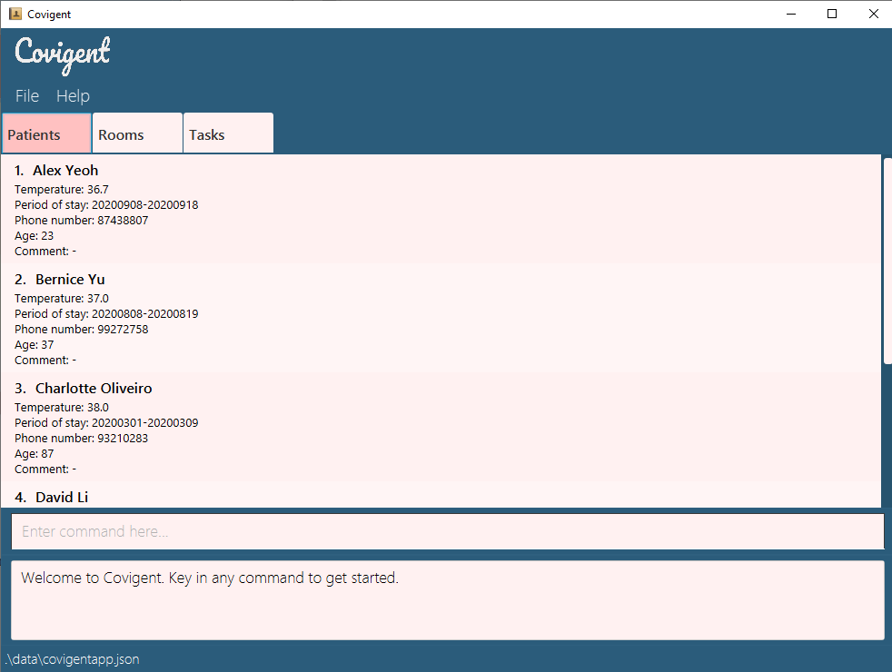

### Covigent

Covigent is a desktop app for managing information of quarantined individuals and the tasks to be done by staff of the quarantine facilities. It is optimized for use via a Command Line Interface (CLI) while still having the benefits of a Graphical User Interface (GUI). If you type fast, Covigent can improve your efficiency in managing your patients and tasks instead of using traditional GUI apps.

Check out our [User Guide](https://ay2021s1-cs2103t-w12-1.github.io/tp/UserGuide.html) to get started.

This project is based on the AddressBook-Level3 project created by the [SE-EDU initiative](https://se-education.org).
