1. [Introduction](#1-introduction)
1. [About this Guide](#2-about-this-guide) 
   2.1. [What's in Covigent](#21-what-is-in-covigent) 
   2.2. [Formatting in the Guide](#22-formatting-in-the-guide) 
1. [Getting Started](#3-getting-started) 
   3.1. [Setting Up](#31-setting-up) 
   3.2. [Parts of the Graphical User Interface](#32-parts-of-the-graphical-user-interface) 
         3.2.1. [Patients Tab](#321-patients-tab) 
         3.2.2. [Rooms Tab](#322-rooms-tab) 
         3.2.3. [Tasks Tab](#323-tasks-tab) 
   3.3. [Tutorial on How to Use Covigent](#33-tutorial-on-how-to-use-covigent) 
1. [Glossary](#4-glossary)
1. [Features](#5-features) 
    5.1. [Command Format](#51-command-format) 
    5.2. [Patient](#52-patient) 
          5.2.1. [Add a Patient: `addpatient`](#521-add-a-patient-addpatient) 
          5.2.2  [Delete a Patient: `deletepatient`](#522-delete-a-patient-deletepatient) 
          5.2.3  [Edit Patient Details: `editpatient`](#523-edit-patient-details-editpatient) 
          5.2.4  [Search Patients by Information: `searchpatient`](#524-search-patients-by-information-searchpatient) 
          5.2.5  [List all Patients: `listpatient`](#525-list-all-patients-listpatient) 
    5.3. [Room](#53-room) 
          5.3.1  [Initialise Rooms in Hotel: `initroom`](#531-initialise-rooms-in-hotel-initroom) 
          5.3.2  [Allocate Patient to Room: `allocateroom`](#532-allocate-patient-to-room-allocateroom) 
          5.3.3  [Search by Room Number: `searchroom`](#533-search-by-room-number-searchroom) 
          5.3.4  [Search for Room with Patient: `searchroom`](#534-search-for-room-with-patient-searchroom) 
          5.3.5  [List the Current Rooms: `listroom`](#535-list-the-current-rooms-listroom) 
          5.3.6  [Find the first free room: `findemptyroom`](#536-find-the-first-free-room-findemptyroom) 
    5.4 [Task](#54-task) 
          5.4.1  [Add a Task to a Room: `addtask`](#541-add-a-task-to-a-room-addtask) 
          5.4.2  [Delete a Task from a Room: `deletetask`](#542-delete-a-task-from-a-room-deletetask) 
          5.4.3  [Edit Task Description or Due Date: `edittask`](#543-edit-task-description-or-due-date-edittask) 
          5.4.4  [Remove Due Date from a Task: `edittask`](#544-remove-due-date-from-a-task-edittask) 
          5.4.5  [Search all Tasks before the Given Date: `searchtask`](#545-search-tasks-before-a-given-date-searchtask) 
          5.4.6  [List all Tasks: `listtask`](#546-list-all-tasks-listtask) 
    5.5  [View Help: `help`](#55-view-help-help) 
    5.6  [Exit Covigent: `exit`](#56-exit-covigent-exit) 
    5.7  [Autosave](#57-autosave) 
1. [Command Summary](#6-command-summary) 
   6.1 [Patient](#61-patient) 
   6.2 [Room](#62-room) 
   6.3 [Task](#63-task) 
   6.4 [General](#64-general) 
1. [FAQ](#7-faq)

--------------------------------------------------------------------------------------------------------------------

## 1. Introduction

Welcome to User Guide for our application, Covigent! Has Covid-19 hit your boutique hotel hard and left you scrambling to search for an application
that can ease your transition from a boutique hotel to a quarantine facility? Your search ends here! 

Covigent is a desktop management application to ease boutique hotels' transitions into quarantine facilities. Covigent aims to help boutique hotel managers
keep track of the information of quarantined individuals and the tasks to be done by their staff. The main features include: 

      1. Managing quarantined individuals information - Period of Stay, temperature, phone number etc. 
      2. Managing the rooms of the quarantine facility - Allocate quarantined individuals to rooms, search for a room, etc. 
      3. Managing the tasks to be done by each room - Add a task to a room, editing a task to the room, etc. 

As an application optimized for use with a keyboard rather than the mouse, you operate Covigent mainly by 
typing commands into a Command Box. If you can type quickly, Covigent can improve your efficiency in managing your patients and tasks instead of using traditional apps.
But wait! Don't forget our beautiful Graphical User Interface (GUI) too!
With our easy to navigate GUI, it has served it's purpose well as an interface that facilitates interaction with our application
through graphical icons. 

Getting interested? Jump to [Section 3, "Getting Started"](#3-getting-started) to get started.

This is what Covigent looks like:

    
     
    <i>Figure 1. The Graphical User Interface for Covigent</i>

_Written by: Ming De_

--------------------------------------------------------------------------------------------------------------------

## 2. About this Guide

This guide gives you an overview of the features in Covigent and shows you how to get started using Covigent. 
Choose a link in the [Feature](#5-features) section to get a step-by-step instruction, and understand how to use Covigent. 

### 2.1 What is in Covigent

In our patient features, you can [add](#521-add-a-patient-addpatient), [delete](#522-delete-a-patient-deletepatient),
[edit](#523-edit-patient-details-editpatient), [search](#524-search-patients-by-information-searchpatient) for a patient,
or you can [list](#525-list-all-patients-listpatient) out all the patients in Covigent.

Moving on to our room features, you can [initialise](#531-initialise-rooms-in-hotel-initroom), [allocate](#532-allocate-patient-to-room-allocateroom),
[search](#533-search-by-room-number-searchroom) and [find](#536-find-the-first-free-room-findemptyroom) the rooms which you need.
If you want an overview of the rooms, you can [list](#535-list-the-current-rooms-listroom) out all the rooms in Covigent.

Next, for our task features, you can [add](#541-add-a-task-to-a-room-addtask), [delete](#542-delete-a-task-from-a-room-deletetask), 
[edit](#543-edit-task-description-or-due-date-edittask) and [search](#545-search-tasks-before-a-given-date-searchtask) for a task
and see it be displayed on our amazing GUI. If you want to see all the tasks, you can [list](#546-list-all-tasks-listtask) out all the tasks in Covigent.

Lastly, our miscellaneous features will ensure that you can seek [help](#55-view-help-help) if you are lost, or 
[exit](#56-exit-covigent-exit) the program when you are done with it. Our app also has an [autosave](#57-autosave) feature that allows you to save the data without manual command.

### 2.2 Formatting in the Guide

Note the following formatting used in this document:
* 
This symbol indicates important information.

*  
A grey highlight (called a mark-up) indicates a keyword. It denotes either i) a field or command that can be typed into the Command Box and executed by Covigent; or ii) the name of a file.

* 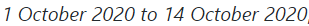 
Italicised words indicate text that is displayed on the Graphical User Interface.

* 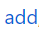
A light blue font color indicates that this is a Hyperlink that you can click on
and be transferred to the corresponding section in Covigent.

_Written by: Wai Lok_

--------------------------------------------------------------------------------------------------------------------

## 3. Getting Started

If you are tired of lengthy and problematic installation processes, Covigent is perfect for you.
The setup is minimal and can be completed in 4 simple steps. Follow the instructions below to try it out!

### 3.1 Setting Up

The following steps to set up Covigent are applicable to Windows, Mac OS X, and Linux.

1. Install Java 11 or a later version. The latest version of Java can be found [here](https://java.com/en/download/).

1. Download the latest version of Covigent from [here](https://github.com/AY2021S1-CS2103T-W12-1/tp/releases). To do so, look for the file `covigent.jar` and click on it.
Please refer to Figure 2 if you require assistance with locating the file. Figure 2 shows how to download version 1.3 of Covigent. `covigent.jar` has been highlighted in red for your convenience.

    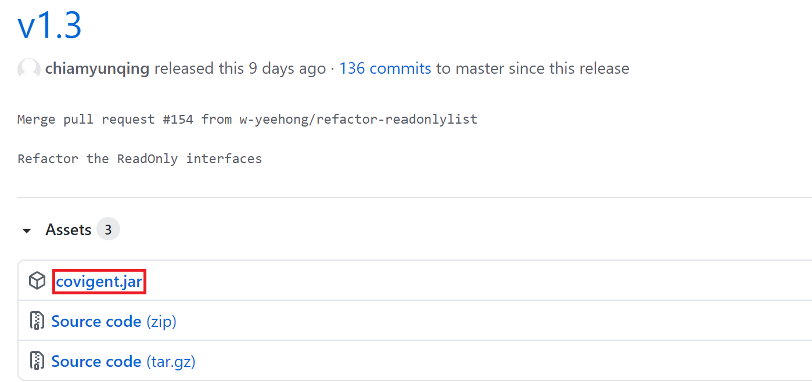
     
    <i>Figure 2. How to Download Covigent</i>

3. You may move `covigent.jar` to any other folder. Your save data and preferences for Covigent will be saved to the same folder.

4. Double-click on `covigent.jar` to start Covigent. Here is what you will see if everything goes right:

    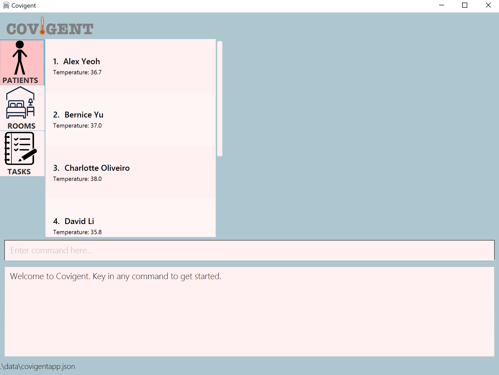
     
    <i>Figure 3. Covigent after Starting Up</i>

In case there are any problems during setup, please refer to [Section 7, "FAQ"](#7-faq) for instructions to resolve them.

### 3.2 Parts of the Graphical User Interface

The user interface of Covigent comprises 3 main tabs: Patients, Rooms, and Tasks. The tabs respectively display information on the
quarantined individuals, the rooms in the quarantine facility, and the tasks assigned to the rooms. A tab turns a deeper shade of pink
when you click on it to indicate that you are currently in the tab. For example, Figure 4 shows how the Tasks tab changes colours when you click on it.

    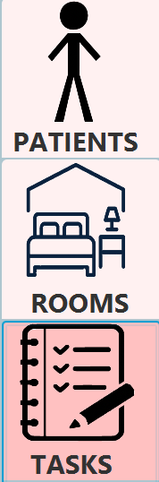
     
    <i>Figure 4. User Interface of Covigent when a Tab is Clicked</i>

#### 3.2.1 Patients Tab

The main purpose of the Patients tab is to display information about the quarantined individuals.

When you first start Covigent, you will find yourself in the Patients tab. You may notice that there is already some sample data for quarantined
individuals. There is no need to worry! The data can be edited or deleted to suit your needs later. If you urgently need to change the data,
please proceed to [Section 5.2.3, "Edit Patient Details"](#523-edit-patient-details-editpatient) for the relevant instructions.

Using the Patients tab is easy. Click on any of the quarantined individuals. This will highlight that individual and display her information.
Figure 5 illustrates what happens when you click on a quarantined individual _David Li_. Observe that his details appear on the right of the
user interface, in the Details Panel.

    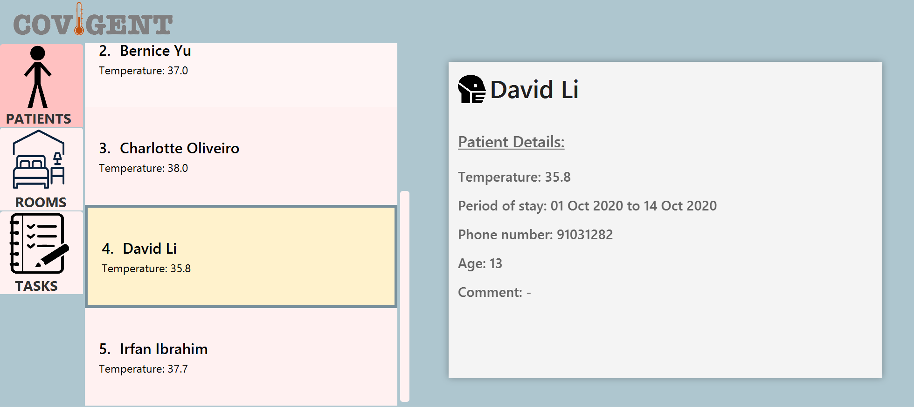
     
    <i>Figure 5. Highlighted Individual in Patients Tab</i>

#### 3.2.2 Rooms Tab

The main purpose of the Rooms tab is to display information about the rooms in the quarantine facility. Each room contains 1 quarantined
individual and multiple tasks.

When you first start Covigent and click into the Rooms tab, it will be empty. Rest assured that this is normal. Once you learn how to add rooms
to Covigent, the Rooms tab will be populated in no time. You may refer to [Section 3.3, "Tutorial on How to Use Covigent"](#33-tutorial-on-how-to-use-covigent)
for step-by-step guidance or [Section 5.3.1, "Initialise Rooms in Hotel"](#531-initialise-rooms-in-hotel-initroom) if you prefer a more hands-on approach.

Using the Rooms tab is easy. Click on any of the rooms. This will highlight that room and display the quarantined individual and tasks allocated
to the room. Figure 6 shows what happens when you click on _Room #2_. The details of the quarantined individual _Alex Yeoh_ and task _Sanitise the room_ 
are displayed on the right of the user interface, in the Details Panel.

    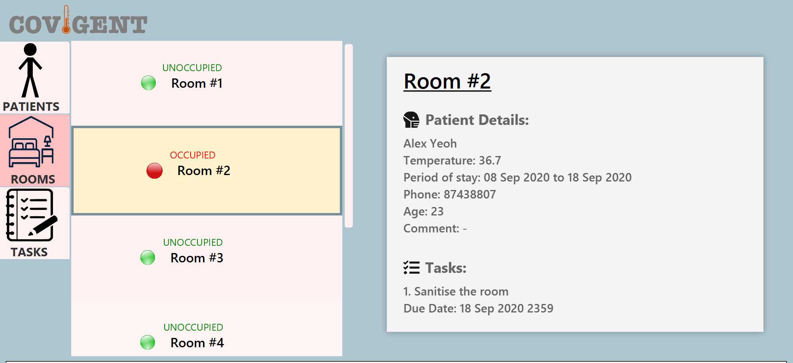
     
    <i>Figure 6. Highlighted Room in Rooms Tab</i>

#### 3.2.3 Tasks Tab

The main purpose of the Tasks tab is to display information about the tasks assigned to the rooms. When you have too many tasks, it is common
to forget which room you have allocated a certain task to. The Tasks tab provides a quick overview of all the tasks in Covigent such that you do not
have to look through each room to find a specific task.

When you first start Covigent and click into the Tasks tab, it will be empty. Do not panic! This is the default behaviour. As you add more tasks to the rooms,
those tasks will start to appear in the Tasks tab. You may refer to [Section 3.3, "Tutorial on How to Use Covigent"](#33-tutorial-on-how-to-use-covigent)
for step-by-step guidance or [Section 5.4.1, "Add a Task to a Room"](#541-add-a-task-to-a-room-addtask) if you prefer a more hands-on approach.

Using the Tasks tab is easy. Simply read the description and due date of the tasks directly from the user interface. For tasks with very long
descriptions, the user interface is unable to fully display them. In those cases, you may highlight the descriptions with your cursor and drag right to scroll through them.
Alternatively, you may triple-click on the descriptions, followed by a right click to copy them. Refer to Figure 7 for an example of the latter method.

    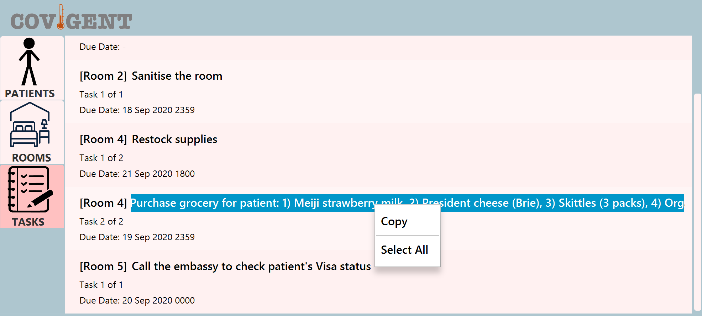
     
    <i>Figure 7. Copying a Long Description in Tasks Tab</i>

### 3.3 Tutorial on How to Use Covigent

Covigent has numerous features, including adding quarantined individuals, creating rooms, assigning tasks to rooms, and more.
Every feature has a corresponding command. Using a feature is as simple as typing a command in the Command Box (see Figure 8) and pressing Enter to execute it.

    
     
    <i>Figure 8. Command Box of Covigent</i>

You have heard so much about the potential of Covigent. Excited? Without further ado, let's give these features a try! We will role-play the
following scenario to get you acquainted with a few common commands: your hotel has 10 rooms; a guest is arriving today and will quarantine with
your hotel for 14 days; and you must not forget to sanitise the room the day after he leaves.

You may copy-and-paste the following commands (bold and in grey highlights) into the Command Box. Do not forget to press Enter, or the command will not execute!

1. **`initroom 10`** : Let's set up the hotel room first. This command creates _10_ rooms in Covigent. If you proceed to the Rooms tab, you will see that 10 rooms
have been created (see Figure 9).

   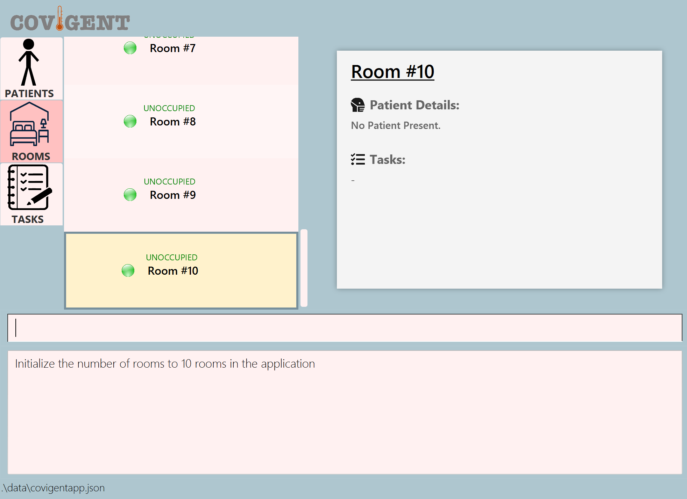
    
   <i>Figure 9. Creating Hotel Rooms in Covigent</i>

2. **`addpatient n/John Doe t/37.4 d/20200910-20200924 p/98765432 a/35 c/Vegan`** : The guest has arrived. You have taken his temperature and need to enter his details into Covigent.
This command adds a new quarantined individual named _John Doe_ with age _35_, phone number _98765432_, period of stay _10 Sep 2020 to 24 Sep 2020_, temperature _37.4_, and a comment that he is _Vegan_.
If you proceed to the Patients tab, you will see that _John Doe's_ entry has been added.

   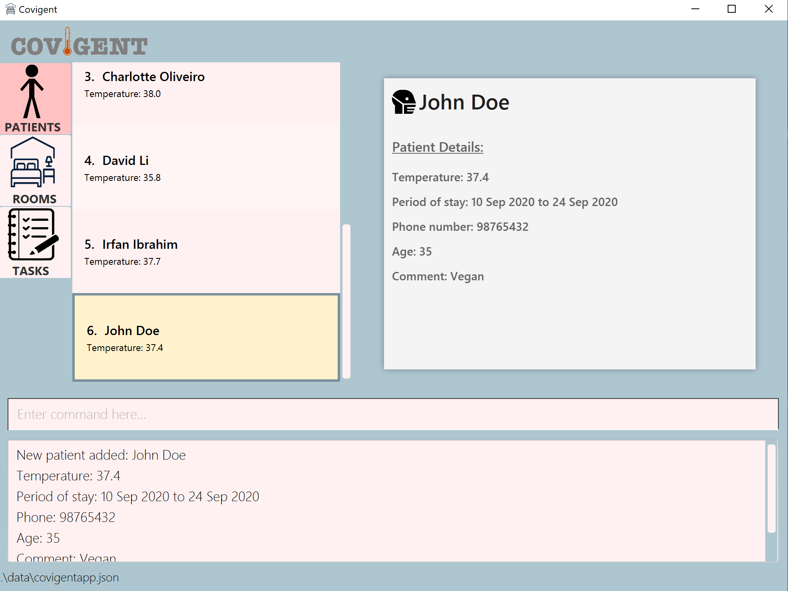
    
   <i>Figure 10. Adding a Patient to Covigent</i>

3. **`findemptyroom`** : You would like to assign _John Doe_ a room but are unsure which rooms are empty. This command will search for an empty room.
Proceed to the Rooms tab. The result can be seen in Figure 11.

    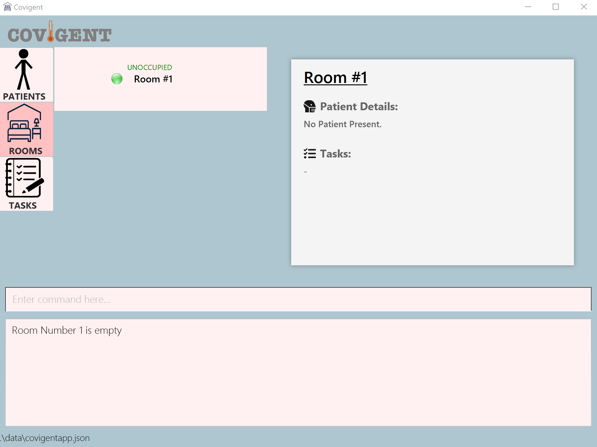
     
    <i>Figure 11. Finding an Empty Room in Covigent</i>

4. **`allocateroom 1 n/John Doe`** : Now that you know _Room #1_ is empty, let's assign _Room #1_ to _John Doe_. This command will do exactly that.
Notice that _Room #1_ is now occupied and _John Doe's_ details are reflected in the Details Panel on the right of the user interface.

   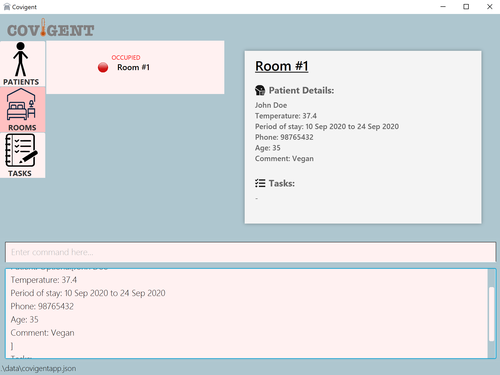
    
   <i>Figure 12. Allocating a Room to a Patient in Covigent</i>

5. **`addtask r/1 d/Sanitise the room dd/20200925 1800`** : Finally, we would like a reminder to sanitise the room after _John Doe_ leaves.
This command adds a task to _Room #1_ with description _Sanitise the room_ and due date _25 Sep 2020 1800_. Notice that the Details Panel
reflects the task now (see Figure 12). You may also click on the Tasks tab to view the newly added task.

   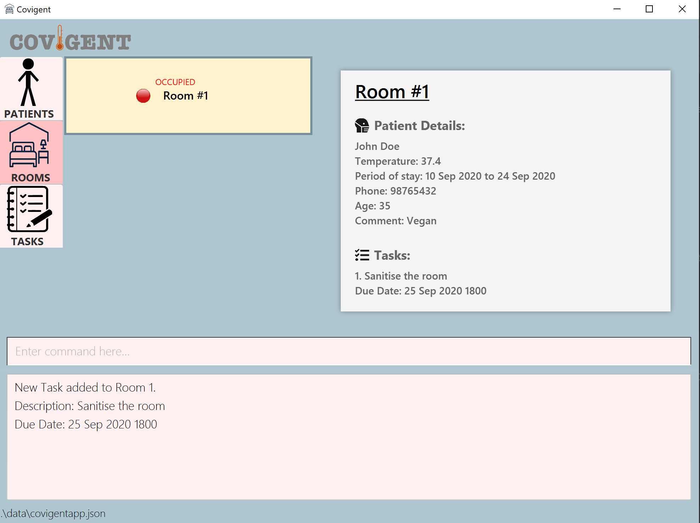
    
   <i>Figure 13. Adding a Task to Covigent</i>

If you are curious about what other features are available in Covigent, please visit [Section 5, Features](#5-features).

_Written by: Yee Hong_

--------------------------------------------------------------------------------------------------------------------

## 4. Glossary

* **Graphical User Interface**: A form of user interface that allows users to interact with electronic devices through graphical icons.  
* **Patient**: An individual who resides in the quarantine facility.  
* **Task**: A task to be completed by staff of the quarantine facility.  

_Written by: Yun Qing_

--------------------------------------------------------------------------------------------------------------------

## 5. Features

This section covers all the commands that you can type into the Command Box of Covigent. The commands are categorised into [patient features](#52-patients), [room features](#53-room) and [task features](#54-room). If it is the first time that you are using the command, we recommend that you refer to [Command Format](#51-command-format) to find out how to interpret the format of the commands.

_Written by: Yun Qing_

### 5.1 Command Format

**:information_source: Notes about the command format:**  
* Words in `UPPER_CASE` are the fields to be supplied by the user.  
  e.g. in `addpatient n/NAME`, `NAME` is a field which can be used as `addpatient n/John Doe`.

* Fields in square brackets are optional.  
  e.g `n/NAME [c/COMMENT]` can be used as `n/John Doe c/Is vegan` or as `n/John Doe`.

* Fields can be in any order.  
  e.g. if the command specifies `n/NAME p/PHONE_NUMBER`, `p/PHONE_NUMBER n/NAME` is also acceptable.

* If the same field is provided multiple times, only the last input for that field will be processed. 
  e.g. if you input `n/John Doe n/Mary Doe`, Covigent will only process `n/Mary Doe` and ignore `n/John Doe`. Similarly, if you input `n/John Doe t/37.4 n/Mary Doe t/36.5`, Covigent will interpret the fields provided as simply `n/Mary Doe t/36.5`.

### 5.2 Patient

This section contains all the commands related to patients. You can [add](#521-add-a-patient-addpatient), [delete](#522-delete-a-patient-deletepatient),
[edit](#523-edit-patient-details-editpatient), [search](#524-search-patients-by-information-searchpatient) for a patient, or you can [list](#525-list-all-patients-listpatient) out all the patients in Covigent. If you are unsure of how to interpret the command format, head back to [Command Format](#51-command-format) before executing the commands!

#### 5.2.1 Add a patient: `addpatient` 

You can use this command to add a patient with the following details: name, temperature, period of stay, phone number, age and comment. 

**Format:** `addpatient n/NAME t/TEMPERATURE d/PERIOD_OF_STAY p/PHONE_NUMBER a/AGE [c/COMMENT]` 

Field | Description
------------ | -------------
`NAME` | The name of the patient. It should preferably be the full name of the patient. The name should be less than 150 characters. 
`TEMPERATURE` | The temperature of the patient. It must be keyed in to 1 decimal place (e.g. 37.0 instead of 37) and must be within the range 32.0 to 41.0 degree celsius, both inclusive.
`PERIOD_OF_STAY` | The period of stay of the patient in the facility. It must be in the format _YYYYMMDD-YYYYMMDD_. Both dates must be valid and the start date must be before or equals to the end date.
`PHONE_NUMBER` | The phone number of the patient that the patient wishes to be contacted by. The maximum number of digits allowed is 20.
`AGE` | The age of the patient, which is between 0 (inclusive) and 120 (exclusive).
`COMMENT` | An optional field that is used to indicate any special details of the patient such as dietary preferences or health conditions.

**:information_source: Important Information:**  
* Duplicate names are not allowed. If an entry of name _John Doe_ is recorded in Covigent, you should not add a patient of the name _John Doe_ again.
 

**Example(s):**
1. `addpatient n/Betsy Crowe t/36.5 d/20201001-20201014 p/91234567 a/19 c/Is asthmatic` A patient named _Betsy Crowe_ with temperature _36.5_, period of stay from _1 October 2020 to 14 October 2020_, phone number _91234567_, age _19_ and comment _Is asthmatic_ is added to Covigent.
 

**Step By Step Usage:**  
1. Navigate to the Patients tab under the navigation bar as shown in Figure 14.
    

        
         
       <i>Figure 14. Navigation to Patients Tab</i>
    

2. Using the first example, key in the command into the Command Box as shown below.
    

        
         
       <i>Figure 15. <code>addpatient</code> command in Command Box</i>
    

3. Press Enter to run the command.
4. The result box displays the sucess message shown in Figure 16 and the newly added patient can now be found in the list of patients in Covigent.
5. To view the details of the newly added patient, click on the newly added patient in the patient list.
    

        
         
        <i>Figure 16. A Successful Execution of <code>addpatient</code> command</i>
    

6. If you do not see the success message as shown in Figure 16, please repeat step 2 onwards.

_Written by: Yun Qing_

#### 5.2.2 Delete a patient: `deletepatient` 

You can use this command to delete the details of the existing patient identified by his/her name from Covigent.  

**Format:** `deletepatient NAME` 

Field | Description
------------ | -------------
`NAME` | The name of the patient to be deleted. It is case-insensitive and must match exactly with the name of the patient that was input into Covigent previously.

**:information_source: Important Information:**  
* If the patient to be deleted was allocated a room previously, the room will be updated to unoccupied in Covigent but the tasks (if any) in that room will remain unchanged.
 

**Example(s):**
1. `deletepatient Mary Doe` The patient details of Mary Doe will be deleted from Covigent.
 

**Step By Step Usage:**  
1. Navigate to the Patients tab under the navigation bar as shown in Figure 17.
    

        
         
       <i>Figure 17. Navigation to Patients Tab</i>
    

1. Using the first example, key in the command into the Command Box as shown below.
    

        
         
       <i>Figure 18. <code>deletepatient</code> command in Command Box</i>
    

1. Press Enter to run the command.
1. The result box displays the success message shown in Figure 19 and the deleted patient can no longer be found in the list of patients in Covigent.
    

        
         
        <i>Figure 19. A Successful Execution of <code>deletepatient</code></i>
    

1. If you do not see the success message as shown in Figure 19, please repeat step 2 onwards.

_Written by: Yun Qing_

#### 5.2.3 Edit Patient Details: `editpatient`

You can use this command to edit an existing patient's details in Covigent.

**Format**: `editpatient ORIGINAL_NAME [n/NEW_NAME] [t/TEMPERATURE] [d/PERIOD_OF_STAY] [p/PHONE_NUMBER] [a/AGE] [c/COMMENT]` 

Field | Description
------------ | -------------
`ORIGINAL_NAME` | The name of the patient whom details are to be edited. It must match exactly with the name of the patient that was input into Covigent previously. It is case-insensitive.
`NEW_NAME` | The new name of the patient. The new name must not already exist within Covigent and should be less than 150 characters. 
`TEMPERATURE` | The new temperature of the patient. It must be keyed in to 1 decimal place (e.g. 37.0 instead of 37) and must be within the range 32.0 to 41.0 degree Celsius, both inclusive.
`PERIOD_OF_STAY` | The new period of stay of the patient. It must be in the format _YYYYMMDD-YYYYMMDD_. Both dates must be valid and the start date must be before or equals to the end date.
`PHONE_NUMBER` | The new phone number of the patient. The maximum number of digits allowed is 20.
`AGE` | The new age of the patient. Age should be between 0 (inclusive) and 120 (exclusive).
`COMMENT` | The new comments about the patient.

**:information_source: Important Information:**  
* At least one of the optional fields must be provided.
* Existing values will be updated to the input values.
 

**Example(s):**
1. `editpatient john doe p/91234567` The phone number of the patient named John Doe will be updated to _91234567_.
1. `editpatient alex t/36.7 a/21 d/20200303-20200315` The temperature, age and period of stay of the patient named Alex will be updated to _36.7_, _21_ and _20200303-20200315_ respectively.

**Step By Step Usage:**  
1. Navigate to the Patients tab under the navigation bar as shown in Figure 20.
    

        
         
       <i>Figure 20. Navigation to Patients Tab</i>
    

1. Using the first example, key in the command into the Command Box as shown below.
    

        
         
       <i>Figure 21. <code>editpatient</code> command in Command Box</i>
    

1. Press Enter to run the command.
1.  The result box displays the success message shown in Figure 22 and the patient has been edited in Covigent.
1. The details of the newly edited patient will be shown in the details panel.
    

        
         
        <i>Figure 22. A Successful Execution of <code>editpatient</code> command</i>
    

1. If you do not see the success message as shown in Figure 11, please repeat step 2 onwards.

_Written by: Ming De_

#### 5.2.4 Search Patients by Information: `searchpatient`

You can use this command to search patients that match the given criteria(name or a range of temperature) in Covigent.

**Format**: `searchpatient [n/NAME] [tr/TEMPERATURE_RANGE]`

Field | Description
------------ | -------------
`NAME` | The full name or the sub-name of the patient you want to look for. If the patient's name is "Alex Joe", then you must enter "Alex", "Joe" or "Alex Joe" to find him. You input is case-insensitive.
`TEMPERATURE_RANGE` | The temperature range that you want to look for. It is made up of two valid temperatures. A temperature must be keyed in to 1 decimal place (e.g. 37.0 instead of 37). The two temperature are linked using a dash "-". The `TEMPERATURE_RANGE` is inclusive of start and end temperatures. `tr/35.5-36.0` means a temperature range of 35.5-36.0 degree, celsius, both inclusive.

**:information_source: Important Information:**  
* Only one of the fields can be provided. If the field `n/name` is entered, you should not enter the field `tr/TEMPERATURE_RANGE`.  
* The two temperature you enter for field `tr/TEMPERATURE_RANGE` must both be valid, if one of the temperature is invalid, the search function will fail.  
 

**Example(s):**
1. `searchpatient n/john` Searches patients with names containing _john_.
1. `searchpatient tr/36.5-36.7` Searches patients within temperature range _36.5 to 36.7_ degree celsius, both inclusive.

**Step By Step Usage:**   

1. Navigate to the Patients tab under the navigation bar as shown in Figure 23.
    

        
         
       <i>Figure 23. Navigation to Patients Tab</i>
    

1. Before the search, this is what you see in the list of patient.
    

        
         
       <i>Figure 24. Patient List before <code>searchpatient</code> command </i>
    

1. Using the second example, key in the command into the Command Box as shown below.
    

        
         
       <i>Figure 25. <code>searchpatient</code> command in Command Box</i>
    

1. Press Enter to run the command. 
1. The result box displays the success message shown in Figure 26 and you can find the patients with temperatures in the inputted temperature range in Covigent.
    

        
         
        <i>Figure 26. A Successful Execution of <code>searchpatient</code></i>
    

_Written by: Wai Lok_

#### 5.2.5 List all patients: `listpatient`

You can use this command to look at the list of all patients in the patient tab.

**Format**: `listpatient`

**Example(s)**:
1. `listpatient` Lists all patients that are present in Covigent.

**Step By Step Usage:**   

1. Navigate to the Patients tab under the navigation bar as shown in Figure 27.
    

        
         
       <i>Figure 27. Navigation to Patients Tab</i>
    

1. Key in the command into the Command Box as shown below.
    

        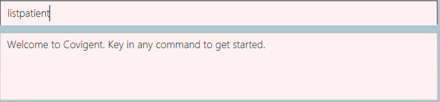
         
        <i>Figure 28. <code>listpatient</code> command in Command Box</i>
    

1. Press Enter to run the command.
1. The result box displays the sucess message shown in Figure 29 and you can find the full list of patient in Covigent.
    

        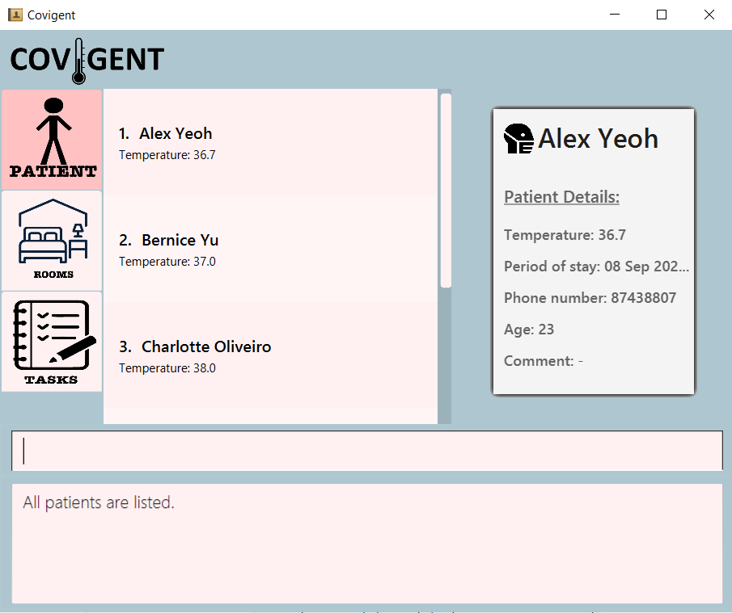
         
        <i>Figure 29. A Successful Execution of <code>listpatient</code></i>
    

_Written by: Wai Lok_

### 5.3 Room

This section contains all the commands related to rooms. You can [initialise](#531-initialise-rooms-in-hotel-initroom), [allocate](#532-allocate-patient-to-room-allocateroom),[search](#533-search-by-room-number-searchroom) and [find](#536-find-the-first-free-room-findemptyroom) the rooms which you need.
If you want an overview of the rooms, you can [list](#535-list-the-current-rooms-listroom) out all the rooms in Covigent. If you are unsure of how to interpret the command format, head back to [Command Format](#51-command-format) before executing the commands!

#### 5.3.1 Initialise Rooms in Hotel: `initroom`

You can use this command to initialise a number of rooms in the quarantine facility to the app, if there was data given previously, they would 
be stored.

Format: `initroom NUMBER_OF_ROOMS`

Field | Description
----------|-------------
`NUMBER_OF_ROOMS` | The number of rooms you wish to have in hotel

**:information_source: Important Information:**  
* If the number of rooms is less than the number of patients error is thrown when decreasing the number of existing rooms.
* Adds `NUMBER_OF_ROOMS` rooms into the hotel system, if there were previously added information that information for respective rooms will still be there.
 

**Example(s):**
1. `initroom 123`. 123 rooms are initialised in Covigent.
1. `initroom 400`. 400 rooms are initialised in Covigent.

**Step By Step Usage:**  
1. Navigate to the Rooms tab under the navigation bar as shown in Figure 30.
    

        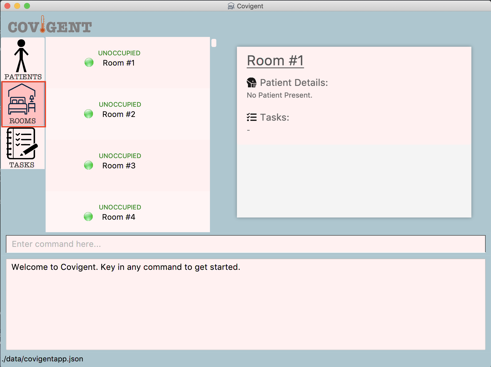
         
       <i>Figure 30. Navigation to Rooms Tab</i>
    

1. Using the first example, key in the command into the Command Box as shown below.
    

        
         
       <i>Figure 31. Navigation to Rooms Tab</i>
    

1. Press Enter to run the command.
1. The result box shows a success message "Initialise the number of rooms to 400 rooms in the application.".
    

        
         
        <i>Figure 32. A Successful Execution of <code>initroom</code></i>
    
 

_Written by: Noorul Azlina_

#### 5.3.2 Allocate Patient to Room: `allocateroom`

You can use this command to allocate a patient to a room.

**Format**: `allocateroom ROOM_NUMBER n/PATIENT_NAME`

Field | Description
----------|-------------
`ROOM_NUMBER` | The room number of the room of which the patient is to be allocated to. A room with the `ROOM_NUMBER` must already exist within Covigent.
`PATIENT_NAME` | The name of the patient to be allocated to the room. It is case-sensitive but must match exactly with the name of the patient that was input into Covigent previously.

**:information_source: Important Information:**  
* To remove a patient from the room, input the patient name as "-". Refer to the example below for more clarity.
 

**Example(s):**
1. `allocateroom 1 n/john doe`. The patient named John Doe will be allocated to Room #1.
1. `allocateroom 1 n/-`. The previous patient will be removed from Room #1.

**Step By Step Usage:**  
1. Navigate to the Rooms tab under the navigation bar as shown in Figure 33.
    

        
         
       <i>Figure 33. Navigation to Rooms Tab</i>
    

1. Using the first example, key in the command into the Command Box as shown below.
    

        
         
       <i>Figure 34. <code>allocateroom</code> command in Command Box</i>
    

1. Press Enter to run the command.
1. The result box displays the sucess message shown in Figure 35 and the patient is allocated to the room.
The room with the newly allocated patient is shown in the room details panel.
    

        
         
        <i>Figure 35. A Successful Execution of <code>allocateroom</code> for Room Number</i>
    

1. If you do not see the success message as shown in Figure 35, please repeat step 2 onwards.

_Written by: Ming De_

#### 5.3.3 Search by Room Number: `searchroom` 

You can use this command to search for the room details with the specified room number.

**Format:** `searchroom r/ROOM_NUMBER`

Field | Description
----------|-------------
`ROOM_NUMBER` | The room number of the room to be searched for, which is a positive integer. The room number should be present in the list of rooms in Covigent.

**Example(s):**
1. `searchroom r/6` The room details of room number 6 will be searched.

**Step By Step Usage:**  
1. Navigate to the Rooms tab under the navigation bar as shown in Figure 36.
    

        
         
       <i>Figure 36. Navigation to Rooms Tab</i>
    

1. Using the first example, key in the command into the Command Box as shown below.
    

        
         
       <i>Figure 37. <code>searchroom</code> command in Command Box</i>
    

1. Press Enter to run the command.
1. The result box displays the success message shown in Figure 38 and the room with the specified room number is shown in the room details panel.
    

        
         
        <i>Figure 38. A Successful Execution of <code>searchroom</code> for Room Number</i>
    

1. If you do not see the success message as shown in Figure 38, please repeat step 2 onwards.

_Written by: Yun Qing_

#### 5.3.4 Search for Room with Patient: `searchroom` 

You can use this command to search for the room that the specified patient is residing in. 

**Format:** `searchroom n/NAME`

Field | Description
----------|-------------
`NAME` | The name of the patient whose room you are looking for. It is case-insensitive and must match exactly with the name of the patient that was input into Covigent previously.

**Example(s):**
1. `searchroom n/Mary Doe` The room details of the room that Mary Doe resides in will be searched.

**Step By Step Usage:**  
1. Navigate to the Rooms tab under the navigation bar as shown in Figure 39.
    

        
         
       <i>Figure 39. Navigation to Rooms Tab</i>
    

1. Using the first example, key in the command into the Command Box as shown below.
    

        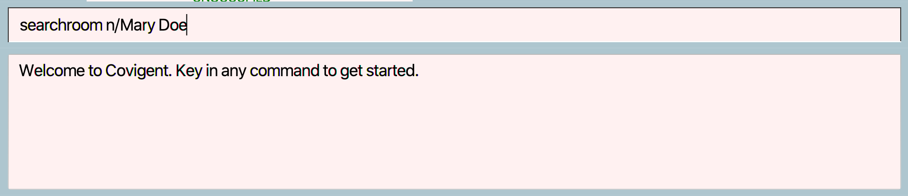
         
       <i>Figure 40. <code>searchroom</code> command in Command Box</i>
    

1. Press Enter to run the command. 
1. The result box displays the success message shown in Figure 41 and the room that the specified patient resides in is shown in the room details panel.
    

        
         
        <i>Figure 41. A Successful Execution of <code>searchroom</code> for Patient</i>
    

1. If you do not see the success message as shown in Figure 41, please repeat step 2 onwards.

_Written by: Yun Qing_

#### 5.3.5 List the Current Rooms: `listroom`

You can use this command to list all the rooms in the hotel together with information of whether the room is occupied or not.

Format: `listroom` All the rooms in Covigent.

**:information_source: Important Information:**  
* If there are no rooms, then no rooms will be mentioned and informs user to initialize rooms using the `initroom` command.
* You need at least one room for this command to work. 
 

**Step By Step Usage:**  
1. Navigate to Rooms tab under the navigation bar as shown in Figure 42
    

        
         
        <i>Figure 42. Navigation to Rooms Tab</i>
    

1. Next, type the command `listroom` in the Command Box as shown below
    

        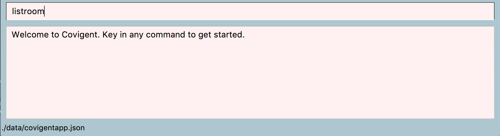
         
        <i>Figure 43. <code>listroom</code> command in Command Box</i>
    

1. Press Enter to run the command
1. The result box shows a success message "All rooms are listed."
    

        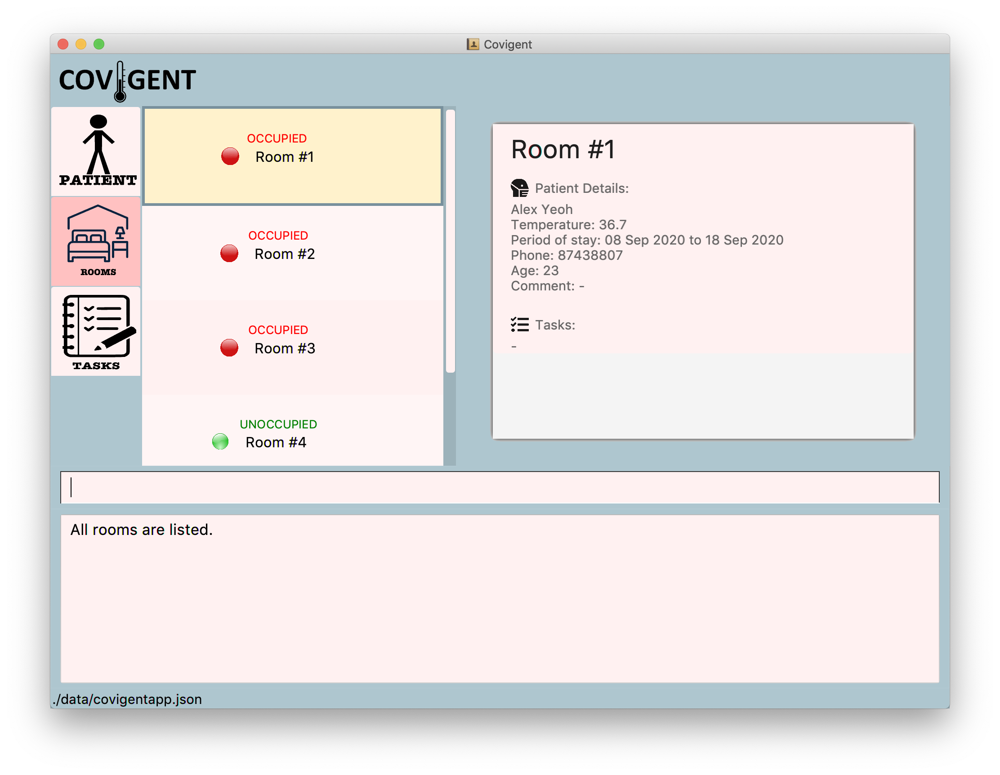
         
        <i>Figure 44. A Successful Execution of <code>listroom</code></i>
    

_Written by: Noorul Azlina_

#### 5.3.6 Find the First Free Room: `findemptyroom`

You can use this command to find the room with the lowest room number that is free for use.

Format: `findemptyroom` The unoccupied room in Covigent with the lowest room number will be displayed on UI.

**:information_source: Important Information:**  
* If there are no empty rooms then an error message informing hotel staff is mentioned.
 

**Step By Step Usage:**  

1. Navigate to Rooms tab under the navigation bar as shown in Figure 45.
    

        
         
        <i>Figure 45. Navigation to Rooms Tab</i>
    

1. Next, type the command `findemptyroom` in the Command Box as shown below
    

        
         
        <i>Figure 46. <code>findemptyroom</code> command in Command Box</i>
    

1. Press Enter to run the command
1. The result box shows a success message that "Room Number 4 is empty"
    

        
         
        <i>Figure 47. A Successful Execution of <code>findemptyroom</code></i>
    
 

_Written by: Noorul Azlina_

### 5.4 Task

This section contains all the commands related to tasks. You can [add](#541-add-a-task-to-a-room-addtask), [delete](#542-delete-a-task-from-a-room-deletetask), 
[edit](#543-edit-task-description-or-due-date-edittask) and [search](#545-search-tasks-before-a-given-date-searchtask) for a task and see it be displayed on our amazing GUI. If you want to see all the tasks, you can [list](#546-list-all-tasks-listtask) out all the tasks in Covigent. If you are unsure of how to interpret the command format, head back to [Command Format](#51-command-format) before executing the commands!

#### 5.4.1 Add a task to a room: `addtask`

You can use this command to add a task to a room. The task has the following details: description and due date.

Format: `addtask r/ROOM_NUMBER d/DESCRIPTION [dd/DUE_DATE]`

Field | Description
------------ | -------------
`ROOM_NUMBER` | The room number of the room to which you want to add the task. It refers to the number displayed beside each room under the list of rooms. An example of the room number highlighted in red:  
`DESCRIPTION` | The description of the task. It can be related to the patient in the room, e.g. _Call the patient_; or related to the room, e.g. _Restock the supplies in this room_.
`DUE_DATE` | An optional field that is used to indicate by what date and time should the task be completed. It can in any of the following formats:  <ul><li>_YYYYMMDD_ \| e.g. 20210131</li><li>_YYYYMMDD HHmm_ \| 20210131 2359</li><li>_D/M/YYYY_ \| e.g. 31/1/2021 or 31/01/2021</li><li>_D/M/YYYY HHmm_ \| e.g. 31/1/2021 2359 or 31/01/2021 2359</li></ul>

**:information_source: Important Information:**  
* `DUE_DATE` defaults to `-` if you leave out the field, i.e. due date is not applicable.
* If you do not provide the time for a `DUE_DATE`, it defaults to 0000 (12am).
 

**Example(s):**
1. `addtask r/5 d/Remind patient to change bedsheets.` A task with description _Remind patient to change bedsheets._ is added to Room #5.
1. `addtask r/1 d/Running low on masks and needs to be restocked. dd/12/1/2021` A task with description _Running low on masks and needs to be restocked._ and due date _12 Jan 2021 0000_ is added to Room #1.

**Step By Step Usage:**  
* Using the first example, the result box displays the message _New Task added to Room 5. Description: Remind Alice to change bedsheets. Due Date: -_.
* The newly added task can now be found in Room #5.
* The newly added task can now be found in the list of tasks in Covigent.
* Figure 14 shows an example of a successful execution.

    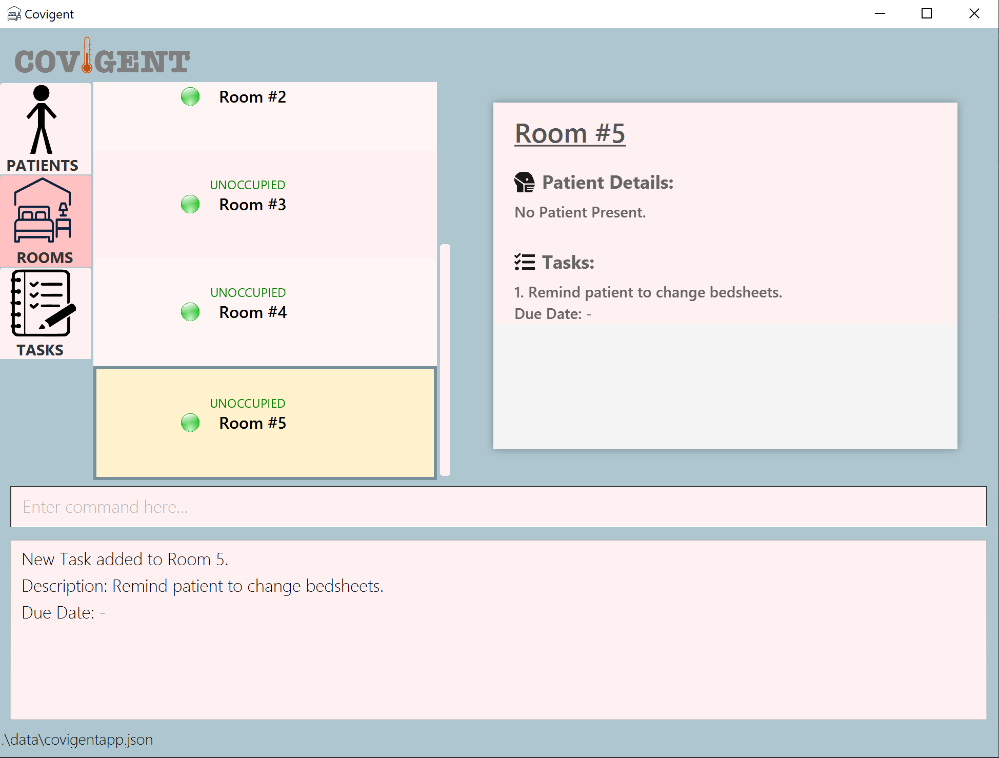
     
    <i>Figure 14. A Successful Execution of <code>addtask</code></i>

_Written by: Yee Hong_

#### 5.4.2 Delete a task from a room: `deletetask`

You can use this command to delete an existing task from a room.

Format: `deletetask r/ROOM_NUMBER t/TASK_NUMBER`

Field | Description
------------ | -------------
`ROOM_NUMBER` | The room number of the room from which you want to delete the task. It refers to the number displayed beside each room under the list of rooms. An example of the room number highlighted in red:  
`TASK_NUMBER` | The task number of the task to be deleted. It refers to the number displayed beside each task in the details panel for rooms. An example of the task number highlighted in red:  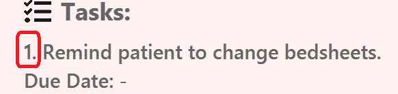

**:information_source: Important Information:**  
* Once you delete a task, the `TASK_NUMBER` of the remaining tasks changes accordingly. Figure 15 illustrates how Task 3 is updated to Task 2 after the original Task 2 is deleted.

    
     
    <i>Figure 15. Task Number Changing after <code>deletetask</code></i>

 

**Example(s):**
1. `deletetask r/5 t/1` The first task (Task 1) of Room #5 is deleted.

**Step By Step Usage:**  
* The result box displays the message _Task 1 deleted from Room 5._, followed by the description and due date of Task 1.
* Task 1 is no longer in Room #5.
* For tasks that come after Task 1, the `TASK_NUMBER` is decreased by 1. E.g. The previous Task 4 will become Task 3.
* Task 1 is no longer in the list of tasks in Covigent.
* Figure 16 shows an example of a successful execution.

    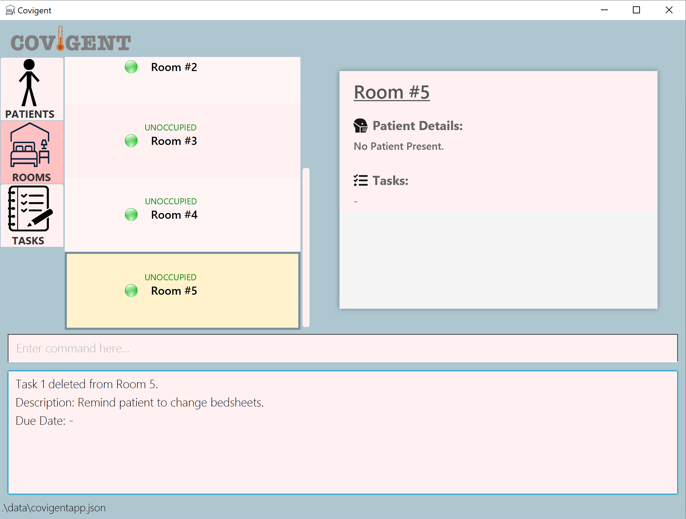
     
    <i>Figure 16. A Successful Execution of <code>deletetask</code></i>

_Written by: Yee Hong_

#### 5.4.3 Edit Task Description or Due Date: `edittask`

You can use this command to edit the description or due date of an existing task in a room.

Format: `edittask r/ROOM_NUMBER t/TASK_NUMBER [d/DESCRIPTION] [dd/DUE_DATE]`

Field | Description
------------ | -------------
`ROOM_NUMBER` | The room number of the room from which you want to edit the task. It refers to the number displayed beside each room under the list of rooms. An example of the room number highlighted in red:  
`TASK_NUMBER` | The task number of the task to be edited. It refers to the number displayed beside each task in the details panel for rooms. An example of the task number highlighted in red:  
`DESCRIPTION` | The description of the task. It can be related to the patient in the room, e.g. _Call the patient_; or related to the room, e.g. _Restock the supplies in this room_. 
`DUE_DATE` | An optional field that is used to indicate by what date and time should the task be completed. It can in any of the following formats:  <ul><li>_YYYYMMDD_ \| e.g. 20210131</li><li>_YYYYMMDD HHmm_ \| 20210131 2359</li><li>_D/M/YYYY_ \| e.g. 31/1/2021 or 31/01/2021</li><li>_D/M/YYYY HHmm_ \| e.g. 31/1/2021 2359 or 31/01/2021 2359</li></ul>

**:information_source: Important Information:**  
* At least one of the optional fields must be provided.
* Existing values will be updated to the input values.
* If you do not provide the time for a `DUE_DATE`, it defaults to _0000_ (12am).
 

**Example(s):**
1. `edittask r/3 t/1 d/Return a call to the patient. dd/12/1/2021 1500` The description and due date of the first task (Task 1) in Room #3 are updated to _Return a call to the patient._ and _12 Jan 2021 1500_ respectively.
1. `edittask r/2 t/2 dd/12/1/2021` The due date for the second task (Task 2) of Room #2 is updated to _12 Jan 2021 0000_.

**Step By Step Usage:**  
* Using the first example, the result box displays the message _Task 1 edited from Room 3. Description: Return a call to the patient. Due Date: 12 Jan 2021 1500_.
* The details panel for Room #3 shows the updated description and due date of Task 1.
* The list of tasks in Covigent shows the updated description and due date of Task 1.
* Figure 17 shows an example of a successful execution.

    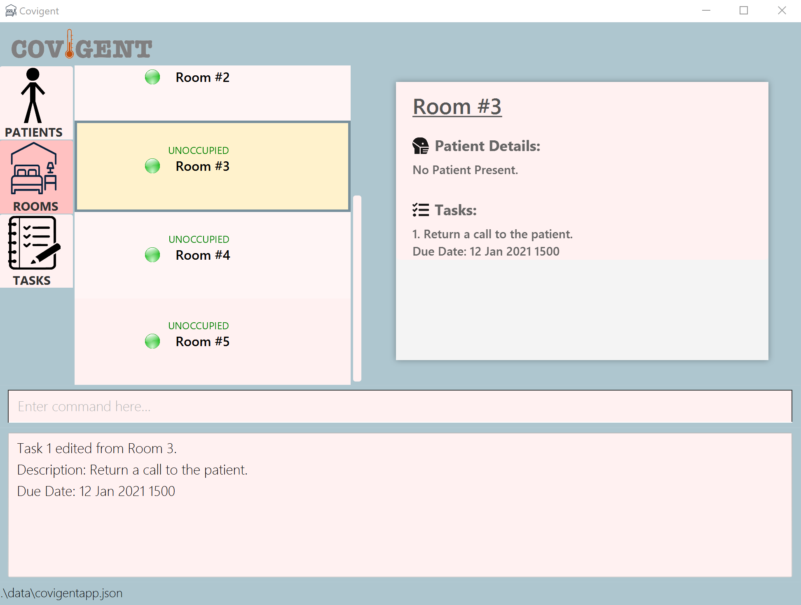
     
    <i>Figure 17. A Successful Execution of <code>edittask</code> to Edit Task Description and Due Date</i>

_Written by: Yee Hong_

#### 5.4.4 Remove Due Date from a Task: `edittask`

You can use this command to remove a due date from a task in a room.

Format: `edittask r/ROOM_NUMBER t/TASK_NUMBER dd/-`

Field | Description
------------ | -------------
`ROOM_NUMBER` | The room number of the room from which you want to edit the task. It refers to the number displayed beside each room under the list of rooms. An example of the room number highlighted in red:  
`TASK_NUMBER` | The task number of the task from which you want to remove the due date. It refers to the number displayed beside each task in the details panel for rooms. An example of the task number highlighted in red:  
`-` | A `-` indicates the removal of a due date. 

**:information_source: Important Information:**  
* Existing values will be updated to the input values.
* This is only one feature of the `edittask` command. Refer to the full command [here](#543-edit-task-description-or-due-date-edittask).
 

**Example(s):**
1. `edittask r/3 t/1 dd/-` The due date of the first task (Task 1) in Room #3 is removed, i.e. set to `-`.

**Step By Step Usage:**  
* The result box displays the message _Task 1 edited from Room 3._ followed by the current description of Task 1 and _Due Date: -_.
* The details panel for Room #3 shows that Task 1 no longer has a due date.
* The list of tasks in Covigent shows that Task 1 of Room #3 no longer has a due date.
* Figure 18 shows an example of a successful execution.

    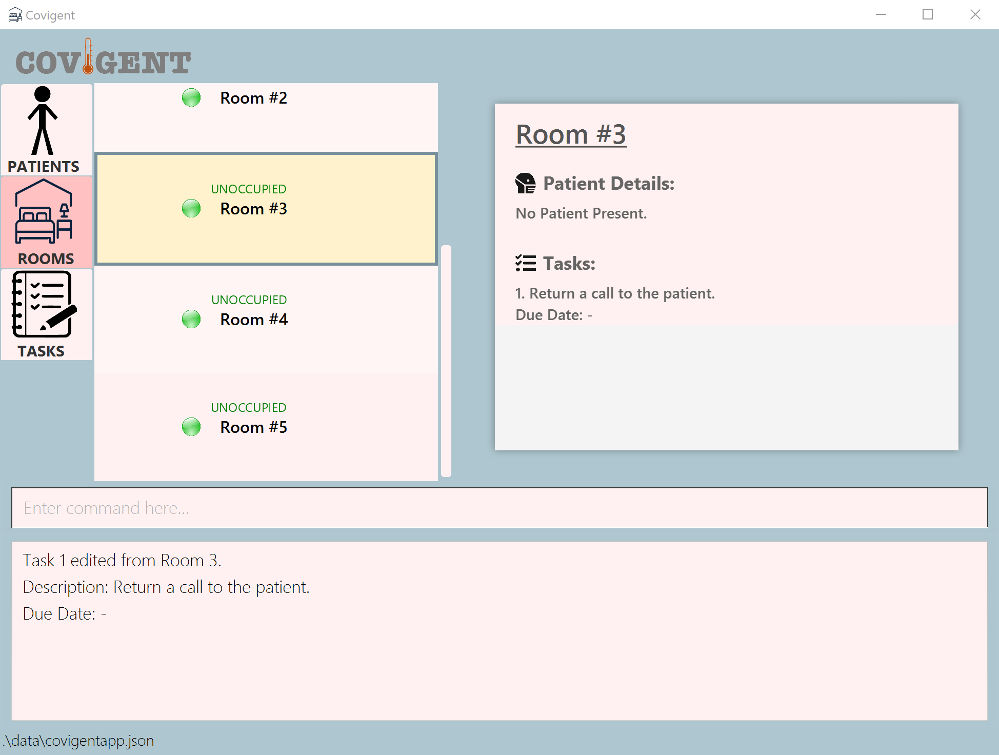
     
    <i>Figure 18. A Successful Execution of <code>edittask</code> to Remove Due Date</i>

_Written by: Yee Hong_

#### 5.4.5 Search Tasks before a Given Date: `searchtask`

You can use this command to search all tasks before a date in Covigent.

**Format**: `searchtask dd/DUE_DATE`

Field | Description
----------|-------------
`DUE_DATE` | The due date you are looking for. It can in any of the following formats:  <ul><li>_YYYYMMDD_ \| e.g. 20210131</li><li>_YYYYMMDD HHmm_ \| 20210131 2359</li><li>_D/M/YYYY_ \| e.g. 31/1/2021 or 31/01/2021</li><li>_D/M/YYYY HHmm_ \| e.g. 31/1/2021 2359 or 31/01/2021 2359</li></ul>

**:information_source: Important Information:**  
* If the time `HHmm` is not specified for a due date, it defaults to 0000 (12am).
 

**Example(s)**:
1. `searchtask dd/12/1/2021` Search all tasks before and including 12 January 2021 0000.

**Step By Step Usage:**  
1. Navigate to the Tasks tab under the navigation bar as shown in Figure 60.
    

        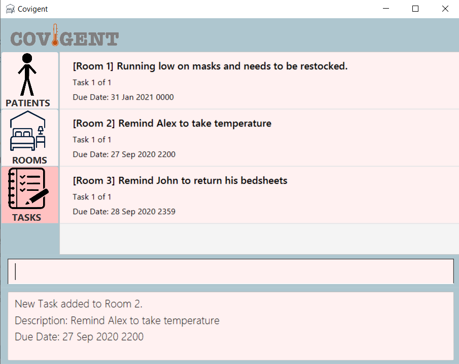
         
       <i>Figure 60. Navigation to Tasks tab</i>
    

1. Using the example,  key in the command into the Command Box as shown below.
    

        
         
       <i>Figure 61. <code>searchtask</code> command in Command Box</i>
    

1. Press Enter to run the command.
1. With reference to Figure 62, the result box displays the message, "Tasks before the due date found.".
1. Now you can find tasks before and including 12 January 2021 0000 can now be found in the list of tasks in Covigent.
    

        
         
        <i>Figure 62. A Successful Execution of <code>searchtask</code></i>
    

_Written by: Wai Lok_

#### 5.4.6 List all Tasks: `listtask`

You can use this command to look at the list of all tasks in the task tab.

**Format**: `listtask`

**Example(s)**:
1. `listtask` Lists all tasks that are present in Covigent.

**Step By Step Usage:**   

1. Navigate to the Tasks tab under the navigation bar as shown in Figure 63.

    
     
   <i>Figure 63. Navigation to Tasks tab</i>

2. Key in the command into the Command Box as shown below.

    
     
    <i>Figure 64. <code>listtask</code> command in Command Box</i>

3. Press Enter to run the command.
4. Now you can find the full list of patient in Covigent.

    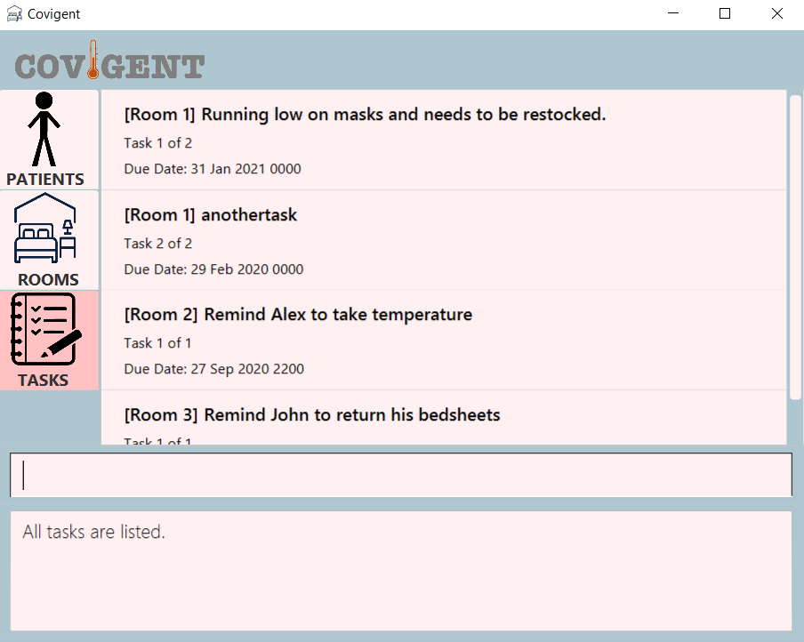
     
    <i>Figure 18. A Successful Execution of <code>listtask</code></i>

_Written by: Wai Lok_

### 5.5 View help: `help`

If you encounter any issues using Covigent and need to access this user guide again, simply key in `help` into the Command Box.

**Format:** `help`

**Step By Step Usage:**   

1. Key in the command into the Command Box as shown below.
    

        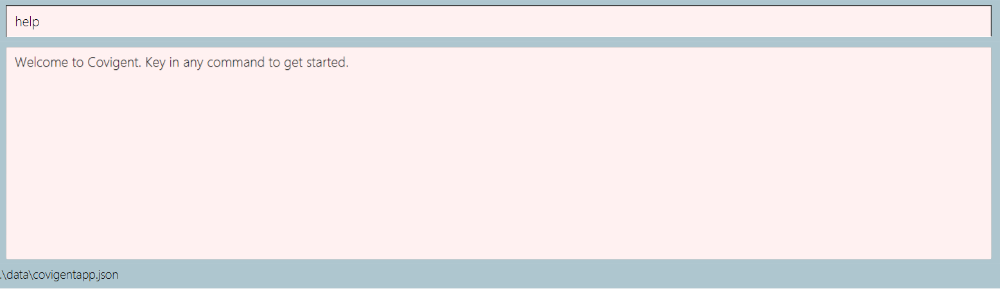
         
        <i>Figure xx. <code>help</code> command in Command Box</i>
    

1. Press Enter to run the command.
1. The result box displays the message as shown in Figure xx.
    

        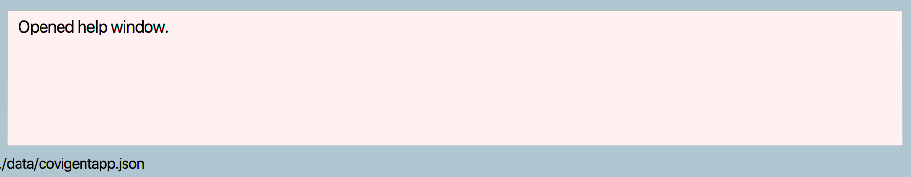
         
        <i>Figure xx. Result display box</i>
    

1. A new help window appears.
    

        
         
        <i>Figure xx. Help window</i>
    

_Written by Yun Qing_

### 5.6 Exit Covigent: `exit`

You can use this command to exit from Covigent.

**Format:** `exit`

**Step By Step Usage:** 
1. Key in the command into the Command Box as shown below.
    

        
         
        <i>Figure xx. <code>exit</code> command in Command Box</i>
    

1. Press Enter to run the command.
1. Covigent exits and closes.

_Written by: MingDe_

### 5.7 Autosave

Covigent data are saved in the hard disk automatically after any command that changes the data. There is no need to save manually.

--------------------------------------------------------------------------------------------------------------------

## 6. Command Summary 

This section provides a quick summary of the commands for [Patient](#61-patient), [Room](#62-room), [Task](#63-task) and [General](#64-general). For the detailed explanation of the usage of each command, head on to the [Features](#5-features) section to find out more.

### 6.1 Patient

Action | Format, Examples
--------|------------------
**Add Patient** | `addpatient n/NAME t/TEMPERATURE d/PERIOD_OF_STAY p/PHONE_NUMBER a/AGE [c/COMMENT]`   e.g., addpatient n/Betsy Crowe t/36.5 d/20201001-20201014 p/91234567 a/19 c/Is asthmatic
**Delete Patient** | `deletepatient NAME`   e.g., deletepatient Mary Doe
**Edit Patient** | `editpatient NAME [n/NAME] [t/TEMPERATURE] [d/PERIOD_OF_STAY] [p/PHONE_NUMBER] [a/AGE] [c/COMMENT]`  e.g., editpatient James Lee t/36.5
**Search Patient** | `searchpatient [n/NAME] [tr/TEMPERATURE_RANGE]`   e.g., searchpatient tr/36.5-36.7
**List Patients** | `listpatient` 

### 6.2 Room

Action | Format, Examples
--------|------------------
**Initialise Room** | `initroom NUMBER_OF_ROOMS`   e.g., initroom 123
**Allocate Patient to Room** | `allocateroom ROOM_NUMBER n/NAME`   e.g., allocateroom 5 n/David Li
**Search by Room Number** | `searchroom r/ROOM_NUMBER`  e.g., searchroom r/15
**Search for Room with Patient** | `searchroom n/NAME`  e.g., searchroom n/Jane Doe
**List Rooms** | `listroom`  
**Find Empty Room** | `findemptyroom`  

### 6.3 Task

Action | Format, Examples
--------|------------------
**Add Task to Room** | `addtask r/ROOM_NUMBER d/DESCRIPTION [dd/DUE_DATE]`   e.g., addtask d/Running low on masks and needs to be restocked. r/1 dd/12/1/2021 
**Delete Task from Room** | `deletetask r/ROOM_NUMBER t/TASK_NUMBER`   e.g., deletetask r/1 t/3
**Edit Task Description or Due Date** | `edittask r/ROOM_NUMBER t/TASK_NUMBER [d/DESCRIPTION] [dd/DUE_DATE]`   e.g., edittask r/1 t/3 dd/12/1/2021 1500
**Remove Due Date from a Task** | `edittask r/ROOM_NUMBER t/TASK_NUMBER dd/-`   e.g., edittask r/1 t/3 dd/-
**Search Task** | `searchtask dd/DUE_DATE`   e.g., searchtask dd/12/1/2021

### 6.4 General

Action | Format, Examples
--------|------------------
**Help** | `help`
**Exit** | `exit`

_Written by: Yun Qing_

--------------------------------------------------------------------------------------------------------------------

## 7. FAQ

**Q**: Why does the output sometimes appear red and sometimes black? 
**A**: If the command input is given in the wrong format, then the output is given in red. Also the correct format for the particular command is given.  
        
        Example: 
        Invalid command format! 
        Please give the number of digits in numbers
        Example: addRooms 200

**Q**: Will data be stored in the system after closing the app? 
**A**: The data is stored in the hard disk and therefore would not be deleted even if you close the app

**Q**: How do I look at all the rooms and patient when only one is being displayed after commands such as `findroom`? 
**A**: Use the command `listroom` for rooms and `listpatient` for patients.

**Q**: What should I do if nothing happens when I double click the Jar file? 
**A**: Open Terminal(Mac)/Command Prompt(Windows) . Type `cd [PATH TO DIRECTORY CONTAINING .JAR FILE]` . Type java `-jar covigent.jar` to run the application.

_Written by: Noorul Azlina_ 
