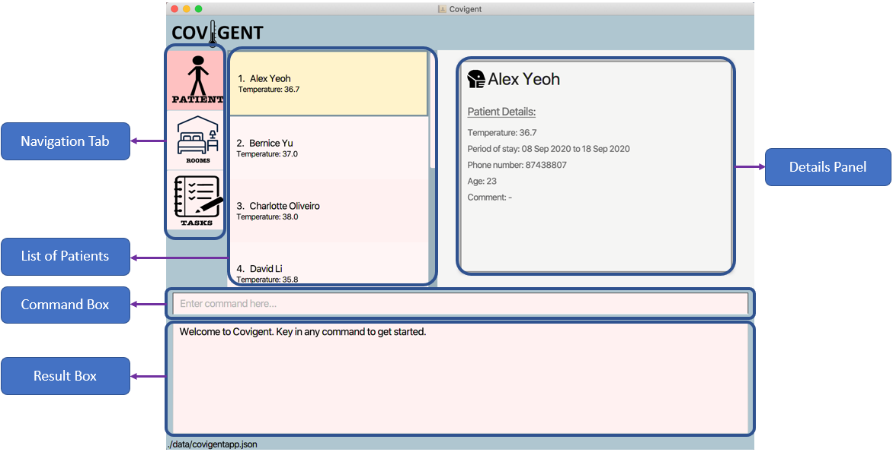

# Covigent - User Guide

1. [Introduction](#1-introduction)
2. [About this Document](#2-about-this-document) 
   2.1 [What's in Covigent](#21-what-is-in-covigent) 
   2.2 [About the guide](#22-about-the-guide) 
   2.3 [Formats in the guide](#23-formats-in-the-guide) 
3. [Getting Started](#3-getting-started)
4. [Glossary](#4-glossary)
5. [Features](#5-features) 
    5.1. [Command Format](#51-command-format) 
    5.2. [Patients](#52-patients) 
          5.2.1. [Add a Patient: `addpatient`](#521-add-a-patient-addpatient) 
          5.2.2  [Delete a Patient: `deletepatient`](#522-delete-a-patient-deletepatient) 
          5.2.3  [Edit Patient Details: `editpatient`](#523-edit-patient-details-editpatient) 
          5.2.4  [Search information: `searchpatient`](#524-search-patients-by-information-searchpatient) 
          5.2.5  [List all Patients: `listpatient`](#525-list-all-patients-listpatient) 
          5.2.6  [Allocate a Patient to a Room: `editroom`](#526-allocate-a-patient-to-a-room-editroom) 
    5.3. [Room](#53-room) 
          5.3.1  [Initialize rooms in hotel: `initRooms`](#531-initialize-rooms-in-hotel-initrooms) 
          5.3.2  [Edit Room: `editroom`](#532-edit-room-editroom) 
          5.3.3  [Search by Room Number: `searchroom`](#533-search-by-room-number-searchroom) 
          5.3.4  [Search for Room with Patient: `searchroom`](#534-search-for-room-with-patient-searchroom) 
          5.3.5  [Lists the current rooms: `listRoom`](#535-lists-the-current-rooms-listroom) 
          5.3.6  [Find the first free room: `findRoom`](#536-find-the-first-free-room-findroom) 
    5.4 [Task](#54-task) 
          5.4.1  [Add a task to a room: `addtask`](#541-add-a-task-to-a-room-addtask) 
          5.4.2  [Delete a task from a room: `deletetask`](#542-delete-a-task-from-a-room-deletetask) 
          5.4.3  [Edit a task in a room: `edittask`](#543-edit-a-task-in-a-room-edittask) 
          5.4.4  [Searches all tasks before the given date: `searchtask`](#544-search-tasks-before-a-date-searchtask) 
    5.5  [View help: `help`](#55-view-help-help) 
    5.6  [Exit Covgient: `exit`](#56-exit-covigent-exit) 
    5.7  [Autosave](#57-autosave) 
 6. [Command Summary](#6-command-summary)
 7. [FAQ](#7-faq)

--------------------------------------------------------------------------------------------------------------------

## 1. Introduction

Covigent (CG) is a desktop app for managing information of quarantined individuals and the tasks to be done by staff of the quarantine facilities.
It is optimized for use via a Command Line Interface (CLI) while retaining the benefits of a Graphical User Interface (GUI).
This means that you operate Covigent mainly by typing commands into a Command Box.
If you can type quickly, CG can improve your efficiency in managing your patients and tasks instead of using traditional GUI apps.
Interested? Jump to [Section 3, "Getting Started"](#3-getting-started) to get started.

This is what **Covigent** looks like:

*Figure 1. The graphical User Interface for **Covigent***

_Written by: MingDe_

## 2. About this Document
Welcome to the **Covigent User Guide**!
Choose a link in the **Feature** section, get a step-by-step instruction, and understand how to use **Covigent**.

### 2.1 What is in Covigent
Covigent contains the following features:
* Patient Features: `addpatient`, `deletepatient`, `editpatient`, `searchpatient`, `listpatient`.
* Room Features: `initroom`, `editroom`, `searchroom`, `listroom`, `findemptyroom`.
* Task Features: `addtask`, `deletetask`, `edittask`, `searchtask`.
* Miscellaneous Features: `help`, `exit`, `autosave`.

### 2.2 About the guide
This tutorial gives you an overview of the features in the **Covigent** and shows you how to get started using the **Covigent**

### 2.3 Formats in the guide
Note the following formatting used in this document:
*  This symbol indicates important information.

* 
A grey highlight (called a mark-up) indicates that this is a parameter or command
that can be typed into the command line and executed by the **Covigent**.

_Written by: Wai Lok_

--------------------------------------------------------------------------------------------------------------------

## 3. Getting Started

1. Ensure you have Java **11** or above installed in your Computer.

1. (*Coming soon*) Download the latest **covigent.jar** from [here](https://github.com).

1. Copy the file to the folder you want to use as the _home folder_ for Covigent.

1. Double-click the file to start the app. The GUI similar to the below should appear in a few seconds. 
   

1. Type the command in the command box and press Enter to execute it.  
   Some example commands you can try:

   * **`addpatient`** `n/John Doe t/37.4 d/20200910-20200924 p/98765432 a/35` : Adds a quarantined individual named `John Doe` to Covigent.

   * **`editpatient`** `Mary t/36.7 p/91234567` : Updates the temperature and phone number of an individual named `Mary` to 36.7 and 91234567 respectively.

1. Refer to the [Features](#3-features) below for details of each command.

--------------------------------------------------------------------------------------------------------------------

## 4. Glossary

* **Mainstream OS**: Windows, Linux, Unix, OS-X.
* **Patient**: An individual who resides in the quarantine facility.
* **Task**: A task to be completed by staff of the quarantine facility.

_Written by: Yun Qing_

--------------------------------------------------------------------------------------------------------------------

## 5. Features

### 5.1 Command Format
**:information_source: Notes about the command format:** 

* Words in `UPPER_CASE` are the parameters to be supplied by the user. 
  e.g. in `addpatient n/NAME`, `NAME` is a parameter which can be used as `addpatient n/John Doe`.

* Items in square brackets are optional. 
  e.g `n/NAME [c/COMMENT]` can be used as `n/John Doe c/Is vegan` or as `n/John Doe`.

* Parameters can be in any order. 
  e.g. if the command specifies `n/NAME p/PHONE_NUMBER`, `p/PHONE_NUMBER n/NAME` is also acceptable.

### 5.2 Patients

This section contains all the commands related to patients. Scroll down to find out which feature you need!

#### 5.2.1 Add a patient: `addpatient`

Adds the patient details (name, temperature, period of stay, phone number, age and comment) to Covigent.

Format: `addpatient n/NAME t/TEMPERATURE d/PERIOD_OF_STAY p/PHONE_NUMBER a/AGE [c/COMMENT]`

Additional Information:
* Duplicate names are not allowed. If an entry of name `John Doe` is recorded in Covigent, you should not add a patient of the name `John Doe` again.
* `PERIOD_OF_STAY` is in the format `YYYYMMDD-YYYYMMDD`.
* `TEMPERATURE` should be keyed in to 1 decimal place (e.g. 37.0 instead of 37).
* `COMMENT`for the patient is optional.

Example(s):
* `addpatient n/John Doe p/98765432 t/37.4 d/20200910-20200924 a/35` A patient named John Doe with phone number 98765432, temperature 37.4, period of stay from 10 September 2020 to 24 September 2020 and age 35 is added to Covigent.
* `addpatient n/Betsy Crowe t/36.5 d/20201001-20201014 p/91234567 a/19 c/Is asthmatic` A patient named Betsy Crowe with temperature 36.5, period of stay from 1 October 2020 to 14 October 2020, phone number 91234567, age 19 and comment is added to Covigent.

Expected Outcome:  
* Using the first example, the result box displays the message, "New patient added: John Doe Temperature: 37.4 Period of stay: 10 Sep 2020 to 24 Sep 2020 Phone: 98765432 Age: 35 Comment: -".
* The newly added patient can now be found in the list of patients in Covigent.

_Written by: Yun Qing_

#### 5.2.2 Delete a patient: `deletepatient`

Deletes the details of the existing patient identified by his/her name from Covigent.

Format: `deletepatient NAME`

Additional Information:
* `NAME` **must match exactly with the name of the patient that was input into Covigent previously** and is case-insensitive.
* If the patient to be deleted was allocated a room previously, the room will be updated to unoccupied in Covigent.

Example(s):
* `deletepatient Mary Doe` The patient details of Mary Doe will be deleted from Covigent.

Expected Outcome:  
* Using the first example, the result box displays the message "Deleted Patient: Mary Doe Temperature: 37.0 Period of stay: 14 Sep 2020 to 28 Sep 2020 Phone: 98765432 Age: 22  Comment: Vegan,asthmatic".
* The deleted patient can no longer be found in the list of patients in Covigent.

_Written by: Yun Qing_

#### 5.2.3 Edit Patient Details: `editpatient`

Edits an existing patient's details in Covigent.

Format: `editpatient NAME [n/NAME] [t/TEMPERATURE] [d/PERIOD_OF_STAY] [p/PHONE_NUMBER] [a/AGE] [c/COMMENT]`

Additional Information:
* Edits the patient with the specified `NAME`.
* `NAME` **must match exactly with the name of the patient that was input into Covigent previously**.
* At least one of the optional fields must be provided.
* Existing values will be updated to the input values.
* `NAME` is case-insensitive.
* `TEMPERATURE` must be to 1 decimal place (e.g. 37.0 instead of 37).
* `PERIOD_OF_STAY` is in the format `YYYYMMDD-YYYYMMDD`.
* `PHONE_NUMBER` consists of only 8 digits (e.g. 84321234).
* `AGE` should be a positive integer between 0 to 119.

Example(s):
*  `editpatient john doe p/91234567` The phone number of the patient named John Doe will be updated to _91234567_.
*  `editpatient alex t/36.7 a/21 d/20200303-20200315` The temperature, age and period of stay of the patient named Alex will be updated to _36.7_, _21_ and _20200303-20200315_ respectively.

Expected Outcome:  
* Using the first example, the result box displays the message, "Edited Patient: John Doe Temperature: 36.7 Period of stay: 08 Sep 2020 to 18 Sep 2020 Phone: 12345678 Age: 23 Comment: -".
* Details panel will show the details of the edited patient.

_Written by: MingDe_

#### 5.2.4 Search patients by information: `searchpatient`

Searches the patients that match the given criteria(name or a range of temperature) in Covigent.

Format: `searchpatient [n/NAME] [tr/TEMPERATURE_RANGE]`

Additional Infomation:

* Only one of the fields can be provided. If the field `n\name` is entered, you should not enter the field `tr/TEMPERATURE_RANGE`.
* The `TEMPERATURE_RANGE` is inclusive of start and end temperatures. `tr/35.5-36.0` means a temperature range of 35.5-36.0 degree, celsius, both inclusive.

Example(s):

*  `searchpatient n/john` Searches patients with a name John.
*  `searchpatient tr/36.5-36.7` Searches patients with temperature 36.5 to 36.7 degree, celsius, both inclusive.

Expected Outcome:  

* Using the second example, the result box displays the message, "Listed patient(s) matching the criteria.".
* Patients with a temperature between 36.5 and 36.7 degree celsius can now be found in the list of patients in **Covigent**.

_Written by: Wai Lok_

#### 5.2.5 List all patients: `listpatient`

Shows a list of all patients in the patient tab.

Format: `listpatient`

Example(s):

*  `listpatient` List all patients that present in Covigent.

Expected Outcome:  

* The result box displays the message, "All patients are listed.".

_Written by: Wai Lok_

#### 5.2.6 Allocate a Patient to a Room: `editroom`

Allocates a patient to a room.

Format: `editroom ROOM_NUMBER p/PATIENT_NAME`

Additional Information:
* Allocates a person to the room with the specified `ROOM_NUMBER`.
* `PATIENT_NAME` **must match exactly with the name of the patient that was input into Covigent previously**.
* `PATIENT_NAME` is case-insensitive.
* `PATIENT_NAME` is compulsory and must be provided.
* A room with the `ROOM_NUMBER` must be present.
* This is only one of features of the editroom command. Refer to the full command [here](#532-edit-room-editroom).

Example(s):
* `editroom 1 p/alex`. The patient named Alex will be allocated to Room #1.

Expected Outcome:  
* Using the first example, the result box displays the message, "Edited Room: Room Number: 1 Patient: Alex Temperature: 36.7 Period of stay: 08 Sep 2020 to 18 Sep 2020
Phone: 12345678 Age: 23 Comment: - TaskList: -".
* Details panel will show the details of the room with the allocated patient.

_Written by: MingDe_

### 5.3 Room

This section contains all the commands related to rooms. Scroll down to find out which feature you need!

#### 5.3.1 Initialize rooms in hotel: `initRoom`

Initializes the number of rooms in the quarantine facility to the app, if there was data given previously, they would
be stored.

Format: `initRoom NUMBER_OF_ROOMS`

* Adds NUMBER_OF_ROOMS rooms into the hotel system, if there were previously added information that information for respective rooms will still be there

Example(s):
* `initRoom 123`. 123 rooms are initialised in **Covigent**.
* `initRoom 400`. 400 rooms are initialised in **Covigent**.

Expected Outcome: 
The result display shows a success message "Initialize the number of rooms to 400 rooms in the application.".

_Written by: Noorul Azlina_
#### 5.3.2 Edit room: `editroom`

Edits an existing room in Covigent.

Format: `editroom ROOM_NUMBER [r/NEW_ROOM_NUMBER] [p/PATIENT_NAME]`

Additional Information:
* Edits the room with the specified `ROOM_NUMBER`.
* `PATIENT_NAME` **must match exactly with the name of the patient that was input into Covigent previously**.
* `PATIENT_NAME` is case-insensitive.
* Remove patient from room by inputting a `-` for `PATIENT_NAME`.
* At least one of the optional fields must be provided.
* A room with the `ROOM_NUMBER` must be present.
* Refer [here](#526-allocate-a-patient-to-a-room-editroom) for the instructions on allocating a patient to a room.

Example(s):
* `editroom 1 r/2 p/alex`. The room with room number #1 will be changed to #2. Afterwards, the previous patient in room #2 will be replaced with the patient named _Alex_.
* `editroom 1 p/-`. The patient in the room with room number #1 will be removed.
* `editroom 1 r/3 p/-`. The room with room number #1 will be changed to #3. Afterwards, the previous patient in room #3 will be removed.

Expected Outcome:  
* Using the first example, the result box displays the message, "Edited Room: Room Number: 2 Patient: Alex Temperature: 37.0 Period of stay: 08 Aug 2020 to 19 Aug 2020 Phone: 99272758 Age: 37 Comment: - TaskList: -".
* Details panel will show the details of the newly edited room.

_Written by: MingDe_

#### 5.3.3 Search by Room Number: `searchroom`

Searches for the room details with the specified room number.

Format: `searchroom r/ROOM_NUMBER`

Example(s):
* `searchroom r/6` The room details of room number 6 will be searched.

Expected Outcome: 
* The result box displays a message "Room has been found and listed."
* The room with the specified room number is shown in the room details panel.

_Written by: Yun Qing_

#### 5.3.4 Search for Room with Patient: `searchroom`

Searches for the room that the specified patient is residing in.

Format `searchroom n/NAME`

Addition Information:
* `NAME` **must match exactly with the name of the patient that was input into Covigent previously** and is case-insensitive.

Example(s):
* `searchroom n/Mary Doe` The room details of the room that Mary Doe resides in will be searched.

Expected Outcome:  
* The result box displays a message "Room has been found and listed."
* The room that the specified patient resides in is shown in the room details panel.

_Written by: Yun Qing_

#### 5.3.5 Lists the current rooms: `listRoom`

Lists all the rooms in the hotel together with informtion of whether the room is occupied or not.

Format: `listRoom` All the rooms in **Covigent**.

Expected Outcome: 
The result display shows a success message "All rooms are listed.".

_Written by: Noorul Azlina_
#### 5.3.6 Find the first free room: `findRoom`

Finds the room with the lowest room number that is free for use.

Format: `findRoom` The unoccupied room in **Covigent** with the lowest room number will be displayed on UI.

* Finds the room number of least value that can be safely used for accommodation

Expected Outcome: 
The result display shows a success message "Room Number 1 is empty.".

_Written by: Noorul Azlina_
### 5.4 Task

This section contains all the commands related to tasks. Scroll down to find out which feature you need!

#### 5.4.1 Add a task to a room: `addtask`

Adds a task to a room.

Format: `addtask d/DESCRIPTION r/ROOM_NUMBER [dd/DUE_DATE]`

* Adds a task with the specified description to the room with the specified room number.
* Due date is optional and defaults to "-" if not provided.
* Due date can be in the any of the following formats:
  * `YYYYMMDD` (e.g. 20210131).
  * `YYYYMMDD HHmm` (e.g. 20210131 2359).
  * `D-M-YYYY` (e.g. 31-1-2021 or 31-01-2021).
  * `D-M-YYYY HHmm` (e.g. 31-1-2021 2359 or 31-01-2021 2359).
* If the time is not given for a due date, it defaults to 0000 (12am).

Example(s):
* `addtask d/Remind Alice to change bedsheets. r/5` Adds a task with description "Remind Alice to change bedsheets." to Room #5.
* `addtask d/Running low on masks and needs to be restocked. r/1 dd/12-1-2021` Adds a task with description "Running low on masks and needs to be restocked." and due date "12 Jan 2021 1200" to Room #1.

#### 5.4.2 Delete a task from a room: `deletetask`

Deletes a task from a room.

Format: `deletetask r/ROOM_NUMBER t/TASK_NUMBER`

* Deletes the task with the `TASK_NUMBER` from the room with the `ROOM_NUMBER`.
* A room with the `ROOM_NUMBER` must be present.
* A task with the `TASK_NUMBER` must be present in the room.

Example(s):
* `deletetask r/1 t/3` Deletes the third task of Room #1.

#### 5.4.3 Edit a task in a room: `edittask`

Edits a task in a room.

Format: `edittask r/ROOM_NUMBER t/TASK_NUMBER [d/DESCRIPTION] [dd/DUE_DATE]`

* Edits the task with the `TASK_NUMBER` in the room with the `ROOM_NUMBER`.

* Remove patient from room by inputting a `-` for `PATIENT_NAME`.
* At least one of the optional fields must be provided.
* A room with the `ROOM_NUMBER` must be present.
* A task with the `TASK_NUMBER` must be present in the room.
* If "-" is provided for due date, the original due date value will be cleared.
* Due date can be in the any of the following formats:
  * `YYYYMMDD` (e.g. 20210131).
  * `YYYYMMDD HHmm` (e.g. 20210131 2359).
  * `D-M-YYYY` (e.g. 31-1-2021 or 31-01-2021).
  * `D-M-YYYY HHmm` (e.g. 31-1-2021 2359 or 31-01-2021 2359).
* If the time is not given for a due date, it defaults to 0000 (12am).

Example(s):
* `edittask r/5 t/1 dd/-` Removes the due date from the first task in Room #5.
* `edittask r/1 t/3 d/Running low on masks and needs to be restocked. dd/12-1-2021` Modifies the third task in Room #1 to have the description "Running low on masks and needs to be restocked." and due date "12 Jan 2021 1200".

#### 5.4.4 Search tasks before a date: `searchtask`

Search all tasks before a date in Covigent.

Format: `searchtask dd/DUE_DATE`

Additional Information:

* Due date can be in the any of the following formats:
  * `YYYYMMDD` (e.g. 20210131).
  * `YYYYMMDD HHmm` (e.g. 20210131 2359).
  * `D/M/YYYY` (e.g. 31/1/2021 or 31/01/2021).
  * `D/M/YYYY HHmm` (e.g. 31/1/2021 2359 or 31/01/2021 2359).

* If the time is not given for a due date, it defaults to 0000 (12am).

Example(s):

* `searchtask dd/12/1/2021` Search all tasks before and including 12 January 2021.

Expected Outcome: 
* The result box displays the message, "Tasks before the due date found.".
* Tasks before and including 12 January 2021 can now be found in the list of tasks in Covigent

_Written by: Wai Lok_

### 5.5 View help: `help`

Shows a message explaining how to access the help page.

Format: `help`

### 5.6 Exit Covigent: `exit`

Exits Covigent and closes it.

Format: `exit`

Expected Outcome: 
* Covigent closes.

### 5.7 Autosave

Covigent data are saved in the hard disk automatically after any command that changes the data. There is no need to save manually.

--------------------------------------------------------------------------------------------------------------------

## 6. Command Summary

Action | Format, Examples
--------|------------------
**Add Patient** | `addpatient n/NAME t/TEMPERATURE d/PERIOD_OF_STAY p/PHONE_NUMBER a/AGE [c/COMMENT]`   e.g., addpatient n/Betsy Crowe t/36.5 d/20201001-20201014 p/91234567 a/19 c/Is asthmatic
**Delete Patient** | `deletepatient NAME`   e.g., deletepatient Mary Doe
**Edit Patient** | `editpatient NAME [n/NAME] [t/TEMPERATURE] [d/PERIOD_OF_STAY] [p/PHONE_NUMBER] [a/AGE] [c/COMMENT]`  e.g., editpatient James Lee t/36.5
**Search Patient** | `searchpatient [n/NAME] [tr/TEMPERATURE_RANGE]`   e.g., searchpatient tr/36.5-36.7
**List Patients** | `listpatient` 
**Allocate Patient to Room** | `editroom ROOM_NUMBER p/NAME`   e.g., editroom 5 p/David Li
**Initialise Room** | `initroom NUMBER_OF_ROOMS`   e.g., initroom 123
**Edit Room Number** | `editroom ROOM_NUMBER r/NEW_ROOM_NUMBER`   e.g., editroom 1 r/2
**Search by Room Number** | `searchroom r/ROOM_NUMBER`  e.g., searchroom r/15
**Search for Room with Patient** | `searchroom n/NAME`  e.g., searchroom n/Jane Doe
**List Rooms** | `listroom`  
**Find Empty Room** | `findemptyroom`  
**Add Task to Room** | `addtask d/DESCRIPTION r/ROOM_NUMBER [dd/DUE_DATE]`   e.g., addtask d/Running low on masks and needs to be restocked. r/1 dd/12-1-2021
**Delete Task from Room** | `deletetask r/ROOM_NUMBER t/TASK_NUMBER`   e.g., deletetask r/1 t/3
**Edit Task in Room** | `edittask r/ROOM_NUMBER t/TASK_NUMBER [d/DESCRIPTION] [dd/DUE_DATE]`   e.g., edittask r/5 t/1 dd/-
**Search Task** | `searchtask dd/DUE_DATE`   e.g., searchtask dd/12-1-2021
**Help** | `help`
**Exit** | `exit`

_Written by: Yun Qing_

--------------------------------------------------------------------------------------------------------------------

## 7. FAQ

**Q**: Why does the output sometimes appear red and sometimes balck? 
**A**: If the command input is given in the wrong format, then the output is given in red. Also the correct format for the particular command is given.
        Example: 
        Invalid command format!
        Please give the number of digits in numbers
        Example: addRooms 200

**Q**: Will data be stored in the system after closing the app 
**A**: The data is stored in the hard disk and therefore would not be deleted even if you close the app

**Q**: How do I look at all the rooms and patient when only one is being displayed after commands such as findRoom?
**A**: Use the command ListRoom for rooms and ListPatient for patients.

_Written by: Noorul Azlina_
