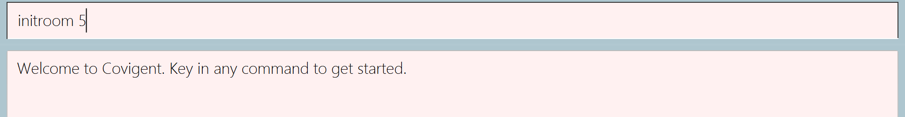

# Covigent - User Guide

1. [Introduction](#1-introduction)
1. [About this Document](#2-about-this-document) 
   2.1. [What's in Covigent](#21-what-is-in-covigent) 
   2.2. [About the Guide](#22-about-the-guide) 
   2.3. [Formats in the Guide](#23-formats-in-the-guide) 
1. [Getting Started](#3-getting-started) 
   3.1. [Setting Up](#31-setting-up) 
   3.2. [Using Covigent](#32-using-covigent) 
1. [Glossary](#4-glossary)
1. [Features](#5-features) 
    5.1. [Command Format](#51-command-format) 
    5.2. [Patients](#52-patients) 
          5.2.1. [Add a Patient: `addpatient`](#521-add-a-patient-addpatient) 
          5.2.2  [Delete a Patient: `deletepatient`](#522-delete-a-patient-deletepatient) 
          5.2.3  [Edit Patient Details: `editpatient`](#523-edit-patient-details-editpatient) 
          5.2.4  [Search Patients by Information: `searchpatient`](#524-search-patients-by-information-searchpatient) 
          5.2.5  [List all Patients: `listpatient`](#525-list-all-patients-listpatient) 
    5.3. [Room](#53-room) 
          5.3.1  [Initialise Rooms in Hotel: `initroom`](#531-initialise-rooms-in-hotel-initroom) 
          5.3.2  [Allocate Patient to Room: `allocateroom`](#532-allocate-patient-to-room-allocateroom) 
          5.3.3  [Search by Room Number: `searchroom`](#533-search-by-room-number-searchroom) 
          5.3.4  [Search for Room with Patient: `searchroom`](#534-search-for-room-with-patient-searchroom) 
          5.3.5  [List the Current Rooms: `listroom`](#535-list-the-current-rooms-listroom) 
          5.3.6  [Find the first free room: `findroom`](#536-find-the-first-free-room-findemptyroom) 
    5.4 [Task](#54-task) 
          5.4.1  [Add a Task to a Room: `addtask`](#541-add-a-task-to-a-room-addtask) 
          5.4.2  [Delete a Task from a Room: `deletetask`](#542-delete-a-task-from-a-room-deletetask) 
          5.4.3  [Edit Task Description or Due Date: `edittask`](#543-edit-task-description-or-due-date-edittask) 
          5.4.4  [Remove Due Date from a Task: `edittask`](#544-remove-due-date-from-a-task-edittask) 
          5.4.5  [Search all Tasks before the Given Date: `searchtask`](#545-search-tasks-before-a-given-date-searchtask) 
    5.5  [View Help: `help`](#55-view-help-help) 
    5.6  [Exit Covigent: `exit`](#56-exit-covigent-exit) 
    5.7  [Autosave](#57-autosave) 
1. [Command Summary](#6-command-summary)
1. [FAQ](#7-faq)

--------------------------------------------------------------------------------------------------------------------

## 1. Introduction

**Covigent** is a desktop app for managing information of quarantined individuals and the tasks to be done by staff of the quarantine facilities. 
It is optimized for use via a Command Line Interface (CLI) while retaining the benefits of a Graphical User Interface (GUI).
This means that you operate Covigent mainly by typing commands into a Command Box.
If you can type quickly, **Covigent** can improve your efficiency in managing your patients and tasks instead of using traditional GUI apps.

Interested? Jump to [Section 3, "Getting Started"](#3-getting-started) to get started.

This is what **Covigent** looks like:

    
     
    <i>Figure 1. The Graphical User Interface for Covigent</i>

_Written by: Ming De_

--------------------------------------------------------------------------------------------------------------------

## 2. About this Document

Welcome to the **Covigent User Guide**! Choose a link in the **Feature** section, get a step-by-step instruction, and understand how to use **Covigent**. 

### 2.1 What is in Covigent

Covigent contains the following features:
* Patient Features: `addpatient`, `deletepatient`, `editpatient`, `searchpatient`, `listpatient`.
* Room Features: `initroom`, `editroom`, `searchroom`, `listroom`, `findemptyroom`.
* Task Features: `addtask`, `deletetask`, `edittask`, `searchtask`.
* Miscellaneous Features: `help`, `exit`, `autosave`.

### 2.2 About the Guide

This tutorial gives you an overview of the features in **Covigent** and shows you how to get started using **Covigent**.

### 2.3 Formats in the Guide

Note the following formatting used in this document:
*  This symbol indicates important information.

*  
A grey highlight (called a mark-up) indicates that this is a field or command
that can be typed into the command line and executed by **Covigent**.

_Written by: Wai Lok_

--------------------------------------------------------------------------------------------------------------------

## 3. Getting Started

If you are tired of lengthy and problematic installation processes, **Covigent** is perfect for you.
The setup is minimal and can be completed in 4 simple steps. Follow the instructions below to try it out!

### 3.1 Setting Up

The following steps to set up **Covigent** are applicable to Windows, Mac OS X, and Linux.

1. Install _Java 11_ or a later version. The latest version of _Java_ can be found [here](https://java.com/en/download/).

1. Download the latest version of **Covigent** from [here](https://github.com/AY2021S1-CS2103T-W12-1/tp/releases). Look for the file `covigent.jar`.

1. Copy the file to the folder you want to use as the home folder of **Covigent**.

1. Double-click on _covigent.jar_ to start **Covigent**.

### 3.2 Using Covigent

**Covigent** has numerous features, including adding quarantined individuals, creating rooms, assigning tasks to rooms, and more.
Every feature has a corresponding command. Using a feature is as simple as typing a command in the command box (see Figure 2) and pressing Enter to execute it.

    
     
    <i>Figure 2. Command Box of Covigent</i>

Some example commands you may try:

   * **`addpatient`** `n/John Doe t/37.4 d/20200910-20200924 p/98765432 a/35` : Adds a quarantined individual named _John Doe_ with age _35_, phone number _98765432_, period of stay _20200910-20200924_, and temperature _37.4_.
   * **`initroom`** `5` : Creates 5 rooms in the quarantine facility.
   * **`addtask`** `r/3 d/Restock supplies dd/20201230 2359` : Adds a task to room 3 with description _Restock supplies_ and due date _20201230 2359_.

For more details of each command, please refer to the section on [Section 5, Features](#5-features).

_Written by: Yee Hong_

--------------------------------------------------------------------------------------------------------------------

## 4. Glossary

* **Command Line Interface**: A form of user interface that processes commands to a computer program in the form of lines of text. 
* **Graphical User Interface**: A form of user interface that allows users to interact with electronic devices through graphical icons. 
* **Patient**: An individual who resides in the quarantine facility. 
* **Task**: A task to be completed by staff of the quarantine facility. 

_Written by: Yun Qing_

--------------------------------------------------------------------------------------------------------------------

## 5. Features

### 5.1 Command Format
**:information_source: Notes about the command format:** 

* Words in `UPPER_CASE` are the fields to be supplied by the user. 
  e.g. in `addpatient n/NAME`, `NAME` is a field which can be used as `addpatient n/John Doe`.

* Fields in square brackets are optional. 
  e.g `n/NAME [c/COMMENT]` can be used as `n/John Doe c/Is vegan` or as `n/John Doe`.

* Fields can be in any order. 
  e.g. if the command specifies `n/NAME p/PHONE_NUMBER`, `p/PHONE_NUMBER n/NAME` is also acceptable.

### 5.2 Patients

This section contains all the commands related to patients. Scroll down to find out which feature you need!

#### 5.2.1 Add a patient: `addpatient` 

You can use this command to add a patient with the following details: name, temperature, period of stay, phone number, age and comment. 

**Format:** `addpatient n/NAME t/TEMPERATURE d/PERIOD_OF_STAY p/PHONE_NUMBER a/AGE [c/COMMENT]` 

Parameter | Description
------------ | -------------
`NAME` | The name of the patient. It should preferably be the full name of the patient.
`TEMPERATURE` | The temperature of the patient. It must be keyed in to 1 decimal place (e.g. 37.0 instead of 37).
`PERIOD_OF_STAY` | The period of stay of the patient in the facility. It must be in the format YYYYMMDD-YYYYMMDD.
`PHONE_NUMBER` | The phone number of the patient that the patient wishes to be contacted by.
`AGE` | The age of the patient, which is between 0 and 120.
`COMMENT` | An optional field that is used to indicate any special details of the patient such as dietary preferences or health conditions.
**Additional Information:**  
 Duplicate names are not allowed. If an entry of name `John Doe` is recorded in Covigent, you should not add a patient of the name `John Doe` again.
 

**Example(s):**
1. `addpatient n/Betsy Crowe t/36.5 d/20201001-20201014 p/91234567 a/19 c/Is asthmatic` A patient named Betsy Crowe with temperature _36.5_, period of stay from _1 October 2020 to 14 October 2020_, phone number _91234567_, age _19_ and comment _Is asthmatic_ is added to Covigent.
 

**Expected Outcome:**  
* Using the first example, the result box displays the message, "New patient added: Betsy Crowe Temperature: 36.5 Period of stay: 1 Oct 2020 to 14 Oct 2020 Phone: 91234567 Age: 19 Comment: Is asthmatic".
* The newly added patient can now be found in the list of patients in Covigent.

//insert ss

_Written by: Yun Qing_

#### 5.2.2 Delete a patient: `deletepatient` 

You can use this command to delete the details of the existing patient identified by his/her name from Covigent.  

**Format:** `deletepatient NAME` 

Parameter | Description
------------ | -------------
`NAME` | The name of the patient to be deleted. It is case-insensitive and must match exactly with the name of the patient that was input into Covigent previously.

**Additional Information:** 
 If the patient to be deleted was allocated a room previously, the room will be updated to unoccupied in Covigent.
 

**Example(s):**
1. `deletepatient Mary Doe` The patient details of Mary Doe will be deleted from Covigent.
 

**Expected Outcome:**  
* Using the first example, the result box displays the message "Deleted Patient: Mary Doe Temperature: 37.0 Period of stay: 14 Sep 2020 to 28 Sep 2020 Phone: 98765432 Age: 22  Comment: Vegan,asthmatic". 
* The deleted patient can no longer be found in the list of patients in Covigent.

//insert ss

_Written by: Yun Qing_

#### 5.2.3 Edit Patient Details: `editpatient`

Edits an existing patient's details in Covigent.

**Format**: `editpatient ORIGNIAL_NAME [n/NEW_NAME] [t/TEMPERATURE] [d/PERIOD_OF_STAY] [p/PHONE_NUMBER] [a/AGE] [c/COMMENT]` 

Parameter | Description
------------ | -------------
`ORIGNIAL_NAME` | The name of the patient whom details are to be edited. It must match exactly with the name of the patient that was input into Covigent previously. It is case-insensitive.
`NEW_NAME` | The new name of the patient. The new name must not already exist within Covigent.
`TEMPERATURE` | The new temperature of the patient. It must be keyed in to 1 decimal place (e.g. 37.0 instead of 37).
`PERIOD_OF_STAY` | The new period of stay of the patient. It must be in the format YYYYMMDD-YYYYMMDD.
`PHONE_NUMBER` | The new phone number of the patient.
`AGE` | The new age of the patient. Age should be between 0 and 120.
`COMMENT` | The new comments about the patient.

**Additional Information:** 
 At least one of the optional fields must be provided. 
 Existing values will be updated to the input values.
 

**Example(s)**:
*  `editpatient john doe p/91234567` The phone number of the patient named John Doe will be updated to _91234567_.
*  `editpatient alex t/36.7 a/21 d/20200303-20200315` The temperature, age and period of stay of the patient named Alex will be updated to _36.7_, _21_ and _20200303-20200315_ respectively.

**Expected Outcome**:  
* Using the first example, the result box displays the message, "Edited Patient: John Doe Temperature: 36.7 Period of stay: 08 Sep 2020 to 18 Sep 2020 Phone: 12345678 Age: 23 Comment: -". 
* Details panel will show the details of the edited patient.

_Written by: Ming De_

#### 5.2.4 Search Patients by Information: `searchpatient`

Searches the patients that match the given criteria(name or a range of temperature) in Covigent.

Format: `searchpatient [n/NAME] [tr/TEMPERATURE_RANGE]`

Additional Information:

* Only one of the fields can be provided. If the field `n\name` is entered, you should not enter the field `tr/TEMPERATURE_RANGE`.
* The `TEMPERATURE_RANGE` is inclusive of start and end temperatures. `tr/35.5-36.0` means a temperature range of 35.5-36.0 degree, celsius, both inclusive.

Example(s):

*  `searchpatient n/john` Searches patients with a name John.
*  `searchpatient tr/36.5-36.7` Searches patients with temperature range _36.5 to 36.7_ degree celsius, both inclusive.

Expected Outcome:  

* Using the second example, the result box displays the message, "Listed patient(s) matching the criteria.".
* Patients with a temperature between 36.5 and 36.7 degree celsius can now be found in the list of patients in Covigent.

_Written by: Wai Lok_

#### 5.2.5 List all patients: `listpatient`

Shows a list of all patients in the patient tab.

Format: `listpatient`

Example(s):

*  `listpatient` Lists all patients that are present in Covigent.

Expected Outcome:  

* The result box displays the message, "All patients are listed.".

_Written by: Wai Lok_

### 5.3 Room

This section contains all the commands related to rooms. Scroll down to find out which feature you need!

#### 5.3.1 Initialise Rooms in Hotel: `initroom`

Initialises the number of rooms in the quarantine facility to the app, if there was data given previously, they would 
be stored.

Format: `initroom NUMBER_OF_ROOMS`

Additional Information:
* Adds NUMBER_OF_ROOMS rooms into the hotel system, if there were previously added information that information for respective rooms will still be there.

Example(s):
* `initroom 123`. 123 rooms are initialised in Covigent.
* `initroom 400`. 400 rooms are initialised in Covigent.

Expected Outcome:  
* The result display shows a success message "Initialise the number of rooms to 400 rooms in the application.".

_Written by: Noorul Azlina_

#### 5.3.2 Allocate Patient to Room: `allocateroom`

Allocates a patient to a room.

**Format**: `allocateroom ROOM_NUMBER n/PATIENT_NAME`

Parameter | Description
----------|-------------
`ROOM_NUMBER` | The room number of the room of which the patient is to be allocated to. A room with the `ROOM_NUMBER` must already exist within Covigent.
`PATIENT_NAME` | The name of the patient to be allocated to the room. It is case-sensitive but must match exactly with the name of the patient that was input into Covigent previously.

 To remove a patient from the room, input the patient name as "-". Refer to the example below for more clarity.

**Example(s):**
* `allocateroom 1 n/alex`. The patient named Alex will be allocated to Room #1.
* `allocateroom 1 n/-`. The previous patient will be removed from Room #1.

**Expected Outcome:**  
* Using the first example, the result box displays the message, "Edited Room: Room Number: 1 Patient: Alex Temperature: 36.7 Period of stay: 08 Sep 2020 to 18 Sep 2020
Phone: 12345678 Age: 23 Comment: - TaskList: -". 
* The details of the room with the allocated patient will be shown in the details panel.

_Written by: Ming De_

#### 5.3.3 Search by Room Number: `searchroom` 

You can use this command to search for the room details with the specified room number.

**Format:** `searchroom r/ROOM_NUMBER`

Parameter | Description
----------|-------------
`ROOM_NUMBER` | The room number of the room to be searched for. The room number should be present in the list of rooms in Covigent.

**Example(s):**
1. `searchroom r/6` The room details of room number 6 will be searched.

**Expected Outcome:** 
* The result box displays a message "Room has been found and listed." 
* The room with the specified room number is shown in the room details panel.
//insert ss
_Written by: Yun Qing_

#### 5.3.4 Search for Room with Patient: `searchroom` 

You can use this command to search for the room that the specified patient is residing in. 

**Format:** `searchroom n/NAME`

Parameter | Description
----------|-------------
`NAME` | The name of the patient whose room you are looking for. It is case-insensitive and must match exactly with the name of the patient that was input into Covigent previously.

**Example(s):**
1. `searchroom n/Mary Doe` The room details of the room that Mary Doe resides in will be searched.

**Expected Outcome:** 
* The result box displays a message "Room has been found and listed." 
* The room that the specified patient resides in is shown in the room details panel.
//insert ss

_Written by: Yun Qing_

#### 5.3.5 List the Current Rooms: `listroom`

Lists all the rooms in the hotel together with informtion of whether the room is occupied or not.

Format: `listroom` All the rooms in Covigent.

Expected Outcome:  
* The result display shows a success message "All rooms are listed.".

_Written by: Noorul Azlina_

#### 5.3.6 Find the First Free Room: `findemptyroom`

Finds the room with the lowest room number that is free for use.

Format: `findemptyroom` The unoccupied room in Covigent with the lowest room number will be displayed on UI.

Expected Outcome:  
* The result display shows a success message "Room Number 1 is empty.".

_Written by: Noorul Azlina_

### 5.4 Task

This section contains all the commands related to tasks. Scroll down to find out which feature you need!

#### 5.4.1 Add a task to a room: `addtask`

Adds a task to a room.

Format: `addtask d/DESCRIPTION r/ROOM_NUMBER [dd/DUE_DATE]`

Additional Information:
* Adds a task to a room with the specified `ROOM_NUMBER`.
* `ROOM_NUMBER` refers to the number displayed beside each room under the list of rooms.
E.g. For Room #5, the `ROOM_NUMBER` is 5.
* A room with the `ROOM_NUMBER` must be present in Covigent.
* `DUE_DATE` is optional and defaults to `-` if not provided.
* `DUE_DATE` can be in the any of the following formats:
  * `YYYYMMDD` (e.g. 20210131).
  * `YYYYMMDD HHmm` (e.g. 20210131 2359).
  * `D/M/YYYY` (e.g. 31/1/2021 or 31/01/2021).
  * `D/M/YYYY HHmm` (e.g. 31/1/2021 2359 or 31/01/2021 2359).
* If you do not provide the time for a `DUE_DATE`, it defaults to `0000` (12am).

Example(s):
* `addtask r/5 d/Remind Alice to change bedsheets.` A task with description _Remind Alice to change bedsheets._ is added to Room #5.
* `addtask r/1 d/Running low on masks and needs to be restocked. dd/12/1/2021` A task with description _Running low on masks and needs to be restocked._ and due date _12 Jan 2021 0000_ is added to Room #1.

Expected Outcome:  
* Using the first example, the result box displays the message _New Task added to Room 5. Description: Remind Alice to change bedsheets. Due Date: -_.
* The new task can now be found in the Room #5.
* The new task can now be found in the list of tasks in Covigent.

_Written by: Yee Hong_

#### 5.4.2 Delete a task from a room: `deletetask`

Deletes an existing task from a room.

Format: `deletetask r/ROOM_NUMBER t/TASK_NUMBER`

Additional Information:
* Deletes a task with the `TASK_NUMBER` from the room with the `ROOM_NUMBER`.
* `ROOM_NUMBER` refers to the number displayed beside each room under the list of rooms.
E.g. For "Room #5", the `ROOM_NUMBER` is 5.
* A room with the `ROOM_NUMBER` must be present in Covigent.
* `TASK_NUMBER` refers to the number displayed beside each task in the details panel for rooms.
E.g. For "3. Remind Alice to change bedsheets.", the `TASK_NUMBER` is 3.
* A task with the `TASK_NUMBER` must be present in the room.

Example(s):
* `deletetask r/1 t/3` The third task (Task 3) of Room 1 is deleted.

Expected Outcome:  
* The result box displays the message _Task 3 deleted from Room 1._, followed by the description and due date of Task 3.
* Task 3 is no longer in Room #1.
* For tasks that come after Task 3, the `TASK_NUMBER` is decreased by 1.
E.g. The previous Task 4 will become Task 3.
* Task 3 is no longer in the list of tasks in Covigent.

_Written by: Yee Hong_

#### 5.4.3 Edit Task Description or Due Date: `edittask`

Edits the description or due date of an existing task in a room.

Format: `edittask r/ROOM_NUMBER t/TASK_NUMBER [d/DESCRIPTION] [dd/DUE_DATE]`

Additional Information:
* Edits the task with the `TASK_NUMBER` in the room with the `ROOM_NUMBER`.
* At least one of the optional fields must be provided.
* Existing values will be updated to the input values.
* `ROOM_NUMBER` refers to the number displayed beside each room under the list of rooms.
E.g. For "Room #5", the `ROOM_NUMBER` is 5.
* A room with the `ROOM_NUMBER` must be present in Covigent.
* `TASK_NUMBER` refers to the number displayed beside each task in the details panel for rooms.
E.g. For "3. Remind Alice to change bedsheets.", the `TASK_NUMBER` is 3.
* A task with the `TASK_NUMBER` must be present in the room.
* `DUE_DATE` can be in the any of the following formats:
  * `YYYYMMDD` (e.g. 20210131).
  * `YYYYMMDD HHmm` (e.g. 20210131 2359).
  * `D/M/YYYY` (e.g. 31/1/2021 or 31/01/2021).
  * `D/M/YYYY HHmm` (e.g. 31/1/2021 2359 or 31/01/2021 2359).
* If you do not provide the time for a `DUE_DATE`, it defaults to `0000` (12am).

Example(s):
* `edittask r/3 t/1 d/Return a call to the patient. dd/12/1/2021 1500` The description and due date of the first task (Task 1) in Room #3 are updated to _Return a call to the patient._ and _12 Jan 2021 1500_ respectively.
* `edittask r/2 t/2 dd/12-1-2021` The due date for the second task (Task 2) of Room #2 is updated to _12 Jan 2021 0000_.

Expected Outcome:  
* Using the first example, the result box displays the message _Task 1 edited from Room 3. Description: Return a call to the patient. Due Date: 12 Jan 2021 1500_.
* The details panel for Room #3 shows the updated description and due date of Task 1.
* The list of tasks in Covigent shows the updated description and due date of Task 1.

_Written by: Yee Hong_

#### 5.4.4 Remove Due Date from a Task: `edittask`

Removes a due date from a task in a room.

Format: `edittask r/ROOM_NUMBER t/TASK_NUMBER dd/-`

Additional Information:
* Removes the due date from the task with the `TASK_NUMBER` in the room with the `ROOM_NUMBER`.
* Existing due date will be set to `-`.
* `ROOM_NUMBER` refers to the number displayed beside each room under the list of rooms.
E.g. For "Room #5", the `ROOM_NUMBER` is 5.
* A room with the `ROOM_NUMBER` must be present in Covigent.
* `TASK_NUMBER` refers to the number displayed beside each task in the details panel for rooms.
* This is only one feature of the `edittask` command. Refer to the full command [here](#543-edit-task-description-or-due-date-edittask).

Example(s):
* `edittask r/3 t/1 dd/-` The due date of the first task (Task 1) in Room #3 is removed, i.e. set to `-`.

Expected Outcome:  
* The result box displays the message _Task 1 edited from Room 3._ followed by the current description of Task 1 and _Due Date: -_.
* The details panel for Room #3 shows the updated description and due date of Task 1.
* The list of tasks in Covigent shows the updated description and due date of Task 1.

_Written by: Yee Hong_

#### 5.4.5 Search Tasks before a Given Date: `searchtask`

Searches all tasks before a date in Covigent.

Format: `searchtask dd/DUE_DATE`

Additional Information:
* Due date can be in the any of the following formats:
  * `YYYYMMDD` (e.g. 20210131).
  * `YYYYMMDD HHmm` (e.g. 20210131 2359).
  * `D/M/YYYY` (e.g. 31/1/2021 or 31/01/2021).
  * `D/M/YYYY HHmm` (e.g. 31/1/2021 2359 or 31/01/2021 2359).
  
* If the time is not given for a due date, it defaults to 0000 (12am).

Example(s):

* `searchtask dd/12/1/2021` Search all tasks before and including 12 January 2021.

Expected Outcome: 
* The result box displays the message, "Tasks before the due date found.".
* Tasks before and including 12 January 2021 can now be found in the list of tasks in Covigent

_Written by: Wai Lok_

### 5.5 View help: `help`

Shows a message explaining how to access the help page.

Format: `help`

Expected Outcome:  
* A new help window appears.

### 5.6 Exit Covigent: `exit`

Exits Covigent and closes it.

Format: `exit`

Expected Outcome: 
* Covigent exits and closes.

_Written by: MingDe_

### 5.7 Autosave

Covigent data are saved in the hard disk automatically after any command that changes the data. There is no need to save manually.

--------------------------------------------------------------------------------------------------------------------

## 6. Command Summary 

Action | Format, Examples
--------|------------------
**Add Patient** | `addpatient n/NAME t/TEMPERATURE d/PERIOD_OF_STAY p/PHONE_NUMBER a/AGE [c/COMMENT]`   e.g., addpatient n/Betsy Crowe t/36.5 d/20201001-20201014 p/91234567 a/19 c/Is asthmatic
**Delete Patient** | `deletepatient NAME`   e.g., deletepatient Mary Doe
**Edit Patient** | `editpatient NAME [n/NAME] [t/TEMPERATURE] [d/PERIOD_OF_STAY] [p/PHONE_NUMBER] [a/AGE] [c/COMMENT]`  e.g., editpatient James Lee t/36.5
**Search Patient** | `searchpatient [n/NAME] [tr/TEMPERATURE_RANGE]`   e.g., searchpatient tr/36.5-36.7
**List Patients** | `listpatient` 
**Initialise Room** | `initroom NUMBER_OF_ROOMS`   e.g., initroom 123
**Allocate Patient to Room** | `allocateroom ROOM_NUMBER p/NAME`   e.g., editroom 5 n/David Li
**Search by Room Number** | `searchroom r/ROOM_NUMBER`  e.g., searchroom r/15
**Search for Room with Patient** | `searchroom n/NAME`  e.g., searchroom n/Jane Doe
**List Rooms** | `listroom`  
**Find Empty Room** | `findemptyroom`  
**Add Task to Room** | `addtask d/DESCRIPTION r/ROOM_NUMBER [dd/DUE_DATE]`   e.g., addtask d/Running low on masks and needs to be restocked. r/1 dd/12-1-2021 
**Delete Task from Room** | `deletetask r/ROOM_NUMBER t/TASK_NUMBER`   e.g., deletetask r/1 t/3
**Edit Task Description or Due Date** | `edittask r/ROOM_NUMBER t/TASK_NUMBER [d/DESCRIPTION] [dd/DUE_DATE]`   e.g., edittask r/1 t/3 dd/12-1-2021 1500
**Remove Due Date from a Task** | `edittask r/ROOM_NUMBER t/TASK_NUMBER dd/-`   e.g., edittask r/1 t/3 dd/-
**Search Task** | `searchtask dd/DUE_DATE`   e.g., searchtask dd/12-1-2021
**Help** | `help`
**Exit** | `exit`

_Written by: Yun Qing_

--------------------------------------------------------------------------------------------------------------------

## 7. FAQ

**Q**: Why does the output sometimes appear red and sometimes black? 
**A**: If the command input is given in the wrong format, then the output is given in red. Also the correct format for the particular command is given.  
        
        Example: 
        Invalid command format! 
        Please give the number of digits in numbers
        Example: addRooms 200

**Q**: Will data be stored in the system after closing the app? 
**A**: The data is stored in the hard disk and therefore would not be deleted even if you close the app

**Q**: How do I look at all the rooms and patient when only one is being displayed after commands such as `findroom`? 
**A**: Use the command `listroom` for rooms and `listpatient` for patients.

**Q**: What should I do if nothing happens when I double click the Jar file? 
**A**: Open Terminal(Mac)/Command Prompt(Windows) . Type `cd [PATH TO DIRECTORY CONTAINING .JAR FILE]` . Type java `-jar covigent.jar` to run the application.

_Written by: Noorul Azlina_ 
